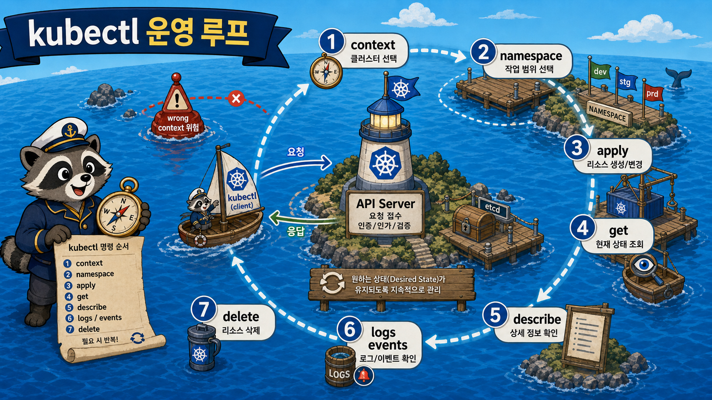

# 1교시: Day4 요약 + kubectl 운영 루프



## 수업 목표
- W3D4의 control plane, node, kubelet, Pod 개념을 실행 관점으로 다시 연결한다.
- `kubectl`이 node에 직접 명령하는 도구가 아니라 API Server에 요청하는 client임을 확인한다.
- context, namespace, `get`, `describe`, `logs`, `events`, `apply`, `delete`를 오늘의 공통 운영 루프로 사용한다.

## Day4에서 가져와야 할 한 문장
```text
Kubernetes는 container를 직접 켜는 명령 모음이 아니라,
원하는 상태를 API Server에 제출하고 control plane이 현재 상태를 맞추게 하는 운영 API다.
```

오늘부터는 이 문장이 명령 출력으로 보이는지 확인한다.

```text
manifest 작성
  -> kubectl apply
  -> API Server 저장
  -> controller/scheduler/kubelet 동작
  -> kubectl get/describe/logs로 현재 상태 확인
```

## 먼저 context를 확인하는 이유
`kubectl`은 kubeconfig의 current-context를 기준으로 API Server에 요청한다. 실무에서 context를 확인하지 않고 명령을 실행하면 개발 cluster에 적용할 manifest를 운영 cluster에 적용하는 사고가 날 수 있다.

```bash
kubectl config current-context
kubectl get nodes -o wide
```

확인 기준:
| 출력 | 해석 |
|---|---|
| `kind-paperclip-week3` | 오늘 수업용 kind cluster를 보고 있음 |
| node `Ready` | API Server와 kubelet이 정상 연결됨 |
| connection refused | cluster가 없거나 API Server가 죽었을 가능성 |
| 다른 context | 엉뚱한 cluster에 배포할 수 있음 |

## namespace는 실습 울타리다
namespace는 cluster 안의 논리적 분리 단위다. 오늘은 `week3` namespace에 리소스를 만든다.

```bash
kubectl apply -f week3/day5/labs/k8s-first-app/namespace.yaml
kubectl get ns week3
```

namespace를 쓰면 다음이 쉬워진다.

| 장점 | 설명 |
|---|---|
| 조회 범위 제한 | `kubectl -n week3 get pods` |
| cleanup 단순화 | `kubectl delete namespace week3` |
| 권한/RBAC 연결 | Week4에서 namespace scope Role을 실습 |
| 관찰 기준 분리 | Grafana/Prometheus에서 namespace별로 보기 쉬움 |

## 오늘의 kubectl 운영 루프
오늘은 모든 실습을 아래 순서로 반복한다.

| 단계 | 명령 | 목적 |
|---|---|---|
| 1. 적용 | `kubectl apply -f ...` | 원하는 상태 제출 |
| 2. 목록 | `kubectl get ...` | 상태 요약 확인 |
| 3. 상세 | `kubectl describe ...` | event, selector, image, scheduling 확인 |
| 4. 로그 | `kubectl logs ...` | app stdout/stderr 확인 |
| 5. 연결 | `kubectl exec` 또는 curlbox | 내부 통신 확인 |
| 6. 복구 | `kubectl rollout undo` 또는 manifest 재적용 | 정상 상태 회복 |
| 7. 정리 | `kubectl delete ...` | 불필요한 리소스 제거 |

## get과 describe의 차이
`get`은 빠른 상태판이고, `describe`는 사건 기록이다.

```bash
kubectl -n week3 get pods
kubectl -n week3 describe pod hello-pod
```

| 명령 | 잘 보이는 것 |
|---|---|
| `get` | 이름, READY, STATUS, RESTARTS, AGE |
| `describe` | image, command, env, volume, node, condition, event |
| `logs` | container process가 남긴 stdout/stderr |
| `events` | cluster가 resource를 처리하며 남긴 이유와 메시지 |

## 오늘의 실패 해석 원칙
Kubernetes 장애는 대개 "어디에서 멈췄는가"를 찾아야 한다.

| 멈춘 지점 | 대표 증상 | 먼저 볼 명령 |
|---|---|---|
| image pull | `ImagePullBackOff` | `describe pod` |
| process start | `CrashLoopBackOff` | `logs`, `logs --previous` |
| scheduling | `Pending` | `describe pod` |
| traffic routing | curl 실패, endpoint 없음 | `get svc,endpoints`, `describe svc` |
| rollout | 새 ReplicaSet이 Ready 안 됨 | `rollout status`, `describe deploy` |

## 실습 시작 전 체크
```bash
export NS=week3
export LAB=week3/day5/labs/k8s-first-app

kubectl config current-context
kubectl get nodes -o wide
kubectl apply -f "$LAB/namespace.yaml"
```

## 한 줄 요약
```text
Day5의 핵심은 manifest를 많이 쓰는 것이 아니라,
적용한 상태가 cluster에서 어떻게 변하는지 kubectl 증거로 읽는 것이다.
```

## Evidence Note
```markdown
# W3D5S1 kubectl loop
- current-context:
- node Ready:
- namespace:
- 오늘 가장 자주 쓸 명령:
- context 확인을 생략하면 생길 수 있는 위험:
```
