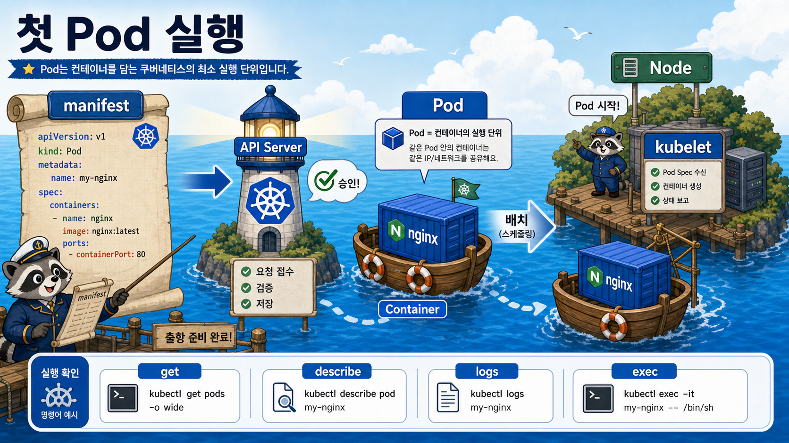

# 2교시: 첫 Pod 실행



## 수업 목표
- Pod manifest를 읽고 `apiVersion`, `kind`, `metadata`, `spec`의 역할을 설명한다.
- Pod가 container를 품는 Kubernetes workload 단위임을 확인한다.
- `get`, `describe`, `logs`, `exec`로 Pod 실행 상태를 증거로 남긴다.

## Pod manifest 읽기
오늘 첫 Pod는 nginx container 하나를 실행한다.

```yaml
apiVersion: v1
kind: Pod
metadata:
  name: hello-pod
  namespace: week3
  labels:
    app: hello-pod
spec:
  containers:
    - name: nginx
      image: nginx:1.27
      ports:
        - containerPort: 80
```

| 필드 | 의미 |
|---|---|
| `apiVersion: v1` | Pod object가 속한 API version |
| `kind: Pod` | 만들 resource 종류 |
| `metadata.name` | cluster 안에서 식별할 이름 |
| `metadata.namespace` | resource가 들어갈 namespace |
| `metadata.labels` | Service/조회/운영 분류에 사용할 key-value |
| `spec.containers[].image` | 실행할 container image |
| `containerPort` | container가 열고 있다고 문서화하는 port |

중요한 점은 `containerPort`가 host port publish가 아니라는 것이다. Docker의 `-p 8080:80`과 다르다. Pod 내부 container가 80번을 사용한다고 선언할 뿐이고, cluster 안팎 접근은 Service/Ingress가 담당한다.

## Pod 생성
```bash
export NS=week3
export LAB=week3/day5/labs/k8s-first-app

kubectl apply -f "$LAB/pod-hello.yaml"
kubectl -n "$NS" get pods -o wide
```

예상 패턴:
```text
NAME        READY   STATUS    RESTARTS   AGE   IP           NODE
hello-pod   1/1     Running   0          ...   10.244...    paperclip-week3-control-plane
```

## describe로 보는 것
```bash
kubectl -n "$NS" describe pod hello-pod
```

확인할 항목:
| 항목 | 의미 |
|---|---|
| `Node` | 어느 node의 kubelet이 실행을 맡았는지 |
| `Image` | 어떤 image를 pull/run했는지 |
| `Container ID` | runtime이 만든 container 식별자 |
| `Conditions` | Initialized, Ready, ContainersReady, PodScheduled |
| `Events` | scheduling, pulling, created, started 순서 |

## logs로 보는 것
```bash
kubectl -n "$NS" logs hello-pod
```

nginx는 request가 없으면 로그가 적을 수 있다. 그래서 내부에서 HTTP 요청을 한 번 보내고 다시 로그를 본다.

```bash
kubectl -n "$NS" exec hello-pod -- curl -sI http://127.0.0.1 || true
kubectl -n "$NS" logs hello-pod
```

nginx image 안에 `curl`이 없을 수 있다. 이 경우 `exec`가 실패할 수 있는데, 이것은 Pod 실패가 아니라 image 안에 해당 도구가 없다는 뜻이다. Week4에서는 이런 확인을 위해 별도의 debug Pod나 ephemeral container 개념으로 이어갈 수 있다.

## exec로 보는 것
```bash
kubectl -n "$NS" exec hello-pod -- printenv HOSTNAME
kubectl -n "$NS" exec hello-pod -- nginx -v
```

`exec`는 상태 확인에는 유용하지만 운영 container를 마음대로 수정하는 용도로 쓰면 안 된다. container 안에서 직접 파일을 고치면 manifest와 실제 상태가 어긋나고, Pod가 재생성되는 순간 변경도 사라진다.

## 직접 Pod의 한계
직접 만든 Pod는 첫 실행 확인에는 좋다. 하지만 운영 배포 단위로는 부족하다.

| 한계 | 설명 |
|---|---|
| replica 관리 없음 | 같은 Pod 여러 개를 선언적으로 유지하기 어렵다 |
| rollout 없음 | image 변경 이력과 undo가 약하다 |
| self-healing 약함 | 삭제된 Pod를 다시 만들 controller가 없다 |
| Service 연결 기준 약함 | label을 직접 관리해야 한다 |

그래서 4교시부터 Deployment로 넘어간다.

## 한 줄 요약
```text
Pod는 container 실행 단위가 아니라 Kubernetes가 스케줄링하고 상태를 추적하는 최소 workload 단위다.
```

## Evidence Note
```markdown
# W3D5S2 First Pod
- pod manifest path:
- pod status:
- node:
- image:
- describe에서 본 event:
- exec로 확인한 값:
- 직접 Pod의 한계:
```
