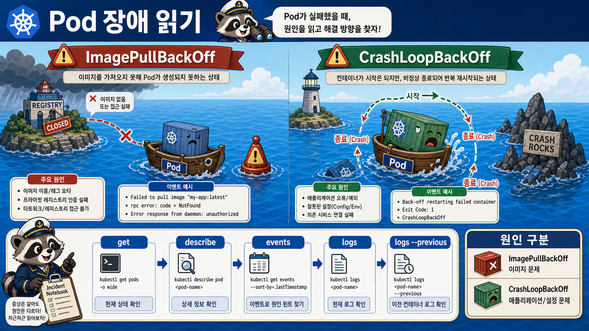

# 3교시: Pod 장애 읽기



## 수업 목표
- `ImagePullBackOff`와 `CrashLoopBackOff`의 원인이 서로 다름을 구분한다.
- `kubectl get`, `describe`, `logs`, `logs --previous`를 상황에 맞게 사용한다.
- 실패한 상태를 복구하기 전에 먼저 증거를 남기는 습관을 만든다.

## 장애는 STATUS만 보면 부족하다
`kubectl get pods`의 STATUS는 힌트다. 원인 분석은 `describe`의 Events와 `logs`에서 시작한다.

```bash
kubectl -n week3 get pods
kubectl -n week3 describe pod <pod-name>
kubectl -n week3 logs <pod-name>
```

| STATUS | 의미 | 주 증거 |
|---|---|---|
| `ImagePullBackOff` | image를 가져오지 못함 | `describe pod` event |
| `CrashLoopBackOff` | process가 시작 후 반복 종료 | `logs`, `logs --previous` |
| `Pending` | 아직 node에 실행 배치되지 못함 | scheduling event |
| `Running` but `0/1` | process는 있어도 Ready가 아님 | readiness/probe, endpoint |

## 장애 1: ImagePullBackOff
bad image manifest는 존재하지 않는 image tag를 사용한다.

```yaml
image: nginx:not-a-real-tag
```

실행:
```bash
export NS=week3
export LAB=week3/day5/labs/k8s-first-app

kubectl apply -f "$LAB/pod-bad-image.yaml"
kubectl -n "$NS" get pod bad-image-pod
kubectl -n "$NS" describe pod bad-image-pod
```

확인할 event:
```text
Failed to pull image
ErrImagePull
ImagePullBackOff
```

해석:
| 증거 | 해석 |
|---|---|
| image tag가 없음 | image 이름/tag 오류 |
| registry 인증 실패 | private registry secret 필요 |
| pull timeout | 네트워크 또는 registry 접근 문제 |

이 장애에서는 `logs`가 핵심이 아니다. container가 시작하지 못했으므로 application log가 없을 수 있다.

정리:
```bash
kubectl -n "$NS" delete pod bad-image-pod
```

## 장애 2: CrashLoopBackOff
CrashLoopBackOff는 image pull은 되었지만 container process가 종료되는 상황이다.

```yaml
command: ["sh", "-c"]
args:
  - echo "intentional crash for W3D5"; exit 1
```

실행:
```bash
kubectl apply -f "$LAB/pod-crashloop.yaml"
kubectl -n "$NS" get pod crashloop-pod
kubectl -n "$NS" logs crashloop-pod
kubectl -n "$NS" logs crashloop-pod --previous || true
kubectl -n "$NS" describe pod crashloop-pod
```

예상 증거:
| 명령 | 기대 |
|---|---|
| `get pod` | `CrashLoopBackOff`, `RESTARTS` 증가 |
| `logs` | `intentional crash for W3D5` |
| `logs --previous` | 이전에 종료된 container 로그 |
| `describe` | Back-off restarting failed container |

`|| true`는 이 명령이 실패해도 다음 실습을 계속하기 위한 표시다. 예를 들어 아직 previous log가 없거나 container 재시작 타이밍이 맞지 않으면 `logs --previous`가 실패할 수 있다. 실패를 숨기는 습관으로 쓰면 안 되고, 타이밍 의존 명령임을 설명할 때만 사용한다.

정리:
```bash
kubectl -n "$NS" delete pod crashloop-pod
```

## Pending은 오늘 깊게 만들지 않는다
Pending은 resource 부족, taint/toleration, volume, scheduling constraint 때문에 발생할 수 있다. local kind 단일 node에서 억지로 만들 수는 있지만, 오늘 목표는 Pod/Deployment/Service 기본 흐름이다. Pending은 Week4 resource, scheduling, policy에서 다시 본다.

## 장애 증거 기록 템플릿
```markdown
## Pod Failure Note
- resource:
- status:
- first command:
- describe event reason:
- log message:
- suspected layer: image pull / process start / scheduling / network
- recovery action:
```

## 한 줄 요약
```text
ImagePullBackOff는 image를 못 가져온 것이고,
CrashLoopBackOff는 process가 시작했다가 죽는 것이다.
```

## Evidence Note
```markdown
# W3D5S3 Pod Failure
- ImagePullBackOff event:
- CrashLoopBackOff log:
- RESTARTS 변화:
- `logs`보다 `describe`를 먼저 봐야 하는 경우:
- `logs --previous`가 필요한 경우:
```
