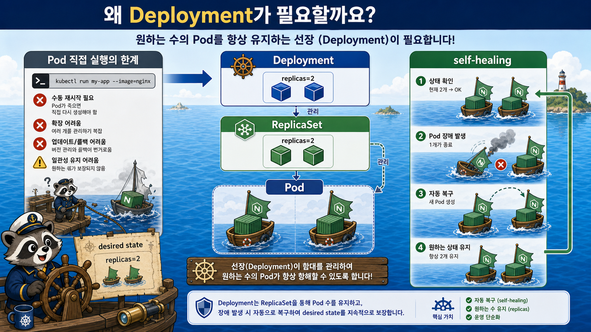

# 4교시: Deployment가 필요한 이유



## 수업 목표
- 직접 만든 Pod와 Deployment의 차이를 운영 관점으로 설명한다.
- Deployment, ReplicaSet, Pod의 소유 관계를 확인한다.
- Pod를 삭제했을 때 Deployment가 replica 수를 다시 맞추는 self-healing을 관찰한다.

## 직접 Pod에서 생기는 운영 문제
2교시에서 만든 `hello-pod`는 학습용으로는 좋지만 운영 배포 단위로는 부족하다.

| 운영 요구 | 직접 Pod의 한계 |
|---|---|
| 같은 앱을 2개 이상 띄우기 | Pod manifest를 여러 개 직접 관리해야 함 |
| 죽은 Pod 복구 | Pod를 다시 만들어 줄 controller가 없음 |
| image 교체 | rollout/history/undo 흐름이 약함 |
| 서비스 연결 | label과 endpoint 관리가 불안정 |
| 배포 상태 확인 | `rollout status` 같은 배포 단위 상태가 없음 |

Deployment는 이 문제를 해결하기 위해 Pod template과 replica 수를 선언한다.

```text
Deployment
  -> ReplicaSet
    -> Pod 1
    -> Pod 2
```

## Deployment 배포
```bash
export NS=week3
export LAB=week3/day5/labs/k8s-first-app

kubectl apply -f "$LAB/deployment.yaml"
kubectl -n "$NS" rollout status deployment/hello-web
kubectl -n "$NS" get deploy,rs,pod -l app=hello-web -o wide
```

예상 패턴:
```text
deployment.apps/hello-web successfully rolled out
deployment.apps/hello-web   2/2
replicaset.apps/hello-web-...
pod/hello-web-...           Running
pod/hello-web-...           Running
```

## Deployment가 유지하는 상태
manifest에서 가장 중요한 부분은 replica 수와 Pod template이다.

```yaml
spec:
  replicas: 2
  selector:
    matchLabels:
      app: hello-web
  template:
    metadata:
      labels:
        app: hello-web
    spec:
      containers:
        - name: nginx
          image: nginx:1.27
```

| 필드 | 의미 |
|---|---|
| `replicas: 2` | Ready Pod 2개를 유지하고 싶다 |
| `selector.matchLabels` | Deployment가 관리할 Pod를 찾는 기준 |
| `template.metadata.labels` | 새로 만들 Pod에 붙일 label |
| `template.spec.containers` | Pod 안 container spec |

selector와 template label이 맞지 않으면 Deployment는 Pod를 제대로 소유할 수 없다. 이 부분은 Week4 Ingress/Service 장애에서도 계속 등장한다.

## Self-healing 확인
Pod 하나를 삭제해도 Deployment가 replica 수를 다시 맞춘다.

```bash
POD_NAME=$(kubectl -n "$NS" get pod -l app=hello-web -o jsonpath='{.items[0].metadata.name}')
kubectl -n "$NS" delete pod "$POD_NAME"
kubectl -n "$NS" get pod -l app=hello-web -w
```

관찰 포인트:
```text
삭제된 Pod는 Terminating이 된다.
새 Pod가 생성된다.
최종적으로 Running Pod가 다시 2개가 된다.
```

`-w`는 watch 모드다. 흐름을 확인한 뒤 `Ctrl+C`로 종료한다.

## owner 관계 확인
```bash
kubectl -n "$NS" get pod -l app=hello-web -o jsonpath='{range .items[*]}{.metadata.name}{" <- "}{.metadata.ownerReferences[0].kind}{"/"}{.metadata.ownerReferences[0].name}{"\n"}{end}'
```

예상:
```text
hello-web-xxxxx <- ReplicaSet/hello-web-xxxxx
```

Deployment가 직접 Pod를 붙잡는 것처럼 보이지만 중간에 ReplicaSet이 있다. rollout 때 새 ReplicaSet과 기존 ReplicaSet의 replica 수를 조정하는 것도 이 구조 때문이다.

## 한 줄 요약
```text
Deployment는 Pod를 직접 실행하는 방법이 아니라,
Pod template과 replica 수를 원하는 상태로 유지하는 controller 단위다.
```

## Evidence Note
```markdown
# W3D5S4 Deployment
- deployment READY:
- replica count:
- ReplicaSet name:
- deleted Pod:
- newly created Pod:
- self-healing evidence:
```
