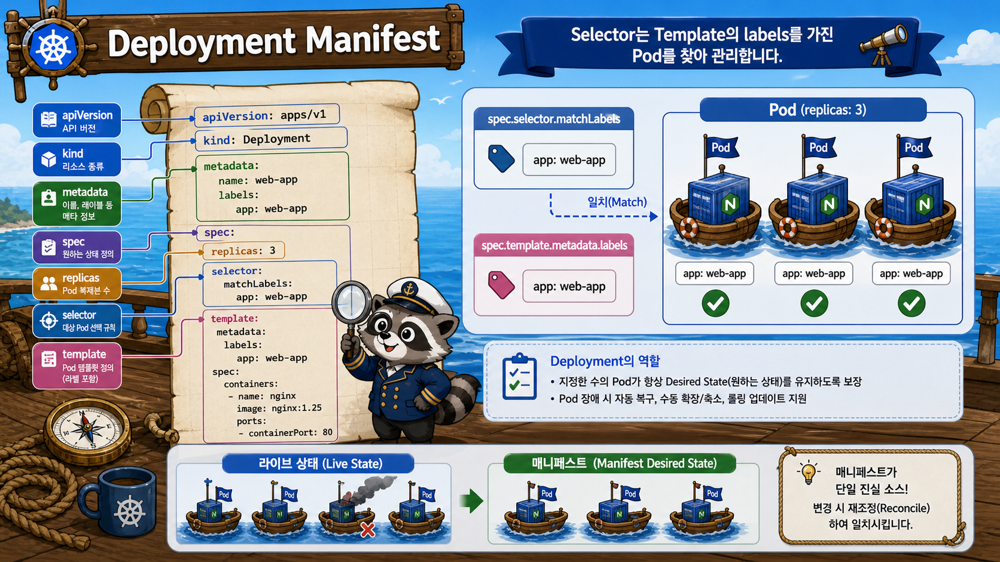

# 5교시: Deployment Manifest 해부



## 수업 목표
- Deployment manifest를 `apiVersion`, `kind`, `metadata`, `spec` 단위로 읽는다.
- `selector`와 `template.labels`가 왜 반드시 맞아야 하는지 설명한다.
- manifest와 live cluster 상태를 비교하는 명령을 익힌다.

## 전체 manifest
```yaml
apiVersion: apps/v1
kind: Deployment
metadata:
  name: hello-web
  namespace: week3
  labels:
    app: hello-web
spec:
  replicas: 2
  selector:
    matchLabels:
      app: hello-web
  template:
    metadata:
      labels:
        app: hello-web
    spec:
      containers:
        - name: nginx
          image: nginx:1.27
          ports:
            - containerPort: 80
```

## apiVersion과 kind
| 필드 | 설명 |
|---|---|
| `apiVersion: apps/v1` | Deployment는 `apps` API group에 속한다 |
| `kind: Deployment` | 만들 resource 종류 |

Pod는 `v1`이지만 Deployment는 `apps/v1`이다. Kubernetes object마다 API group/version이 다를 수 있다.

## metadata
| 필드 | 설명 |
|---|---|
| `name` | namespace 안에서 resource 이름 |
| `namespace` | 배포 위치 |
| `labels` | 조회, grouping, 운영 분류용 metadata |

조회 예:
```bash
kubectl -n week3 get deployment hello-web --show-labels
kubectl -n week3 get pods -l app=hello-web
```

## spec.replicas
`replicas: 2`는 "Pod 두 개를 유지하고 싶다"는 desired state다.

```bash
kubectl -n week3 scale deployment hello-web --replicas=3
kubectl -n week3 get deploy,pod -l app=hello-web
kubectl -n week3 scale deployment hello-web --replicas=2
```

scale 명령은 live object를 바꾼다. 수업에서는 manifest와 live state가 달라질 수 있다는 점을 보여주기 위해 짧게 사용한다. 운영에서는 Git/manifest 기준과 cluster live state가 어긋나는 문제를 Argo CD에서 다시 다룬다.

## selector와 template label
Deployment에서 가장 중요한 연결이다.

```yaml
selector:
  matchLabels:
    app: hello-web
template:
  metadata:
    labels:
      app: hello-web
```

| 값 | 역할 |
|---|---|
| `selector.matchLabels` | Deployment가 관리할 Pod를 찾는 기준 |
| `template.metadata.labels` | Deployment가 새로 만들 Pod에 붙이는 label |

이 둘이 어긋나면 controller가 원하는 Pod를 찾지 못한다. Kubernetes는 Deployment 생성 시 selector/template label 불일치를 강하게 막지만, Service selector 불일치는 쉽게 만들 수 있다. 그래서 6교시에서 Service endpoint 장애로 확인한다.

## template.spec
template 아래는 새 Pod의 spec이다.

| 필드 | 설명 |
|---|---|
| `containers[].name` | container 이름. rollout set image에서 사용 |
| `containers[].image` | 실행 image |
| `containerPort` | container가 사용하는 port 문서화 |

현재 image 확인:
```bash
kubectl -n week3 get deployment hello-web -o jsonpath='{.spec.template.spec.containers[0].image}{"\n"}'
```

## live state와 manifest 비교
```bash
kubectl -n week3 get deployment hello-web -o yaml | sed -n '1,120p'
kubectl -n week3 describe deployment hello-web
```

live yaml에는 manifest에 쓰지 않은 필드도 많다.

| live field | 의미 |
|---|---|
| `status` | 현재 상태 |
| `resourceVersion` | API Server 저장 버전 |
| `managedFields` | 어떤 client가 어떤 field를 관리했는지 |
| `conditions` | Available, Progressing 등 |

처음부터 모든 field를 외우지 않는다. 오늘은 `metadata`, `spec`, `status`, `events`를 구분하는 것이 중요하다.

## 한 줄 요약
```text
Deployment manifest의 핵심은 replicas, selector, template이며,
selector와 template label이 controller의 소유 관계를 만든다.
```

## Evidence Note
```markdown
# W3D5S5 Manifest
- apiVersion:
- kind:
- replicas:
- selector:
- template label:
- current image:
- live status에서 확인한 condition:
```
