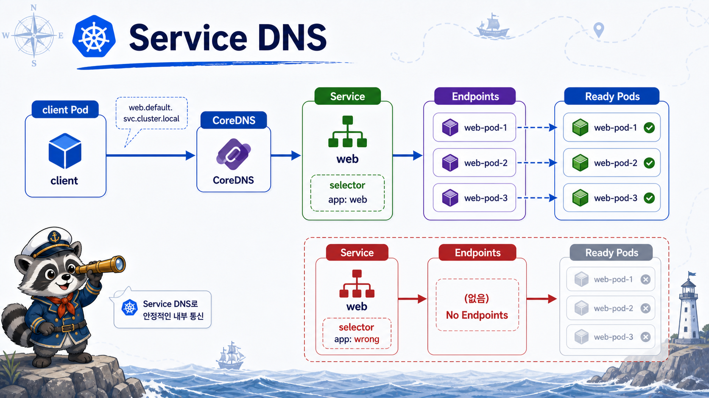

# 6교시: Service와 내부 DNS



## 수업 목표
- Pod IP가 안정적인 접근 계약이 아니라는 점을 설명한다.
- Service의 selector가 Pod label을 endpoint로 연결하는 흐름을 확인한다.
- cluster 내부에서 service name DNS로 접근하는 방식을 curlbox로 검증한다.

## 왜 Service가 필요한가
Deployment는 Pod를 다시 만들 수 있다. 이때 Pod IP는 바뀔 수 있다.

```text
Pod A: 10.244.0.12
Pod 삭제/재생성
Pod B: 10.244.0.18
```

client가 Pod IP를 직접 알고 있으면 재생성 때마다 연결이 깨진다. Service는 바뀌는 Pod IP 뒤에 안정적인 접근 지점을 제공한다.

```text
client
  -> http://hello-web
  -> Service hello-web
  -> endpoints
  -> Ready Pods
```

## Service manifest
```yaml
apiVersion: v1
kind: Service
metadata:
  name: hello-web
  namespace: week3
spec:
  type: ClusterIP
  selector:
    app: hello-web
  ports:
    - name: http
      port: 80
      targetPort: 80
```

| 필드 | 의미 |
|---|---|
| `type: ClusterIP` | cluster 내부에서 접근 가능한 가상 IP |
| `selector.app` | 연결할 Pod label |
| `port` | Service가 받을 port |
| `targetPort` | Pod/container 쪽으로 보낼 port |

## 그림에서 덜어낸 세부 구조
이미지는 `client -> CoreDNS -> Service -> Endpoints -> Ready Pods` 흐름만 단순하게 보여준다. 실제 troubleshooting에서는 아래 항목을 따로 확인해야 한다.

| 항목 | 확인 명령 | 해석 기준 |
|---|---|---|
| Service DNS | `kubectl -n week3 run curlbox --rm -it --image=curlimages/curl:8.8.0 --restart=Never -- nslookup hello-web` | 같은 namespace에서는 `hello-web` 이름으로 해석되어야 한다 |
| ClusterIP | `kubectl -n week3 get svc hello-web` | Pod IP와 달리 Service가 유지되는 동안 안정적인 내부 IP다 |
| selector | `kubectl -n week3 get svc hello-web -o jsonpath='{.spec.selector}'` | Pod label과 정확히 맞아야 endpoint가 생긴다 |
| Pod label | `kubectl -n week3 get pods --show-labels` | Service selector가 찾는 label이 Pod에 붙어 있어야 한다 |
| Endpoints | `kubectl -n week3 get endpoints hello-web` | Ready 상태인 Pod IP와 port가 보여야 한다 |
| EndpointSlice | `kubectl -n week3 get endpointslice -l kubernetes.io/service-name=hello-web` | 최근 Kubernetes에서는 EndpointSlice가 endpoint 정보를 더 세밀하게 나눠 관리한다 |

중요한 점은 DNS가 성공해도 application 통신이 성공한다는 뜻은 아니라는 것이다. DNS는 Service 이름을 찾는 단계이고, 실제 traffic은 Service selector가 만든 endpoint로 전달된다.

```text
DNS 성공 + endpoint 없음 = 이름은 찾았지만 보낼 Pod가 없음
DNS 실패 = Service 이름, namespace, CoreDNS 상태부터 확인
endpoint 있음 + curl 실패 = Pod readiness, container port, app 응답, NetworkPolicy를 확인
```

## Service 생성
```bash
export NS=week3
export LAB=week3/day5/labs/k8s-first-app

kubectl apply -f "$LAB/service.yaml"
kubectl -n "$NS" get svc hello-web
kubectl -n "$NS" get endpoints hello-web
```

끝난 뒤에는 selector, label, endpoint가 한 줄로 이어지는지 확인한다.

```bash
kubectl -n "$NS" get svc hello-web -o wide
kubectl -n "$NS" get pods -l app=hello-web --show-labels -o wide
kubectl -n "$NS" get endpoints hello-web
```

성공 기준:
```text
Service TYPE은 ClusterIP다.
Endpoints에 Pod IP:80이 2개 보인다.
```

## Service DNS 확인
cluster 내부 Pod에서 접근한다.

```bash
kubectl -n "$NS" run curlbox --rm -it --image=curlimages/curl:8.8.0 --restart=Never -- \
  curl -sI http://hello-web
```

성공 패턴:
```text
HTTP/1.1 200 OK
Server: nginx
```

가능한 DNS 이름:
| 이름 | 설명 |
|---|---|
| `hello-web` | 같은 namespace 안에서 짧은 이름 |
| `hello-web.week3` | namespace 포함 |
| `hello-web.week3.svc.cluster.local` | 전체 cluster DNS 이름 |

## selector 장애 만들기
Service selector를 일부러 틀리게 바꾼다.

```bash
kubectl -n "$NS" patch service hello-web -p '{"spec":{"selector":{"app":"wrong-label"}}}'
kubectl -n "$NS" get endpoints hello-web
```

예상:
```text
ENDPOINTS가 비어 있음
```

이 상태는 backend Pod가 죽은 것이 아닐 수도 있다. Service가 selector로 Pod를 못 찾는 것이다.

운영에서 이 유형은 자주 나온다. Deployment는 정상이고 Pod도 Running인데 Service endpoint만 비어 있으면, app 장애처럼 보이지만 실제로는 `selector`와 `label` 계약이 깨진 상태일 수 있다.

확인:
```bash
kubectl -n "$NS" get pods -l app=hello-web
kubectl -n "$NS" describe svc hello-web
```

비교 확인:
```bash
kubectl -n "$NS" get svc hello-web -o jsonpath='{.spec.selector}{"\n"}'
kubectl -n "$NS" get pods --show-labels
```

복구:
```bash
kubectl apply -f "$LAB/service.yaml"
kubectl -n "$NS" get endpoints hello-web
```

## Week4 Ingress와의 연결
Ingress는 직접 Pod로 가지 않는다. 보통 Ingress Controller가 Service로 traffic을 보낸다.

```text
browser/curl
  -> Ingress Controller
  -> Ingress rule
  -> Service
  -> Endpoint
  -> Pod
```

그래서 Service selector/endpoint를 못 읽으면 Ingress 장애도 분석하기 어렵다.

## 한 줄 요약
```text
Service는 Pod IP를 숨기고 selector로 Ready Pod endpoint를 찾아주는 안정적인 내부 접근점이다.
```

## Evidence Note
```markdown
# W3D5S6 Service
- Service name:
- ClusterIP:
- selector:
- endpoint count:
- curlbox result:
- selector 장애 시 endpoint:
- 복구 후 endpoint:
```
