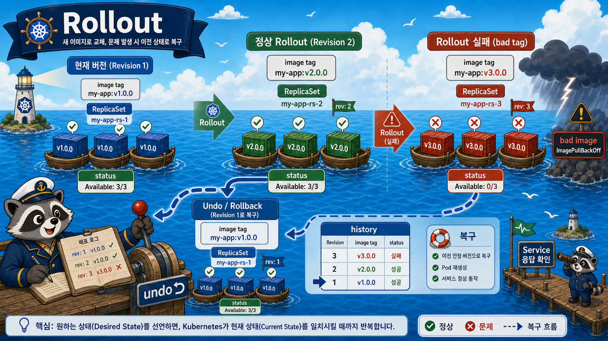

# 7교시: Rollout과 내부 통신 검증



## 수업 목표
- Deployment image 변경이 새 ReplicaSet과 rollout으로 이어지는 흐름을 확인한다.
- 정상 rollout과 실패 rollout의 증거를 구분한다.
- `rollout status`, `history`, `undo`를 이용해 복구 흐름을 맛본다.

## Rollout이 필요한 이유
운영에서는 image tag 변경이 곧 배포다. Docker Compose에서는 `image`를 바꾸고 다시 `up`하는 방식에 가까웠지만, Kubernetes Deployment는 Pod template 변경을 rollout으로 관리한다.

```text
Deployment template image 변경
  -> 새 ReplicaSet 생성
  -> 새 Pod 생성
  -> Ready 확인
  -> 이전 Pod 감소
```

## 현재 상태 확인
```bash
export NS=week3

kubectl -n "$NS" get deployment hello-web
kubectl -n "$NS" rollout history deployment/hello-web
kubectl -n "$NS" get deployment hello-web -o jsonpath='{.spec.template.spec.containers[0].image}{"\n"}'
```

## 정상 image 변경
```bash
kubectl -n "$NS" set image deployment/hello-web nginx=nginx:1.27-alpine
kubectl -n "$NS" rollout status deployment/hello-web
kubectl -n "$NS" get deploy,rs,pod -l app=hello-web
kubectl -n "$NS" rollout history deployment/hello-web
```

성공 기준:
```text
deployment "hello-web" successfully rolled out
READY가 2/2로 돌아온다.
새 ReplicaSet이 생긴다.
```

Service 통신 재확인:
```bash
kubectl -n "$NS" run curlbox-rollout --rm -it --image=curlimages/curl:8.8.0 --restart=Never -- \
  curl -sI http://hello-web
```

## 실패 image 변경
존재하지 않는 tag로 바꿔 실패 rollout을 만든다.

```bash
kubectl -n "$NS" set image deployment/hello-web nginx=nginx:not-a-real-tag
kubectl -n "$NS" rollout status deployment/hello-web --timeout=20s || true
kubectl -n "$NS" get pods -l app=hello-web
kubectl -n "$NS" describe deployment hello-web
```

예상 증거:
| 증거 | 의미 |
|---|---|
| rollout timeout | 새 revision이 성공하지 못함 |
| 새 Pod `ImagePullBackOff` | image tag 오류 |
| 기존 Pod 일부 Running | rolling update 중 기존 replica가 남아 있을 수 있음 |
| Deployment condition | Progressing/Available 상태 확인 |

중요한 점은 실패 rollout이 곧바로 전체 서비스 중단을 의미하지 않을 수 있다는 것이다. rolling update 전략 때문에 기존 Pod가 남아 있으면 Service는 여전히 응답할 수 있다. 하지만 배포는 실패한 상태이므로 반드시 복구해야 한다.

## undo로 복구
```bash
kubectl -n "$NS" rollout undo deployment/hello-web
kubectl -n "$NS" rollout status deployment/hello-web
kubectl -n "$NS" get deploy,rs,pod -l app=hello-web
kubectl -n "$NS" rollout history deployment/hello-web
```

복구 후 Service 확인:
```bash
kubectl -n "$NS" run curlbox-after-undo --rm -it --image=curlimages/curl:8.8.0 --restart=Never -- \
  curl -sI http://hello-web
```

## tag 기준 연결
W3D3에서 Git tag, app version, Docker image tag를 다뤘다. Kubernetes rollout은 이 tag 기준과 직접 연결된다.

| 나쁜 기준 | 문제 |
|---|---|
| 항상 `latest` | 무엇이 배포됐는지 추적 어려움 |
| commit과 image tag 불일치 | 장애 시 원인 commit 추적 어려움 |
| 수동 변경만 기록 | rollback 근거 부족 |

| 권장 기준 | 설명 |
|---|---|
| app version과 image tag 연결 | 웹 애플리케이션 version과 배포 image를 맞춤 |
| Git SHA 또는 release tag 기록 | 어떤 소스에서 나온 image인지 추적 |
| rollout history/evidence 저장 | 실패 시 되돌릴 기준 확보 |

## Argo CD와의 연결
오늘은 `kubectl set image`로 live object를 직접 바꿨다. Week4에서는 Git에 있는 manifest가 기준이 되고, Argo CD가 cluster 상태와 Git 상태를 비교한다.

```text
Day5: kubectl로 rollout 흐름 이해
Week4: Argo CD로 GitOps sync/drift 이해
```

## 한 줄 요약
```text
Rollout은 image 변경을 단순 교체가 아니라 revision, ReplicaSet, 상태 확인, undo가 있는 배포 흐름으로 만든다.
```

## Evidence Note
```markdown
# W3D5S7 Rollout
- initial image:
- changed image:
- successful rollout evidence:
- failed image:
- failure symptom:
- undo result:
- Service response after undo:
- image tag 운영 기준:
```
