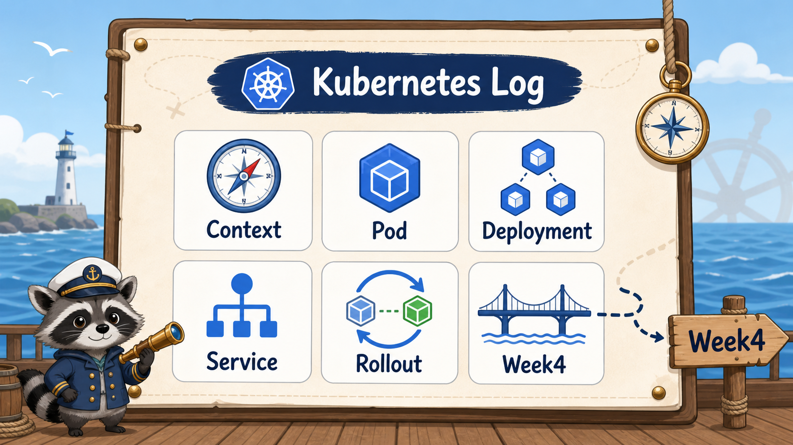

# 8교시: 구름 EXP 배움일기



## 수업 목표
- Day5에서 확인한 Pod, Deployment, Service, rollout evidence를 정리한다.
- 장애 상태를 "느낌"이 아니라 명령 출력과 event/log로 설명한다.
- Week4의 Helm add-on 탐험으로 이어질 질문을 남긴다.

## 오늘 정리할 핵심
오늘은 Kubernetes object를 많이 외운 날이 아니다. 아래 흐름을 손으로 확인한 날이다.

```text
context 확인
  -> namespace 생성
  -> Pod 실행
  -> Pod 장애 읽기
  -> Deployment로 replica 유지
  -> Service로 내부 접근
  -> rollout 실패와 undo
```

## evidence를 남기는 기준
그림에는 `Context`, `Pod`, `Deployment`, `Service`, `Rollout`, `Week4`만 남겼다. 대신 제출하거나 회고할 때는 아래처럼 "무엇을 봤는지"와 "그 출력이 무슨 뜻인지"를 본문에 남긴다.

| 항목 | 남길 evidence | 해석 문장 예시 |
|---|---|---|
| Context | `kubectl config current-context` | 내가 어느 cluster에 명령을 보내는지 확인했다 |
| Namespace | `kubectl get ns week3` | 실습 object를 기본 namespace와 분리했다 |
| Pod | `kubectl -n week3 get pods -o wide` | Pod 상태, node 배치, Pod IP를 함께 확인했다 |
| 장애 Pod | `kubectl -n week3 describe pod ...` | event에서 image pull 실패나 restart 원인을 찾았다 |
| Deployment | `kubectl -n week3 get deploy,rs,pod` | Deployment가 ReplicaSet과 Pod 수를 맞추는 것을 확인했다 |
| Service | `kubectl -n week3 get svc,endpoints hello-web` | Service selector가 Ready Pod endpoint로 연결되는지 확인했다 |
| Rollout | `kubectl -n week3 rollout status deploy/hello-web` | 새 version 배포가 성공했는지 rollout 상태로 확인했다 |
| Undo | `kubectl -n week3 rollout undo deploy/hello-web` | 실패한 image 배포를 이전 revision으로 되돌렸다 |

## 배움일기 권장 구조
```markdown
# W3D5 Kubernetes 첫 앱 실행

## 1. 오늘 이해한 개념
- Pod:
- Deployment:
- Service:
- Rollout:

## 2. 오늘 남긴 evidence
- context:
- 첫 Pod 상태:
- ImagePullBackOff event:
- CrashLoopBackOff log:
- Deployment READY:
- Service endpoint:
- curlbox 응답:
- rollout undo 결과:

## 3. 헷갈렸던 지점
- Pod와 container:
- selector와 label:
- Service port와 targetPort:
- rollout과 rollback:

## 4. 다시 해볼 실습
- Pod 장애 재현:
- Service selector 장애:
- 실패 image rollout 후 undo:

## 5. Week4 질문
- Helm:
- metrics-server:
- ingress-nginx:
- Prometheus/Grafana:
- RBAC/Kyverno:
- Argo CD:
- Istio/Kiali:
```

## 오늘의 체크 질문
| 질문 | 스스로 답해보기 |
|---|---|
| `kubectl`은 어디에 요청을 보내는가? | API Server |
| Pod가 삭제되면 직접 Pod와 Deployment Pod는 어떻게 다른가? | controller 유무 |
| `ImagePullBackOff`에서 왜 logs가 없을 수 있는가? | container가 시작하지 못했기 때문 |
| Service endpoint가 비어 있으면 먼저 무엇을 보는가? | selector와 Pod label |
| rollout 실패 후 어떤 명령으로 되돌렸는가? | `kubectl rollout undo` |
| Week4에서 add-on 설치는 어떤 도구로 통일하는가? | Helm |

## Week4 예고
Week4는 오늘 만든 기본 object 위에 운영 도구를 하나씩 얹는다.

| Week4 주제 | Day5와의 연결 |
|---|---|
| Helm + metrics-server | Pod resource 사용량 보기 |
| ingress-nginx | Service를 외부 traffic에 연결 |
| kube-prometheus-stack | Pod/Deployment 상태를 dashboard로 관찰 |
| RBAC + Kyverno | 배포 권한과 policy deny 확인 |
| Argo CD | Git manifest와 cluster 상태 동기화 |
| Istio/Kiali | Service 간 traffic을 mesh로 시각화 |

## 마무리 기준
```text
오늘의 성공은 모든 명령을 외우는 것이 아니다.
실패했을 때 get -> describe -> logs/events -> 복구 순서로 움직일 수 있으면 성공이다.
```

## Evidence Note
```markdown
# W3D5S8 Learning Journal
- 오늘 가장 명확해진 개념:
- 아직 헷갈리는 개념:
- 가장 유용했던 명령:
- 다시 재현할 장애:
- Week4에서 기대하는 plugin/add-on:
```
