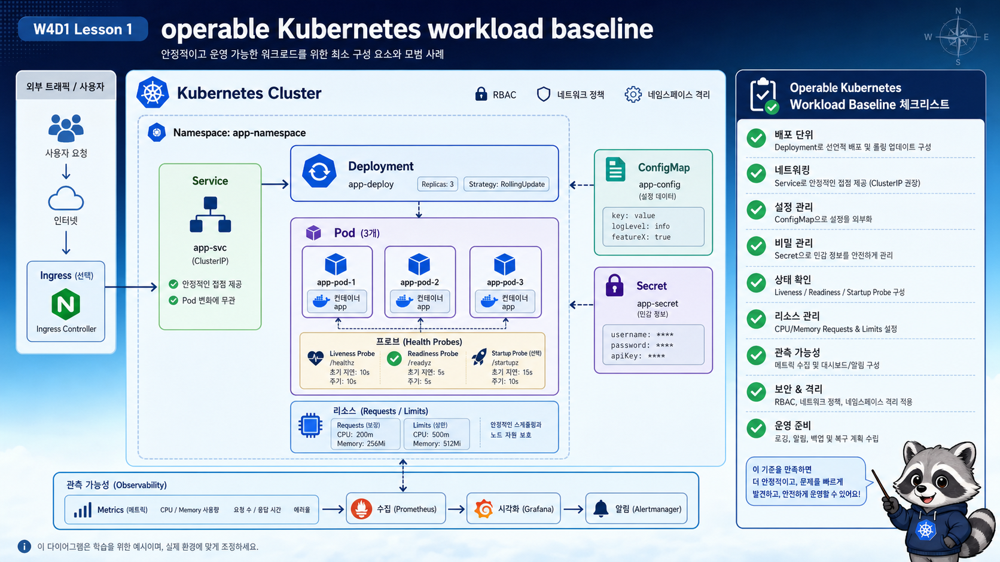

# 1교시: Week3 Kubernetes 2일 요약 + 운영 가능한 Workload 기준



## 수업 목표
- W3D4~W3D5에서 배운 Kubernetes 기본 요소를 운영 기준으로 다시 묶는다.
- Pod/Deployment/Service가 “실행”의 기준이라면 config/secret/probe/resource/metric은 “운영”의 기준임을 설명한다.
- 오늘 실습에서 무엇을 evidence로 남길지 정한다.

## Week3에서 이미 한 것
Week3 Day4에서는 Kubernetes가 왜 필요한지, control plane과 node가 어떤 역할을 하는지 봤다. Day5에서는 Pod, Deployment, Service를 직접 만들고 `kubectl get/describe/logs/rollout`으로 상태를 확인했다.

이제 질문이 바뀐다.

| Week3 질문 | Week4 Day1 질문 |
|---|---|
| Pod가 뜨는가 | traffic을 받아도 되는 상태인가 |
| Deployment가 replica를 맞추는가 | resource와 health 기준을 선언했는가 |
| Service DNS로 접근되는가 | endpoint에서 빠져야 할 Pod를 분리할 수 있는가 |
| 로그를 볼 수 있는가 | metric으로 사용량을 볼 수 있는가 |
| YAML을 적용할 수 있는가 | add-on 설치와 변경 이력을 Helm으로 관리하는가 |

## 강의 시작 시 던질 질문
학생들에게 먼저 아래 질문을 던진다.

```text
Pod 2개가 Running이고 Service도 있다.
그럼 이 서비스는 운영 가능한 상태인가?
```

정답은 “아직 모른다”다. 이유는 다음 증거가 아직 없기 때문이다.

| 아직 모르는 것 | 필요한 증거 |
|---|---|
| 환경별 설정이 분리되어 있는가 | ConfigMap, Secret, env 주입 |
| secret이 image나 Git에 박혀 있지 않은가 | Secret 관리 방식, 권한 |
| 사용자를 받을 준비가 되었는가 | readinessProbe, endpoint |
| 죽은 process를 회복할 수 있는가 | livenessProbe, restart count |
| node에 배치 가능한 자원 기준이 있는가 | requests |
| 폭주했을 때 상한이 있는가 | limits |
| 실제 사용량을 볼 수 있는가 | metrics-server, `kubectl top` |

이 질문은 앞으로 Kubernetes 수업 전체를 관통한다. “띄웠다”는 개발자의 관점이고, “운영 가능하다”는 운영자의 관점이다.

## 운영 가능한 workload의 최소 기준
운영 가능한 workload는 Running 상태 하나로 판단하지 않는다.

| 기준 | Kubernetes 요소 | 왜 필요한가 |
|---|---|---|
| 설정 분리 | ConfigMap | image 재빌드 없이 환경별 값 변경 |
| 민감정보 분리 | Secret | token/password를 image와 Git에서 분리 |
| 준비 상태 | readinessProbe | 준비 안 된 Pod로 traffic 유입 방지 |
| 생존 상태 | livenessProbe | 멈춘 process를 자동 재시작 |
| 시작 보호 | startupProbe | 느린 앱이 liveness에 의해 조기 재시작되는 상황 방지 |
| 자원 선언 | requests/limits | scheduling, OOMKilled, throttling, 비용 판단 |
| 관찰 | metrics-server | CPU/memory 사용량과 HPA preview |

## 운영 사고 시나리오로 보기
다음 상황을 가정한다.

```text
새 버전의 backend를 배포했다.
Pod는 Running이다.
하지만 사용자는 502 또는 timeout을 본다.
개발자는 "Pod 떠 있는데요?"라고 말한다.
운영자는 "Ready endpoint가 있나요?"라고 묻는다.
```

이때 확인 순서는 다음과 같다.

| 순서 | 명령 | 해석 |
|---|---|---|
| 1 | `kubectl -n week4 get pod` | Running/Ready/Restart 개요 |
| 2 | `kubectl -n week4 get endpoints runtime-api` | Service가 보낼 endpoint 존재 여부 |
| 3 | `kubectl -n week4 describe pod <pod>` | readiness 실패 reason |
| 4 | `kubectl -n week4 logs <pod>` | app process log |
| 5 | `kubectl top pod -n week4` | resource 압박 여부 |

학생들이 자주 놓치는 포인트는 `logs`부터 보는 것이다. 로그도 중요하지만 traffic routing 문제는 `Service`, `Endpoint`, `Readiness` 증거가 먼저일 때가 많다.

## Running과 Ready는 다르다
Kubernetes에서 `STATUS=Running`은 container process가 실행 중이라는 뜻에 가깝다. `READY=1/1`은 probe 기준으로 traffic을 받을 준비가 되었다는 뜻이다.

```text
Running but not Ready
  -> process는 떠 있다
  -> readinessProbe가 실패한다
  -> Service endpoint에서 제외될 수 있다
  -> 사용자 traffic을 받으면 안 되는 상태일 수 있다
```

이 차이를 모르면 “Pod는 떠 있는데 왜 서비스가 안 되지?”라는 질문에서 길을 잃는다.

## 오늘 다룰 manifest의 변화
W3D5의 Deployment는 의도적으로 단순했다.

```yaml
containers:
  - name: nginx
    image: nginx:1.27
    ports:
      - containerPort: 80
```

W4D1에서는 같은 Deployment라도 운영 기준이 들어간다.

```yaml
containers:
  - name: api
    image: hashicorp/http-echo:1.0
    envFrom:
      - configMapRef:
          name: api-config
      - secretRef:
          name: api-secret
    readinessProbe:
      httpGet:
        path: /
        port: http
    livenessProbe:
      httpGet:
        path: /
        port: http
    resources:
      requests:
        cpu: 25m
        memory: 32Mi
      limits:
        cpu: 100m
        memory: 64Mi
```

핵심은 YAML이 길어지는 것이 아니다. Kubernetes에게 판단 기준을 알려주는 것이다.

## 오늘의 큰 흐름
```text
기본 workload 배포
  -> ConfigMap/Secret 주입
  -> readiness/liveness 확인
  -> resources 확인
  -> Helm으로 metrics-server 설치
  -> kubectl top으로 resource metric 확인
```

## 실제 출력으로 보는 차이
정상으로 보이는 Pod 출력부터 본다.

```bash
kubectl -n week4 get pod -l app=runtime-api
```

예상 출력:
```text
NAME                           READY   STATUS    RESTARTS   AGE
runtime-api-7c7d8f7f9f-bxk6m   1/1     Running   0          2m
runtime-api-7c7d8f7f9f-vs8nd   1/1     Running   0          2m
```

이 출력은 “process가 실행 중이고 readiness도 통과했다”는 뜻이다. 반면 다음 출력은 전혀 다르게 해석해야 한다.

```text
NAME                                         READY   STATUS    RESTARTS   AGE
runtime-api-bad-readiness-66b5c8d7d8-kd2x4   0/1     Running   0          1m
```

`STATUS`만 보면 Running이지만, `READY`가 `0/1`이므로 Service traffic을 받아서는 안 되는 상태다.

Service endpoint도 함께 본다.

```bash
kubectl -n week4 get endpoints runtime-api
```

정상 출력:
```text
NAME          ENDPOINTS                           AGE
runtime-api   10.244.0.12:8080,10.244.0.13:8080   2m
```

문제 출력:
```text
NAME          ENDPOINTS   AGE
runtime-api   <none>      2m
```

여기서 핵심은 “Pod가 있느냐”보다 “Service가 보낼 수 있는 endpoint가 있느냐”다.

## 오늘의 확인 순서
오늘은 명령어 개수를 늘리는 날이 아니다. 어떤 기준을 manifest에 적어야 운영자가 판단할 수 있는가를 잡는 날이다.

| 순서 | 확인 | 명령 |
|---|---|---|
| 1 | cluster/context | `kubectl config current-context` |
| 2 | workload 상태 | `kubectl -n week4 get deploy,pod` |
| 3 | traffic 준비 | `kubectl -n week4 get svc,endpoints` |
| 4 | 상태 이유 | `kubectl -n week4 describe pod <pod>` |
| 5 | runtime config | `kubectl -n week4 describe pod <pod>` |
| 6 | resource 기준 | `kubectl -n week4 describe pod <pod>` |
| 7 | resource metric | `kubectl top pod -n week4` |

## 학생들이 헷갈릴 수 있는 말
| 표현 | 정리 |
|---|---|
| Pod가 떴다 | process가 실행 중이라는 뜻에 가깝다 |
| 서비스가 된다 | Service endpoint, DNS, app response까지 확인해야 한다 |
| 헬스체크가 있다 | readiness/liveness/startup 중 무엇인지 구분해야 한다 |
| 리소스를 줬다 | request인지 limit인지 분리해야 한다 |
| metric이 있다 | metrics-server인지 Prometheus인지 목적을 구분해야 한다 |

## Evidence Note
```markdown
# W4D1S1 운영 가능한 workload 기준
- Running과 Ready의 차이:
- 운영 가능한 workload에 필요한 기준 3가지:
- 오늘 반드시 남길 evidence:
- 내가 가장 자주 놓칠 것 같은 확인 명령:
```

## 한 줄 요약
```text
Kubernetes에서 앱을 띄우는 것과 운영 가능한 workload를 만드는 것은 다르다.
```
