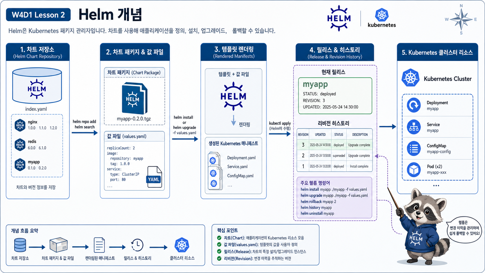

# 2교시: Helm 기본 개념



## 수업 목표
- Helm의 chart, repository, release, values, revision을 구분한다.
- `kubectl apply -f remote-url` 방식이 왜 설치 표준으로 부족한지 설명한다.
- Week4 add-on 설치 표준을 `helm upgrade --install`로 통일한다.

## Helm을 왜 쓰는가
Kubernetes add-on은 보통 리소스 하나가 아니다. metrics-server만 해도 Deployment, Service, ServiceAccount, RBAC, APIService 같은 리소스가 함께 필요하다. ingress-nginx, kube-prometheus-stack, Argo CD, Istio는 더 복잡하다.

원격 YAML을 그대로 적용하면 빠르지만 다음 질문에 약하다.

| 질문 | remote YAML만 쓸 때 문제 |
|---|---|
| 어떤 버전을 설치했는가 | 파일 URL이나 commit을 추적하지 않으면 애매함 |
| 어떤 설정을 바꿨는가 | 긴 명령 또는 임시 수정이 사라짐 |
| 같은 설치를 다시 할 수 있는가 | 재현성이 낮아짐 |
| 변경 이력은 어디 있는가 | release revision이 없음 |
| 제거는 어떻게 하는가 | label 추적 실패 시 리소스가 남을 수 있음 |

## 수동 설치가 점점 무너지는 지점
처음에는 이런 방식이 쉬워 보인다.

```bash
kubectl apply -f https://example.com/install.yaml
```

하지만 운영에서는 곧 다음 문제가 나온다.

| 상황 | 수동 설치의 문제 |
|---|---|
| 개발 cluster와 운영 cluster 설정이 다름 | 파일을 직접 수정하거나 별도 문서가 필요 |
| 설치 옵션이 길어짐 | 명령 히스토리에만 남고 repo에 남지 않음 |
| 업그레이드가 필요함 | 현재 버전과 변경점을 추적하기 어려움 |
| 장애가 나서 되돌려야 함 | 이전 적용 상태가 명확하지 않음 |
| 제거 후 재설치 | 어떤 리소스가 설치됐는지 추적해야 함 |

Helm은 이 문제를 release와 values로 정리한다. 특히 values file을 Git에 남기면 “우리 팀은 이 add-on을 이런 옵션으로 설치한다”는 운영 지식이 문서가 아니라 코드로 남는다.

## Helm 용어
| 용어 | 설명 | 예시 |
|---|---|---|
| Chart | 설치 패키지 | `metrics-server/metrics-server` |
| Repository | chart 저장소 | `https://kubernetes-sigs.github.io/metrics-server/` |
| Release | cluster에 설치된 chart instance | `metrics-server` |
| Values | chart에 넣는 설정 | `values.yaml` |
| Revision | release 변경 이력 | `helm history` |

## Metric Server 설치
```bash
helm repo add metrics-server https://kubernetes-sigs.github.io/metrics-server/

helm repo update metrics-server

helm upgrade --install metrics-server metrics-server/metrics-server -n kube-system

helm list -n kube-system
```

## 실제 명령 출력으로 용어 연결하기
용어는 외우는 것보다 출력에서 찾는 것이 빠르다.

```bash
helm list -n kube-system
```

예상 출력:
```text
NAME             NAMESPACE    REVISION    UPDATED                 STATUS      CHART                   APP VERSION
metrics-server   kube-system  1           2026-06-26 10:20:31     deployed    metrics-server-3.x.x    0.x.x
```

출력 해석:
| 출력 컬럼 | Helm 용어 | 의미 |
|---|---|---|
| `NAME` | Release | cluster에 설치된 instance 이름 |
| `NAMESPACE` | Namespace | release가 설치된 namespace |
| `REVISION` | Revision | release 변경 횟수 |
| `STATUS` | Release 상태 | Helm 관점의 배포 상태 |
| `CHART` | Chart | 설치에 사용된 chart와 chart version |
| `APP VERSION` | App version | chart가 설치하는 app version |

여기서 `STATUS=deployed`는 Helm release가 배포됐다는 뜻이지, Pod가 반드시 Ready라는 뜻은 아니다. 그래서 Helm 출력과 `kubectl get pod`를 같이 봐야 한다.

## Helm은 template engine이기도 하다
Helm chart 안에는 template이 있고, values가 들어가면 Kubernetes manifest가 렌더링된다.

```text
chart template + values.yaml
  -> rendered Kubernetes manifests
  -> API Server apply
  -> release revision 기록
```

그래서 Helm을 쓴다는 것은 단순히 설치 명령을 외우는 것이 아니라 “설정 파일과 변경 이력을 남기는 설치 방식”을 쓰는 것이다.

## Chart와 Release를 꼭 구분한다
학생들이 가장 자주 헷갈리는 지점이다.

```text
Chart
  -> 설치 가능한 패키지
  -> 예: metrics-server/metrics-server

Release
  -> chart를 cluster에 설치한 결과물
  -> 예: kube-system namespace의 metrics-server release
```

같은 chart를 여러 release로 설치할 수 있다. 예를 들어 staging과 production ingress controller를 다른 namespace와 다른 values로 설치할 수도 있다. 그래서 실무에서는 release name 규칙이 중요하다.

| release name 예시 | 의미 |
|---|---|
| `metrics-server` | cluster 공통 add-on |
| `ingress-nginx` | 기본 ingress controller |
| `payments-api` | app release |
| `payments-api-canary` | canary release |

## values는 옵션 목록이 아니라 운영 정책이다
values file에는 단순 옵션이 아니라 환경별 운영 판단이 들어간다.

```yaml
replicaCount: 2
resources:
  requests:
    cpu: 100m
    memory: 128Mi
  limits:
    cpu: 500m
    memory: 512Mi
```

이 값은 “이 add-on은 최소 얼마의 자원을 요구하고, 최대 얼마까지 허용할 것인가”라는 운영 결정이다. 그래서 values를 문서 없이 명령줄 `--set`으로만 남기면 나중에 팀원이 재현하기 어렵다.

## `install`보다 `upgrade --install`
실습과 운영 자동화에서는 다음 형태가 편하다.

```bash
helm upgrade --install metrics-server metrics-server/metrics-server \
  --namespace kube-system \
  -f week4/day1/labs/helm-metrics-server/values.yaml
```

의미:
| 부분 | 의미 |
|---|---|
| `upgrade --install` | release가 있으면 갱신, 없으면 설치 |
| `metrics-server` | release name |
| `metrics-server/metrics-server` | repo/chart |
| `--namespace kube-system` | 설치 namespace |
| `-f values.yaml` | repo에 남긴 설정 파일 |

## revision이 생기는 이유
Helm release는 변경될 때 revision을 남긴다.

```bash
helm history metrics-server -n kube-system
```

예상 출력 형태:
```text
REVISION  UPDATED                  STATUS      CHART                 APP VERSION
1         Fri Jun 26 10:10:00      superseded  metrics-server-3.x.x  0.x.x
2         Fri Jun 26 10:25:00      deployed    metrics-server-3.x.x  0.x.x
```

이 revision 덕분에 “무엇을 언제 바꿨는가”를 확인하고, 문제가 생기면 rollback 명령으로 이전 revision을 다시 적용할 수 있다.

```bash
helm rollback metrics-server 1 -n kube-system
```

단, rollback이 항상 데이터까지 되돌리는 것은 아니다. Deployment, Service, ConfigMap 같은 Kubernetes manifest 상태를 되돌리는 것이고, DB schema나 외부 상태는 별도 전략이 필요하다.

## Helm이 모든 문제를 해결하지는 않는다
Helm은 설치와 변경 관리를 돕지만, values를 이해하지 못한 채 적용하면 장애를 더 빠르게 만들 수도 있다. 그래서 Week4에서는 Helm 명령과 함께 반드시 다음을 본다.

| 확인 | 명령 |
|---|---|
| release 목록 | `helm list -A` |
| release 상태 | `helm status <release> -n <ns>` |
| 적용 values | `helm get values <release> -n <ns>` |
| 생성 리소스 | `kubectl get all -n <ns>` |
| 이력 | `helm history <release> -n <ns>` |

## 반드시 비교해야 하는 두 방식
같은 설치라도 아래 두 방식의 차이를 말로 비교한다.

| 방식 | 장점 | 한계 |
|---|---|---|
| `kubectl apply -f remote-url` | 빠르고 단순함 | values, release, rollback, uninstall 추적이 약함 |
| `helm upgrade --install -f values.yaml` | 재현성, 변경 이력, 제거가 좋음 | chart와 values 이해가 필요함 |

정리하면 Helm이 더 멋있어서 쓰는 것이 아니다. 설치한 것을 다시 설명하고 되돌리기 위해 쓴다.

## Helm에서 바로 믿으면 안 되는 것
Helm은 강력하지만 다음 오해를 조심한다.

| 오해 | 실제 확인 |
|---|---|
| `helm install` 성공이면 앱도 성공 | `kubectl get pod`, `kubectl logs` 확인 필요 |
| `helm uninstall`이면 모든 것이 사라짐 | PVC/CRD/cluster-scoped resource는 남을 수 있음 |
| values file만 보면 실제 설정을 안다 | `helm get values`, `helm get manifest` 확인 |
| rollback이면 모든 상태가 이전으로 감 | DB schema, 외부 시스템, 데이터는 별도 관리 |

## 오늘 사용할 Helm 판단 문장
수업 중 Helm을 볼 때는 아래 문장으로 계속 되돌아온다.

```text
무엇을 설치했는가? chart
어디에 설치했는가? namespace
어떤 이름으로 설치했는가? release
어떤 설정으로 설치했는가? values
어떻게 바뀌었는가? revision/history
정말 동작하는가? kubectl evidence
```

## Evidence Note
```markdown
# W4D1S2 Helm 개념
- chart와 release 차이:
- values file에 남겨야 하는 이유:
- `upgrade --install`을 쓰는 이유:
- Helm으로도 해결되지 않는 것:
```

## 한 줄 요약
```text
Helm은 Kubernetes add-on을 설치하는 명령이 아니라, 설치 설정과 변경 이력을 남기는 운영 표준이다.
```
