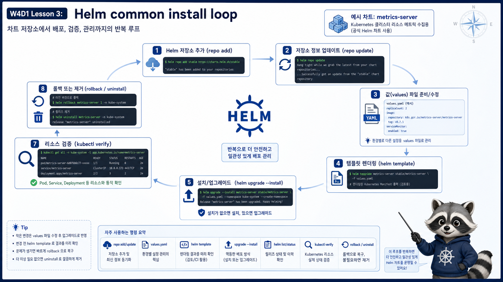

# 3교시: Helm 공통 설치 루프



## 수업 목표
- Week4에서 반복 사용할 Helm 설치 루프를 익힌다.
- chart repo, release, namespace, values file, 검증, 제거를 한 묶음으로 본다.
- metrics-server 설치 전에 Helm 명령이 어떤 증거를 남기는지 확인한다.

## 공통 설치 루프
Week4 add-on은 아래 루프를 반복한다.

```text
1. chart repo 등록
2. chart repo update
3. values file 확인
4. helm upgrade --install
5. helm list/status/history 확인
6. kubectl로 실제 리소스 확인
7. 필요하면 rollback 또는 uninstall
```

이 루프는 W4D1 metrics-server에서 끝나지 않는다. W4D2 ingress-nginx, W4D3 kube-prometheus-stack, W4D4 Kyverno, W4D5 Argo CD/Istio/Kiali까지 같은 패턴으로 반복한다.

| Day | add-on | 오늘 루프와 연결 |
|---|---|---|
| W4D1 | metrics-server | resource metric과 `kubectl top` |
| W4D2 | ingress-nginx | 외부 traffic 진입점 |
| W4D3 | kube-prometheus-stack | 관찰 stack |
| W4D4 | Kyverno | admission policy |
| W4D5 | Argo CD, Istio, Kiali | GitOps와 mesh preview |

그래서 오늘 Helm 루프를 허술하게 넘기면 뒤의 4일이 전부 흔들린다.

## repo add/update
```bash
helm repo add metrics-server https://kubernetes-sigs.github.io/metrics-server/
helm repo update
helm search repo metrics-server
```

`helm repo add`는 chart 저장소를 등록하고, `helm repo update`는 index를 갱신한다. chart가 보이지 않으면 설치 명령보다 repository 등록 상태를 먼저 본다.

확인 출력 예시:
```text
NAME                            CHART VERSION   APP VERSION
metrics-server/metrics-server   3.x.x           0.x.x
```

여기서 chart version과 app version은 다를 수 있다. chart version은 Helm 패키지의 버전이고, app version은 설치되는 애플리케이션의 버전이다.

| 버전 | 의미 |
|---|---|
| Chart Version | chart template/values 구조의 버전 |
| App Version | 실제 metrics-server app의 버전 |

## dry-run과 template
실제 cluster에 적용하기 전에 어떤 YAML이 만들어지는지 볼 수 있다.

```bash
helm template metrics-server metrics-server/metrics-server \
  --namespace kube-system \
  -f week4/day1/labs/helm-metrics-server/values.yaml
```

`helm template`은 API Server에 적용하지 않는다. 설치 전에 “어떤 리소스가 만들어질지”를 눈으로 보는 용도다.

렌더링 결과에서 최소한 아래를 찾는다.

```bash
helm template metrics-server metrics-server/metrics-server \
  --namespace kube-system \
  -f week4/day1/labs/helm-metrics-server/values.yaml \
  | grep -E "kind: Deployment|kind: APIService|--kubelet-insecure-tls"
```

예상 출력:
```text
kind: Deployment
            - --kubelet-insecure-tls
kind: APIService
```

이 확인은 매우 중요하다. values file에 썼다고 실제 manifest에 반영됐다고 가정하지 않는다. template 결과로 확인한다.

## 설치
```bash
helm upgrade --install metrics-server metrics-server/metrics-server \
  --namespace kube-system \
  -f week4/day1/labs/helm-metrics-server/values.yaml
```

예상 출력:
```text
Release "metrics-server" does not exist. Installing it now.
NAME: metrics-server
LAST DEPLOYED: Fri Jun 26 10:30:00 2026
NAMESPACE: kube-system
STATUS: deployed
REVISION: 1
```

이미 설치되어 있으면 문장이 달라질 수 있다.

```text
Release "metrics-server" has been upgraded. Happy Helming!
STATUS: deployed
REVISION: 2
```

두 출력의 차이는 중요하다. 첫 번째는 신규 설치이고, 두 번째는 기존 release를 upgrade한 것이다.

설치 후 바로 성공이라고 말하지 않는다. release와 실제 Pod 상태를 따로 확인한다.

```bash
helm list -n kube-system
helm status metrics-server -n kube-system
kubectl -n kube-system get deploy,pod -l app.kubernetes.io/name=metrics-server
```

`helm status`가 성공이어도 Pod가 Ready가 아닐 수 있다. Helm은 Kubernetes API에 리소스를 제출하고 release를 관리하지만, 애플리케이션이 정상 동작하는지까지 항상 보장하지 않는다.

확인해야 할 레이어:
| 레이어 | 명령 | 의미 |
|---|---|---|
| Helm release | `helm status` | chart가 release로 설치됐는가 |
| Kubernetes object | `kubectl get deploy,pod` | object가 만들어졌는가 |
| Pod readiness | `kubectl get pod` | container가 준비됐는가 |
| API aggregation | `kubectl get apiservice` | Metrics API가 붙었는가 |
| 사용자 명령 | `kubectl top` | 실제 metric 조회가 되는가 |

## values 확인
```bash
helm get values metrics-server -n kube-system
helm get manifest metrics-server -n kube-system | less
```

강의에서 중요한 것은 “내가 어떤 설정으로 설치했는지 다시 설명할 수 있는가”다. values file이 repo에 있어야 같은 설정을 다시 만들 수 있다.

`helm get values`와 repo의 values file을 비교한다.

```bash
cat week4/day1/labs/helm-metrics-server/values.yaml
helm get values metrics-server -n kube-system
```

두 결과가 다르면 누군가 명령줄 `--set`으로 설정을 추가했거나, 다른 파일로 upgrade했을 가능성이 있다. 이것은 운영 인수인계에서 자주 문제를 만든다.

## rollback과 uninstall
```bash
helm history metrics-server -n kube-system
helm rollback metrics-server 1 -n kube-system
helm uninstall metrics-server -n kube-system
```

rollback은 release revision을 기준으로 되돌린다. uninstall은 Helm release가 관리하는 리소스를 제거한다. 단, chart에 따라 PVC나 CRD는 남을 수 있으므로 각 chart의 정리 정책을 확인해야 한다.

history 출력 예시:
```text
REVISION  UPDATED                  STATUS      CHART                   APP VERSION  DESCRIPTION
1         Fri Jun 26 10:20:31      superseded  metrics-server-3.x.x    0.x.x        Install complete
2         Fri Jun 26 10:31:02      deployed    metrics-server-3.x.x    0.x.x        Upgrade complete
```

이 출력에서 현재 적용된 revision은 `STATUS=deployed`인 행이다. rollback을 하면 새 revision이 하나 더 생기며 이전 manifest 상태를 다시 적용한다.

## 실패 상황별 판단
| 상황 | 먼저 볼 것 | 이유 |
|---|---|---|
| chart를 찾지 못함 | `helm repo list`, `helm search repo` | repository/index 문제 |
| release가 이미 있음 | `helm history`, `helm get values` | 기존 설치와 충돌 가능 |
| Pod가 Pending | `kubectl describe pod` | scheduling/resource 문제 |
| Pod가 CrashLoop | `kubectl logs` | app 실행 문제 |
| APIService가 False | `kubectl describe apiservice` | metrics API 연결 문제 |
| uninstall 후에도 리소스가 남음 | CRD/PVC/cluster-scoped resource | chart 정리 정책 확인 |

## 실수 패턴
| 실수 | 증상 | 해결 |
|---|---|---|
| repo update 생략 | chart를 찾지 못함 | `helm repo update` |
| namespace 혼동 | release가 안 보임 | `helm list -A` |
| release name 중복 | 다른 설정이 덮임 | release naming 기준 정리 |
| values file 미보관 | 재현 불가 | repo에 values 저장 |
| uninstall만 믿음 | 일부 리소스 잔존 | `kubectl get all,cm,secret,crd -A` 확인 |

## 오늘 실행 순서
1. `helm repo add/update`를 실행한다.
2. `helm search repo`로 chart가 보이는지 확인한다.
3. values file을 열어 `--kubelet-insecure-tls`의 의미를 확인한다.
4. `helm template`로 실제 manifest에 반영됐는지 확인한다.
5. `helm upgrade --install`로 설치한다.
6. `helm status`와 `kubectl get pod`를 비교한다.
7. `helm get values`로 설치 설정을 다시 읽는다.
8. `helm history`로 revision을 확인한다.

## 성공 기준
| 기준 | 명령 | 성공으로 볼 수 있는 출력 |
|---|---|---|
| release 생성 | `helm list -n kube-system` | `metrics-server`, `deployed` |
| Pod 준비 | `kubectl -n kube-system get pod -l app.kubernetes.io/name=metrics-server` | `READY 1/1` |
| API 등록 | `kubectl get apiservice v1beta1.metrics.k8s.io` | `AVAILABLE True` |
| 사용자 조회 | `kubectl top node` | node CPU/memory 출력 |

## Evidence Note
```markdown
# W4D1S3 Helm install loop
- chart repo:
- release name:
- namespace:
- values file:
- template에서 확인한 리소스:
- status와 pod ready 결과:
```

## 한 줄 요약
```text
Helm 설치는 install 명령 하나가 아니라 repo, values, release, kubectl 검증까지 이어지는 반복 루프다.
```
