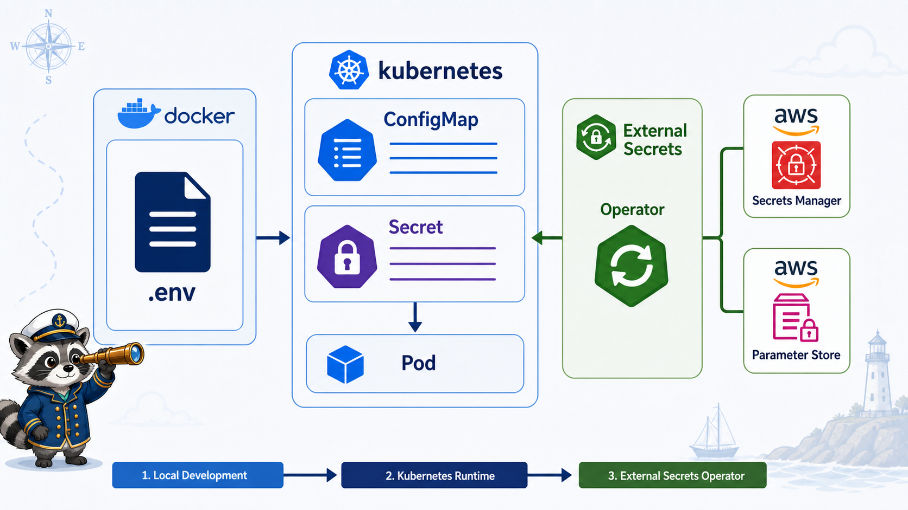

# 4교시: ConfigMap과 Secret



## 수업 목표
- image 밖 runtime config가 왜 필요한지 설명한다.
- `.env`, ConfigMap, Secret의 관계를 연결한다.
- Secret이 base64일 뿐 암호화 자체가 아니라는 점을 분명히 한다.

## Docker의 `.env` 감각에서 Kubernetes로
Docker Compose에서는 `.env.dev`, `.env.staging`, `.env.prod`처럼 환경별 파일을 나누는 방식이 자주 쓰인다.

```text
.env.dev      -> 개발 API endpoint, debug log
.env.staging  -> staging DB, staging token
.env.prod     -> 운영 endpoint, 운영 secret
```

Kubernetes에서도 환경 분리는 계속 필요하다. 다만 운영 secret을 파일 그대로 Git에 올리는 방식은 위험하다. Kubernetes에서는 설정을 ConfigMap/Secret object로 주입하고, 이후 Terraform, External Secrets, cloud secret manager로 확장한다.

## 왜 image 안에 설정을 넣으면 안 되는가
아래처럼 환경별 endpoint나 token을 image build 시점에 박아 넣으면 편해 보일 수 있다.

```Dockerfile
ENV APP_ENV=prod
ENV API_ENDPOINT=https://api.example.com
ENV API_TOKEN=...
```

하지만 이 방식은 운영에서 문제가 된다.

| 문제 | 설명 |
|---|---|
| image 재사용 불가 | dev/staging/prod마다 image가 달라짐 |
| secret 노출 | image layer/history에 민감정보가 남을 수 있음 |
| 변경 속도 저하 | 설정 하나 바꿔도 build/push/rollout 필요 |
| 감사 어려움 | 어떤 환경값으로 실행됐는지 추적이 애매함 |

운영 기준은 “동일 image를 환경별 runtime config로 다르게 실행한다”에 가깝다.

## ConfigMap 적용
```bash
export NS=week4
export LAB=week4/day1/labs/workload-basics

kubectl apply -f "$LAB/namespace.yaml"
kubectl apply -f "$LAB/configmap.yaml"
kubectl -n "$NS" get configmap api-config -o yaml
```

예상 출력 일부:
```yaml
apiVersion: v1
kind: ConfigMap
metadata:
  name: api-config
  namespace: week4
data:
  APP_ENV: dev
  LOG_LEVEL: debug
  RESPONSE_MESSAGE: hello from kubernetes runtime config
```

ConfigMap 예시:
```yaml
data:
  APP_ENV: "dev"
  LOG_LEVEL: "debug"
  RESPONSE_MESSAGE: "hello from kubernetes runtime config"
```

ConfigMap은 app code가 아니라 운영 설정이다. 예를 들면 다음 값이 적합하다.

| 값 | ConfigMap 적합 여부 | 이유 |
|---|---|---|
| `LOG_LEVEL=debug` | 적합 | 민감하지 않은 동작 설정 |
| `FEATURE_GREETING=enabled` | 적합 | feature flag 성격 |
| `API_BASE_URL=http://backend` | 대체로 적합 | 내부 endpoint |
| `DB_PASSWORD=...` | 부적합 | Secret 대상 |
| `JWT_PRIVATE_KEY=...` | 부적합 | Secret 또는 외부 secret manager |

## Secret 적용
```bash
kubectl apply -f "$LAB/secret.yaml"
kubectl -n "$NS" describe secret api-secret
```

예상 출력:
```text
Name:         api-secret
Namespace:    week4
Type:         Opaque

Data
====
DEMO_API_TOKEN:  26 bytes
```

`describe secret`는 값 자체를 보여주지 않고 key와 byte 수를 보여준다. 이 출력만 보고 값이 암호화되어 안전하다고 착각하면 안 된다.

`stringData`로 작성하면 Kubernetes가 저장 시점에 data 형태로 변환한다. 수업용으로는 편하지만 실제 secret 값을 repo에 남기면 안 된다.

Secret YAML에서 `stringData`와 `data`의 차이는 학생들이 헷갈리기 쉽다.

| 필드 | 작성 방식 | 예시 |
|---|---|---|
| `stringData` | 사람이 읽는 plain string 입력 | `DEMO_API_TOKEN: local-demo-token` |
| `data` | base64 인코딩된 값 입력 | `DEMO_API_TOKEN: bG9jYWw...` |

둘 다 저장된 Secret이 “암호화되어 안전하다”는 뜻은 아니다. base64는 누구나 되돌릴 수 있다.

```bash
echo 'bG9jYWw=' | base64 -d
```

이 예시는 base64가 암호가 아니라 표현 방식이라는 것을 보여주기 위한 것이다. 실제 secret 값으로 시연하지 않는다.

## Pod에 주입하기
Deployment에서는 `envFrom`으로 ConfigMap과 Secret을 주입한다.

```yaml
envFrom:
  - configMapRef:
      name: api-config
  - secretRef:
      name: api-secret
```

Pod 상세에서 확인한다.

```bash
POD=$(kubectl -n "$NS" get pod -l app=runtime-api -o jsonpath='{.items[0].metadata.name}')
kubectl -n "$NS" describe pod "$POD"
```

확인할 출력:
```text
Environment Variables from:
  api-config  ConfigMap  Optional: false
  api-secret  Secret     Optional: false
```

이 출력은 Pod가 ConfigMap과 Secret을 참조했다는 증거다. 다만 Secret 값 자체를 화면에 출력하지 않는다. 수업에서도 secret value를 확인하기 위해 `env`를 찍는 습관은 만들지 않는다.

실제 앱 응답으로도 확인한다.

```bash
kubectl -n "$NS" run curlbox --rm -it --restart=Never \
  --image=curlimages/curl:8.10.1 \
  -- curl -s http://runtime-api
```

기대값:
```text
hello from kubernetes runtime config
```

이 값은 container image 안에 고정된 값이 아니라 ConfigMap의 `RESPONSE_MESSAGE`에서 온 값이다.

## 설정이 빠졌을 때의 실패
ConfigMap이나 Secret 이름이 틀리면 Pod는 시작하지 못할 수 있다.

예상 event:
```text
Error: configmap "api-config-missing" not found
Error: secret "api-secret-missing" not found
```

이때는 app log를 보기 전에 `kubectl describe pod`의 events를 먼저 본다.

```bash
kubectl -n "$NS" describe pod <pod-name>
```

판단 기준:
| 증상 | 먼저 볼 곳 |
|---|---|
| Pod가 `CreateContainerConfigError` | ConfigMap/Secret 이름과 key |
| Pod는 뜨는데 값이 이상함 | ConfigMap data와 rollout 여부 |
| secret 값을 바꿨는데 반영 안 됨 | 기존 Pod 재시작 여부 |

## Secret 주의사항
| 오해 | 실제 |
|---|---|
| Secret이면 안전하다 | 기본값은 base64 인코딩이며 암호화가 아니다 |
| Git에 넣어도 된다 | 실제 secret 값은 Git에 넣지 않는다 |
| Pod env로 넣으면 항상 안전하다 | Pod describe 권한, process env 노출을 고려해야 한다 |
| 한 번 넣으면 끝이다 | rotation, 만료, 접근 권한이 필요하다 |

## secret을 env로 넣을 때의 현실적인 주의
env 주입은 쉽지만 모든 상황에서 최선은 아니다.

| 방식 | 장점 | 주의 |
|---|---|---|
| env | app 수정이 적고 간단함 | process env, crash dump, debug 출력 주의 |
| volume mount | file 기반 key/cert에 적합 | app이 파일 reload를 지원해야 함 |
| external secret | cloud secret manager와 연결 | add-on과 권한 설계 필요 |

오늘은 입문이므로 env/envFrom으로 시작한다. 하지만 현업에서는 운영 secret 값을 Git repository의 Kubernetes Secret YAML에 직접 넣지 않는 패턴이 흔하다. 이때 자주 등장하는 도구가 External Secrets Operator다.

## External Secrets Operator preview
External Secrets Operator는 외부 secret store의 값을 Kubernetes Secret으로 동기화하는 operator다.

```text
AWS Secrets Manager 또는 SSM Parameter Store
  -> External Secrets Operator
  -> Kubernetes Secret
  -> Pod env 또는 volume mount
```

Docker에서는 `.env.prod` 파일을 배포 서버에 두거나 CI secret으로 주입하는 식으로 처리했다. Kubernetes에서는 secret 값의 출처와 동기화 주체를 더 명확히 나눈다.

| 방식 | Docker/Compose 감각 | Kubernetes 확장 |
|---|---|---|
| `.env` 파일 | container 실행 시 env 주입 | ConfigMap/Secret, 환경별 manifest |
| CI secret | workflow에서 build/deploy 시 주입 | GitHub Secret, cloud secret store |
| 운영 secret store | 직접 스크립트로 조회 | External Secrets Operator |
| cloud IAM | 배포 서버 권한 | ServiceAccount + workload identity |

AWS에서는 External Secrets Operator가 Secrets Manager와 SSM Parameter Store를 provider로 사용할 수 있다. 수업에서는 W4D4에서 권한 모델을 보고, W5 AWS에서 Secrets Manager/Parameter Store 선택 기준으로 다시 연결한다.

| 외부 저장소 | 성격 |
|---|---|
| AWS Secrets Manager | rotation, secret lifecycle, DB credential 관리에 적합 |
| AWS SSM Parameter Store | 설정/parameter 저장, 비용과 단순성 측면에서 선택 가능 |

중요한 점은 "External Secrets Operator를 쓰면 secret 고민이 끝난다"가 아니다. operator가 외부 secret을 읽을 권한, Kubernetes Secret을 만들 권한, Pod가 그 Secret을 읽는 권한을 모두 설계해야 한다.

오늘은 개념 preview이고 실제 설치는 W4D4에서 RBAC/ServiceAccount 흐름과 함께 다룬다.

## 설정 변경 후 Pod가 자동으로 바뀌는가
ConfigMap을 수정했다고 기존 Pod의 env가 자동으로 바뀌지는 않는다. env는 container 시작 시점에 주입된다.

```bash
kubectl -n "$NS" edit configmap api-config
kubectl -n "$NS" rollout restart deploy/runtime-api
kubectl -n "$NS" rollout status deploy/runtime-api
```

이 흐름은 운영에서 자주 쓰인다. 설정 변경 자체와 workload restart/rollout은 별개라는 것을 설명한다.

rollout 후에는 새 ReplicaSet과 Pod가 만들어졌는지 확인한다.

```bash
kubectl -n "$NS" rollout status deploy/runtime-api
kubectl -n "$NS" get rs,pod -l app=runtime-api
```

예상 흐름:
```text
deployment "runtime-api" successfully rolled out
```

ConfigMap 수정은 “설정 object 변경”이고, rollout restart는 “새 설정으로 Pod를 다시 시작하는 작업”이다. 이 둘을 분리해서 설명해야 한다.

## 운영 기준
ConfigMap과 Secret을 쓰는 이유는 깔끔한 YAML을 만들기 위해서가 아니다. image를 다시 빌드하지 않고 환경별 값을 바꾸고, 민감정보의 저장과 접근 범위를 분리하기 위해서다.

## Evidence Note
```markdown
# W4D1S4 ConfigMap/Secret
- ConfigMap에 넣은 값:
- Secret에 넣으면 안 되는 방식:
- Pod describe에서 envFrom 확인:
- 앱 응답으로 확인한 runtime config:
- 설정 변경 후 필요한 rollout 작업:
```

## 한 줄 요약
```text
ConfigMap과 Secret은 image를 환경에 종속시키지 않기 위한 runtime config 경계다.
```
