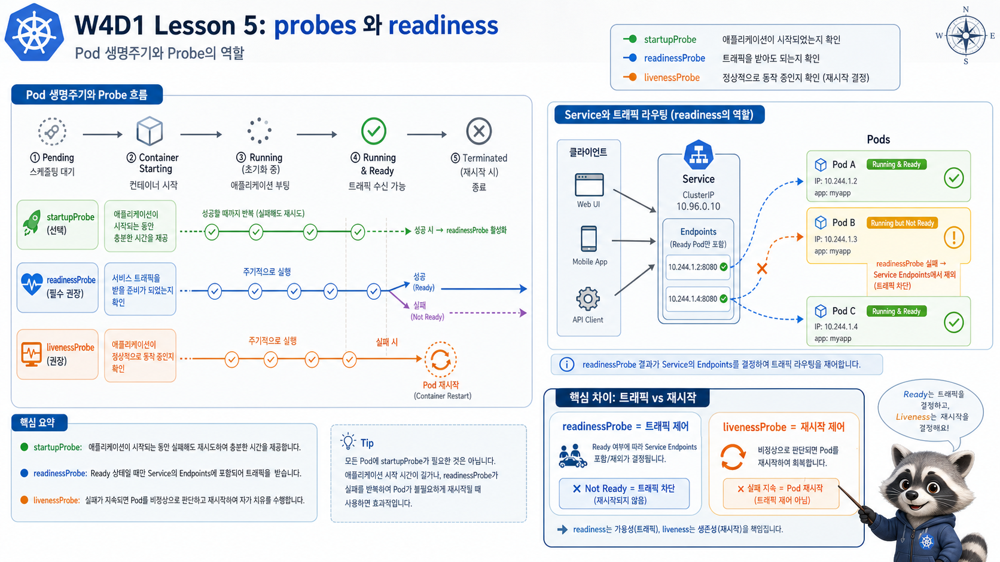

# 5교시: Probe와 Readiness



## 수업 목표
- readinessProbe, livenessProbe, startupProbe의 역할을 구분한다.
- Running이지만 Ready가 아닌 Pod를 해석한다.
- 잘못된 probe가 traffic과 restart에 미치는 영향을 확인한다.

## 세 가지 probe
| Probe | Kubernetes의 질문 | 실패 시 영향 |
|---|---|---|
| startupProbe | 시작이 끝났는가 | 성공 전까지 다른 probe 판단 지연 |
| readinessProbe | 지금 traffic을 받아도 되는가 | Service endpoint에서 제외 |
| livenessProbe | 재시작해야 하는가 | container restart |

## HTTP probe, TCP probe, exec probe
probe는 방식도 여러 가지다.

| 방식 | 예시 | 적합한 경우 |
|---|---|---|
| HTTP GET | `/ready`, `/healthz` | 웹/API 서버 |
| TCP socket | port 연결 확인 | HTTP endpoint가 없는 TCP 서비스 |
| exec | container 안 명령 실행 | 특정 파일/프로세스 확인 |

입문 단계에서는 HTTP probe가 가장 설명하기 쉽다. 하지만 모든 서비스가 HTTP를 제공하는 것은 아니므로 TCP/exec 방식도 있다는 정도는 알려둔다.

## 정상 probe가 들어간 Deployment
```bash
export NS=week4
export LAB=week4/day1/labs/workload-basics

kubectl apply -f "$LAB/deployment.yaml"
kubectl apply -f "$LAB/service.yaml"
kubectl -n "$NS" rollout status deploy/runtime-api
kubectl -n "$NS" get pod -l app=runtime-api
```

기대값:
```text
READY   STATUS
1/1     Running
```

Pod 상세에서 probe 설정을 확인한다.

```bash
POD=$(kubectl -n "$NS" get pod -l app=runtime-api -o jsonpath='{.items[0].metadata.name}')
kubectl -n "$NS" describe pod "$POD"
```

확인할 출력:
```text
Readiness:  http-get http://:http/ delay=3s timeout=2s period=5s
Liveness:   http-get http://:http/ delay=10s timeout=2s period=10s
```

## readiness 실패 실험
```bash
kubectl apply -f "$LAB/deployment-bad-readiness.yaml"
kubectl -n "$NS" get pod -l app=runtime-api-bad-readiness
kubectl -n "$NS" describe pod -l app=runtime-api-bad-readiness
```

기대 출력:
```text
READY   STATUS
0/1     Running

Readiness probe failed: HTTP probe failed with statuscode: 404
```

실제 `describe pod`에서는 events 쪽에 더 긴 메시지가 남는다.

```text
Warning  Unhealthy  12s (x3 over 22s)  kubelet  Readiness probe failed: HTTP probe failed with statuscode: 404
```

이 메시지에서 봐야 할 것은 세 가지다.

| 부분 | 의미 |
|---|---|
| `Warning Unhealthy` | kubelet이 상태 점검 실패를 기록 |
| `Readiness probe failed` | traffic 준비 상태 실패 |
| `statuscode: 404` | probe path가 app에서 정상 응답하지 않음 |

여기서 가장 중요한 문장은 이것이다.

```text
Pod가 Running이어도 Ready가 아니면 traffic을 받으면 안 된다.
```

## 실패 출력 해석
`kubectl get pod`만 보면 오해하기 쉽다.

```text
NAME                                         READY   STATUS    RESTARTS
runtime-api-bad-readiness-xxxxxxxxxx-xxxxx   0/1     Running   0
```

해석:
| 컬럼 | 의미 |
|---|---|
| `READY 0/1` | container 1개 중 준비된 container 0개 |
| `STATUS Running` | process는 실행 중 |
| `RESTARTS 0` | liveness 실패로 재시작된 것은 아님 |

즉 app process가 죽은 것이 아니라 “traffic 받을 준비가 안 됐다”는 상태다.

## readiness와 Service endpoint
Service는 selector로 Pod를 찾지만, readiness가 실패한 Pod는 endpoint에서 빠질 수 있다. 그래서 장애 확인 시 `get pod`만 보면 부족하다.

```bash
kubectl -n "$NS" get svc,endpoints
kubectl -n "$NS" describe endpoints runtime-api
```

endpoint 확인 예시:
```text
NAME          ENDPOINTS
runtime-api   10.244.0.12:8080,10.244.0.13:8080
```

readiness가 모두 실패하면 이런 식으로 비어 보일 수 있다.

```text
NAME          ENDPOINTS
runtime-api   <none>
```

이 상황에서 사용자는 Service DNS는 resolve되지만 실제 backend endpoint가 없어 503/connection reset/timeout 계열 문제를 볼 수 있다.

## curl 결과로 확인하기
정상 Service는 내부 curlbox에서 응답이 온다.

```bash
kubectl -n "$NS" run curlbox --rm -it --restart=Never \
  --image=curlimages/curl:8.10.1 \
  -- curl -s -o /dev/null -w "%{http_code}\n" http://runtime-api
```

예상 출력:
```text
200
```

endpoint가 비어 있거나 준비된 Pod가 없으면 다음 계열의 오류를 볼 수 있다.

```text
curl: (7) Failed to connect to runtime-api port 80
```

또는 Ingress/Proxy를 거친 상황에서는 503처럼 보일 수 있다. 지금은 cluster 내부 Service 기준으로 endpoint와 readiness를 먼저 확인한다.

## probe 설계 실수
| 실수 | 결과 |
|---|---|
| `/`만 확인 | 앱은 떠 있지만 DB 연결 실패를 못 잡을 수 있음 |
| readiness와 liveness를 같은 endpoint로 둠 | 일시적 dependency 장애가 restart 폭탄으로 번질 수 있음 |
| initialDelay가 너무 짧음 | 느린 앱이 시작 중 계속 실패 |
| timeout이 너무 짧음 | 부하 순간에 false negative |
| liveness가 너무 공격적 | 복구보다 restart가 더 큰 장애를 만듦 |

## readiness와 liveness를 같은 endpoint로 쓰면 왜 위험한가
예를 들어 `/health`가 DB 연결까지 검사한다고 하자. DB가 30초 정도 느려졌을 때 readiness 실패는 합리적이다. 그동안 traffic을 받지 않으면 된다.

하지만 같은 endpoint를 liveness에도 쓰면 Kubernetes가 app을 계속 재시작할 수 있다.

```text
DB 지연
  -> /health 실패
  -> liveness 실패
  -> container restart
  -> cold start
  -> 다시 DB 연결 지연
  -> restart 반복
```

이렇게 되면 원래는 30초 dependency 지연이었는데, 공격적인 liveness 때문에 더 큰 장애가 된다.

## probe 값 조정 기준
| 필드 | 의미 | 너무 작을 때 |
|---|---|---|
| `initialDelaySeconds` | 첫 probe 전 대기 | 시작 중 실패 |
| `periodSeconds` | probe 주기 | 불필요한 probe 증가 |
| `timeoutSeconds` | 응답 대기 시간 | 순간 지연을 장애로 오판 |
| `failureThreshold` | 몇 번 실패해야 실패 처리 | false positive 증가 |

probe는 “빨리 죽이는 장치”가 아니라 정확하게 상태를 판단하는 장치다.

## 운영 팁
readiness는 “사용자 요청을 받을 준비”를 물어야 한다. liveness는 “재시작이 필요한 고착 상태”를 물어야 한다. 둘을 같은 질문으로 만들면 장애를 분리하기 어렵다.

## 오늘의 판단 루프
probe 장애는 다음 순서로 본다.

```text
kubectl get pod
  -> READY가 0인지 확인
kubectl describe pod
  -> probe 실패 reason 확인
kubectl get endpoints
  -> Service가 보낼 대상 확인
kubectl logs
  -> app 내부 오류 확인
manifest 수정
  -> rollout
```

이 순서를 잡아두면 “Pod는 Running인데 왜 안 돼요?”라는 질문에 훨씬 빨리 답할 수 있다.

## Evidence Note
```markdown
# W4D1S5 Probe
- 정상 Pod READY:
- bad readiness Pod READY/STATUS:
- readiness 실패 메시지:
- endpoint 변화:
- readiness와 liveness를 분리해야 하는 이유:
```

## 한 줄 요약
```text
readiness는 traffic 기준이고, liveness는 restart 기준이다.
```
