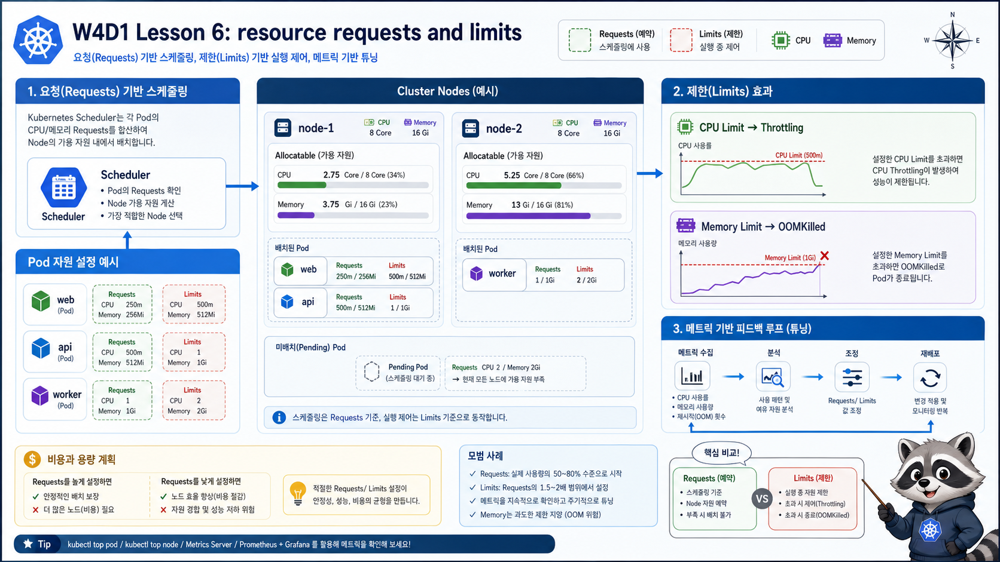

# 6교시: Resource Requests/Limits



## 수업 목표
- requests와 limits의 차이를 설명한다.
- resource 선언이 scheduler, OOMKilled, CPU throttling, 비용과 연결되는 이유를 이해한다.
- manifest에서 resource 값을 어디에 쓰는지 확인한다.

## requests와 limits
| 설정 | 역할 | 운영 의미 |
|---|---|---|
| `requests.cpu` | 필요한 CPU 양 | scheduler가 node 배치 판단에 사용 |
| `requests.memory` | 필요한 memory 양 | node capacity 계획의 기준 |
| `limits.cpu` | CPU 사용 상한 | 초과 시 throttling 가능 |
| `limits.memory` | memory 사용 상한 | 초과 시 OOMKilled 가능 |

Deployment 예시:
```yaml
resources:
  requests:
    cpu: 25m
    memory: 32Mi
  limits:
    cpu: 100m
    memory: 64Mi
```

## CPU 단위와 Memory 단위
Kubernetes resource 단위도 꼭 짚는다.

| 표현 | 의미 |
|---|---|
| `100m` CPU | CPU 0.1 core |
| `500m` CPU | CPU 0.5 core |
| `1` CPU | CPU 1 core |
| `64Mi` memory | 64 mebibytes |
| `512Mi` memory | 512 mebibytes |

`m`은 milli CPU다. `100m`은 “100 메가 CPU”가 아니다. 이걸 헷갈리면 resource 값을 전혀 다르게 잡게 된다.

## 왜 비용과 연결되는가
requests가 커지면 scheduler는 더 많은 node capacity가 필요하다고 판단한다. cloud 환경에서는 이것이 node 수, instance size, autoscaling, 비용으로 연결된다.

limits를 너무 낮게 잡으면 앱은 자주 죽거나 느려진다. limits를 너무 높게 잡으면 noisy neighbor 문제를 만들 수 있다.

## scheduler가 보는 것은 request다
scheduler는 Pod를 배치할 때 실제 사용량이 아니라 request를 기준으로 판단한다.

```text
node capacity: 2 CPU, 4Gi
Pod A request: 500m, 512Mi
Pod B request: 1 CPU, 1Gi
Pod C request: 1 CPU, 3Gi
```

이 상황에서 node의 남은 request capacity가 부족하면 Pod는 Pending이 된다. 실제로 지금 CPU를 거의 쓰지 않더라도 request 기준으로는 배치가 안 될 수 있다.

| 상태 | 해석 |
|---|---|
| 실제 사용량 낮음 | 이미 떠 있는 Pod의 현재 사용량 |
| request 합계 높음 | scheduler가 예약한 capacity |
| Pending | request를 만족하는 node가 없음 |

## 확인 명령
```bash
export NS=week4
kubectl -n "$NS" describe deploy runtime-api
kubectl -n "$NS" describe pod -l app=runtime-api
```

확인할 출력:
```text
Limits:
  cpu:     100m
  memory:  64Mi
Requests:
  cpu:        25m
  memory:     32Mi
```

`kubectl get pod`에는 requests/limits가 바로 보이지 않는다. 상세를 보거나 custom columns를 쓴다.

```bash
kubectl -n "$NS" get pod -l app=runtime-api \
  -o custom-columns=NAME:.metadata.name,CPU_REQ:.spec.containers[0].resources.requests.cpu,MEM_REQ:.spec.containers[0].resources.requests.memory,CPU_LIMIT:.spec.containers[0].resources.limits.cpu,MEM_LIMIT:.spec.containers[0].resources.limits.memory
```

예상 출력:
```text
NAME                           CPU_REQ   MEM_REQ   CPU_LIMIT   MEM_LIMIT
runtime-api-7c7d8f7f9f-bxk6m   25m       32Mi      100m        64Mi
runtime-api-7c7d8f7f9f-vs8nd   25m       32Mi      100m        64Mi
```

이 출력은 “현재 얼마나 쓰는가”가 아니라 “Pod가 어떤 resource 기준으로 선언되었는가”를 보여준다. 실제 사용량은 7교시의 `kubectl top`에서 확인한다.

## OOMKilled 실험
```bash
kubectl apply -f week4/day1/labs/workload-basics/pod-oom-demo.yaml
kubectl -n week4 get pod oom-demo -w
```

Pod가 종료되면 상세를 본다.

```bash
kubectl -n week4 describe pod oom-demo
```

확인할 출력:
```text
Reason: OOMKilled
Exit Code: 137
```

`kubectl get pod`에서는 다음처럼 보일 수 있다.

```text
NAME       READY   STATUS   RESTARTS   AGE
oom-demo   0/1     Error    0          40s
```

`STATUS=Error`만 보고 원인을 알 수는 없다. `describe` 또는 jsonpath로 마지막 종료 이유를 확인해야 한다.

OOMKilled는 app이 정상적으로 종료한 것이 아니다. container가 memory limit을 넘어서 kernel에 의해 종료된 것이다.

확인할 위치:
```bash
kubectl -n week4 describe pod oom-demo
kubectl -n week4 get pod oom-demo -o jsonpath='{.status.containerStatuses[0].lastState.terminated.reason}'
```

정리:
```bash
kubectl -n week4 delete pod oom-demo --ignore-not-found
```

## request가 너무 큰 경우
node capacity보다 큰 request를 선언하면 Pod가 Pending에 머물 수 있다. 이때 먼저 볼 곳은 log가 아니라 event다.

```bash
kubectl -n week4 describe pod <pending-pod>
```

대표 메시지:
```text
0/1 nodes are available: insufficient cpu
0/1 nodes are available: insufficient memory
```

이 경우에는 app log가 없다. container가 시작되지 않았기 때문이다. Pending은 대개 scheduler 단계 문제라 `describe pod`의 events가 핵심이다.

Pending 출력 예시:
```text
NAME              READY   STATUS    RESTARTS   AGE
too-large-pod     0/1     Pending   0          20s
```

판단:
| 출력 | 의미 |
|---|---|
| `Pending` | scheduler가 배치하지 못했을 수 있음 |
| `insufficient cpu` | request를 만족할 CPU capacity가 없음 |
| `insufficient memory` | request를 만족할 memory capacity가 없음 |
| log 없음 | container가 시작되지 않았으므로 정상 |

## CPU throttling은 왜 더 어렵나
memory limit 초과는 OOMKilled로 비교적 선명하게 보인다. CPU limit은 보통 process가 죽지 않고 느려진다.

```text
CPU limit이 낮음
  -> request 처리 시간이 늘어남
  -> readiness timeout이 발생할 수 있음
  -> 사용자는 latency 증가를 느낌
```

그래서 CPU 문제는 `kubectl top`만으로 끝나지 않고 W4D3 Prometheus/Grafana에서 더 깊게 본다.

## 서비스 성향별 resource 감각
| 서비스 성향 | CPU 부하 | Memory 부하 | 주의 |
|---|---|---|---|
| API gateway | 중간 | 낮음~중간 | connection 수, timeout |
| JSON CRUD API | 중간 | 중간 | DB latency와 thread pool |
| image 처리 | 높음 | 높음 | CPU limit, memory peak |
| batch worker | 높음 | 케이스별 | concurrency 제한 |
| cache | 낮음~중간 | 높음 | memory limit과 eviction |
| database | 중간 | 높음 | 보통 별도 운영/managed service |

이 표는 정확한 sizing 공식이 아니다. 학생들이 “모든 container에 같은 limit을 넣으면 된다”는 착각을 피하기 위한 기준이다.

## 운영 기준
처음부터 완벽한 requests/limits 값을 맞추기는 어렵다. 하지만 아예 선언하지 않는 것은 더 위험하다. 최소 기준을 넣고 metrics를 보며 조정하는 루프가 필요하다.

```text
초기값 선언
  -> metrics 관찰
  -> peak와 idle 비교
  -> requests/limits 조정
  -> rollout
```

## Evidence Note
```markdown
# W4D1S6 Resources
- runtime-api requests:
- runtime-api limits:
- OOMKilled 확인 결과:
- Pending이면 먼저 볼 명령:
- CPU limit이 낮을 때 나타날 수 있는 사용자 영향:
```

## 한 줄 요약
```text
requests는 배치 약속이고, limits는 사용 상한이며, 둘 다 비용과 장애 양상을 바꾼다.
```
