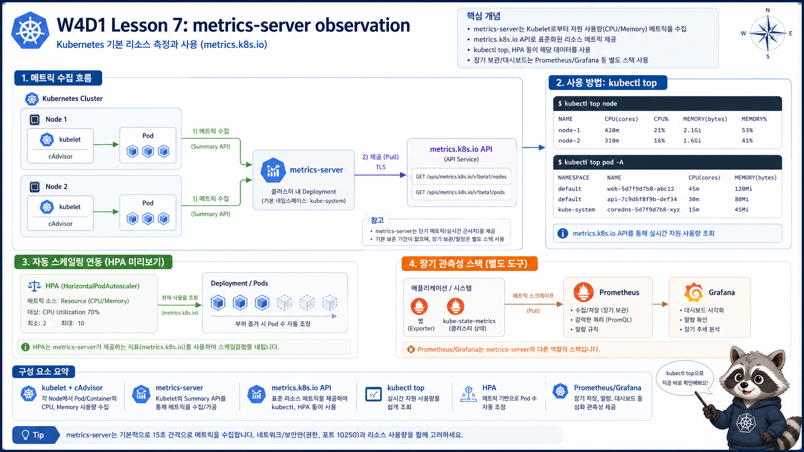

# 7교시: Metrics Server 설치와 관찰



## 수업 목표
- metrics-server의 역할과 Prometheus/Grafana와의 차이를 설명한다.
- Helm으로 metrics-server를 설치한다.
- `kubectl top node/pod`로 CPU/memory 사용량을 확인한다.

## metrics-server의 위치
metrics-server는 kubelet에서 CPU/memory resource metric을 수집하고 Kubernetes Metrics API로 제공한다.

```text
kubelet
  -> metrics-server
  -> metrics.k8s.io API
  -> kubectl top / HPA
```

Prometheus처럼 장기 시계열 저장과 dashboard를 제공하는 도구가 아니다. W4D3에서 Prometheus/Grafana를 별도로 다룬다.

## kube-system에 있는데 다른 namespace가 보이는 이유
metrics-server는 보통 `kube-system` namespace에 설치된다. 그런데 명령은 이렇게 실행한다.

```bash
kubectl top pod -n week4
```

이때 `week4` namespace의 Pod가 metrics-server Pod와 직접 통신하는 것이 아니다. 사용자는 API server에 요청하고, API server는 metrics APIService를 통해 metrics-server로 연결한다.

```text
kubectl
  -> Kubernetes API server
  -> APIService: v1beta1.metrics.k8s.io
  -> Service: kube-system/metrics-server
  -> metrics-server
  -> kubelet resource summary
```

namespace를 넘어 보이는 원리는 다음처럼 나눠야 한다.

| 질문 | 원리 |
|---|---|
| metrics-server는 어디에 설치되는가 | `kube-system` namespace |
| `kubectl top -n week4`는 누구에게 요청하는가 | Kubernetes API server |
| API server는 metrics를 어디로 라우팅하는가 | `v1beta1.metrics.k8s.io` APIService |
| metrics-server는 metric을 어디서 가져오는가 | 각 node의 kubelet |
| namespace는 어떤 역할인가 | 조회 결과를 `week4` Pod로 필터링 |

즉 "system namespace에 설치된 add-on이 application namespace를 본다"는 말은, 보통 Kubernetes API와 RBAC, APIService, selector가 허용한 범위 안에서 동작한다는 뜻이다. 네트워크가 아무렇게나 열린다는 뜻이 아니다.

## metrics-server와 Prometheus를 구분한다
학생들이 “Grafana에서 봤던 metric이랑 같은 건가요?”라고 묻기 쉽다. 목적이 다르다.

| 항목 | metrics-server | Prometheus/Grafana |
|---|---|---|
| 주 목적 | 현재 resource metric 제공 | 시계열 저장, query, dashboard, alert |
| 대표 명령/화면 | `kubectl top` | PromQL, Grafana dashboard |
| 저장 기간 | 짧음 | 설정에 따라 장기 |
| HPA resource metric | 직접 연결 | custom/external metric 구성 가능 |
| 수업 일차 | W4D1 | W4D3 |

오늘은 “사용량을 보기 시작하는 첫 단계”다. 깊은 dashboard와 alert는 W4D3에서 다룬다.

## Helm 설치
```bash
helm repo add metrics-server https://kubernetes-sigs.github.io/metrics-server/
helm repo update

helm upgrade --install metrics-server metrics-server/metrics-server \
  --namespace kube-system \
  -f week4/day1/labs/helm-metrics-server/values.yaml
```

values file:
```yaml
args:
  - --kubelet-insecure-tls
  - --kubelet-preferred-address-types=InternalIP,Hostname,ExternalIP
```

kind/local 실습에서는 kubelet certificate 검증 문제 때문에 필요할 수 있다. `--kubelet-preferred-address-types`는 metrics-server가 node에 접근할 주소 우선순위를 명시한다. 운영 환경에 그대로 가져가기보다 cluster 인증서와 node address 체계에 맞게 설정해야 한다.

## values file을 먼저 읽는다
설치 전에 values file을 직접 확인한다.

```bash
cat week4/day1/labs/helm-metrics-server/values.yaml
```

수업용 values:
```yaml
args:
  - --kubelet-insecure-tls
  - --kubelet-preferred-address-types=InternalIP,Hostname,ExternalIP

resources:
  requests:
    cpu: 50m
    memory: 64Mi
  limits:
    cpu: 200m
    memory: 256Mi
```

여기서 `resources`도 일부러 넣었다. add-on도 cluster 위에서 도는 workload이므로 resource 기준을 가져야 한다.

## 설치 확인
```bash
helm list -n kube-system
helm status metrics-server -n kube-system
kubectl -n kube-system get deploy,pod -l app.kubernetes.io/name=metrics-server
kubectl get apiservice v1beta1.metrics.k8s.io
```

values 파일이 실제 Deployment에 반영됐는지도 확인한다.

```bash
helm get values metrics-server -n kube-system
kubectl -n kube-system get deploy metrics-server \
  -o jsonpath='{.spec.template.spec.containers[0].args}{"\n"}'
```

반드시 다음 값이 보여야 한다.

```text
--kubelet-insecure-tls
--kubelet-preferred-address-types=InternalIP,Hostname,ExternalIP
```

values 파일에는 값이 있는데 Deployment args에 없다면 Helm upgrade가 values 파일 없이 실행됐거나, 다른 cluster/context를 보고 있을 가능성이 크다.

metrics-server가 어떤 ServiceAccount와 APIService를 쓰는지도 확인한다.

```bash
kubectl -n kube-system get sa | grep metrics-server
kubectl get apiservice v1beta1.metrics.k8s.io -o wide
kubectl describe apiservice v1beta1.metrics.k8s.io
```

정상에 가까운 출력:
```text
NAME             READY   UP-TO-DATE   AVAILABLE
metrics-server   1/1     1            1

NAME                     SERVICE                      AVAILABLE
v1beta1.metrics.k8s.io   kube-system/metrics-server   True
```

Pod 출력은 실제로는 다음처럼 보인다.

```text
NAME                                  READY   STATUS    RESTARTS   AGE
metrics-server-6b8f8b7db7-9d4px       1/1     Running   0          75s
```

`READY 1/1`이 되기 전에는 `kubectl top`이 실패할 수 있다. 설치 직후 바로 결과가 안 보이는 것은 흔한 일이다.

`APIService`가 True가 아니라면 `kubectl top`은 실패할 수 있다.

```bash
kubectl describe apiservice v1beta1.metrics.k8s.io
```

확인할 부분:
| 항목 | 의미 |
|---|---|
| `Available` | metrics API가 사용 가능한지 |
| `Service` | 어느 namespace/service로 연결되는지 |
| `Message` | 실패 이유 |

## metric 확인
metric이 바로 보이지 않으면 30~90초 기다린다.

```bash
kubectl top node
kubectl top pod -n week4
```

출력 예시:
```text
NAME                           CPU(cores)   MEMORY(bytes)
runtime-api-xxxxxxxxxx-xxxxx   1m           8Mi
```

node와 pod를 함께 본다.

```bash
kubectl top node
kubectl top pod -n week4 --containers
```

node 출력 예시:
```text
NAME                         CPU(cores)   CPU%   MEMORY(bytes)   MEMORY%
kind-control-plane           162m         8%     1080Mi          28%
```

pod container 출력 예시:
```text
POD                            NAME   CPU(cores)   MEMORY(bytes)
runtime-api-7c7d8f7f9f-bxk6m   api    1m           8Mi
runtime-api-7c7d8f7f9f-vs8nd   api    1m           8Mi
```

`--containers`를 쓰면 Pod 안 container별 사용량을 볼 수 있다. 지금 예제는 container가 하나라 차이가 작지만, sidecar가 있는 Pod에서는 매우 중요해진다.

## 자주 보는 문제
| 증상 | 원인 후보 | 확인 명령 |
|---|---|---|
| `Metrics API not available` | APIService 준비 전 또는 metrics-server 실패 | `kubectl get apiservice v1beta1.metrics.k8s.io` |
| `kubectl top`이 비어 있음 | Pod가 없거나 namespace 오타 | `kubectl -n week4 get pods` |
| metrics-server CrashLoop | kubelet 연결/TLS/args 문제 | `kubectl -n kube-system logs deploy/metrics-server` |
| helm release는 있는데 Pod 없음 | chart install 실패 또는 namespace 혼동 | `helm status metrics-server -n kube-system` |

## 실제 오류 메시지 예시
`kubectl top`에서 볼 수 있는 오류:

```text
error: Metrics API not available
```

해석:
```text
kubectl 명령 자체 문제가 아니라 metrics.k8s.io API가 준비되지 않았다는 뜻이다.
```

metrics-server log에서 볼 수 있는 계열:
```text
unable to fully scrape metrics from node
x509: cannot validate certificate
failed to verify certificate: x509: cannot validate certificate for 172.19.0.2 because it doesn't contain any IP SANs
Failed probe probe="metric-storage-ready" err="no metrics to serve"
```

kind/local에서는 kubelet 인증서 검증 이슈가 흔하다. metrics-server가 kubelet의 `https://<node-ip>:10250/metrics/resource`를 긁으려는데, kubelet 인증서에 해당 IP가 SAN으로 들어있지 않으면 TLS 검증이 실패한다. 그래서 실습용 values에 `--kubelet-insecure-tls`를 넣었다. 단, 이건 운영 보안 기준이 아니라 로컬 실습 우회다.

`metric-storage-ready`가 `no metrics to serve`라고 나오는 것은 보통 metrics-server가 node scrape에 실패해 저장할 metric이 없다는 후속 증상이다. root cause는 앞의 x509/kubelet scrape 실패다.

## x509 IP SAN 오류 즉시 복구
다음 로그가 보이면:

```text
failed to verify certificate: x509: cannot validate certificate for 172.19.0.2 because it doesn't contain any IP SANs
```

먼저 context를 확인한다. 예전 cluster를 보고 있으면 values를 고쳐도 다른 곳에 적용된다.

```bash
kubectl config current-context
kind get clusters
kubectl get nodes
```

그 다음 Helm values와 실제 Deployment args를 확인한다.

```bash
helm get values metrics-server -n kube-system
kubectl -n kube-system get deploy metrics-server \
  -o jsonpath='{.spec.template.spec.containers[0].args}{"\n"}'
```

`--kubelet-insecure-tls`가 없으면 values 파일로 다시 upgrade한다.

```bash
helm upgrade --install metrics-server metrics-server/metrics-server \
  --namespace kube-system \
  -f week4/day1/labs/helm-metrics-server/values.yaml

kubectl -n kube-system rollout restart deploy/metrics-server
kubectl -n kube-system rollout status deploy/metrics-server
```

다시 확인한다.

```bash
kubectl -n kube-system logs deploy/metrics-server --tail=80
kubectl get apiservice v1beta1.metrics.k8s.io
sleep 60
kubectl top node
```

그래도 같은 오류가 유지되면 현재 보고 있는 cluster가 수업 values로 설치한 cluster인지 다시 확인한다. node 이름이 예를 들어 `paperclip-week3-control-plane`이면 W4D1 cluster가 아니라 이전 Week3 cluster에 설치했거나 그 context를 보고 있을 수 있다.

## Helm은 성공했는데 top이 안 되는 경우
이 케이스를 꼭 분리한다.

| 단계 | 성공 가능 | 아직 실패할 수 있는 것 |
|---|---|---|
| `helm upgrade --install` 성공 | 리소스 제출 성공 | Pod readiness 실패 |
| `helm status` deployed | release 상태 정상 | metrics API 미등록 |
| metrics-server Pod Running | process 실행 | kubelet scrape 실패 |
| APIService True | API 연결 | metric 수집 대기 시간 |

따라서 설치 직후 바로 `kubectl top`이 안 된다고 무조건 실패로 단정하지 않는다. 하지만 2~3분 이상 지속되면 logs와 apiservice를 본다.

## 안 될 때 5단계 체크
```bash
helm status metrics-server -n kube-system
kubectl -n kube-system get pod -l app.kubernetes.io/name=metrics-server
kubectl get apiservice v1beta1.metrics.k8s.io
kubectl -n kube-system logs deploy/metrics-server --tail=80
helm get values metrics-server -n kube-system
kubectl -n kube-system get deploy metrics-server -o jsonpath='{.spec.template.spec.containers[0].args}{"\n"}'
```

판단 기준:
| 단계 | 실패하면 |
|---|---|
| `helm status` 실패 | release 설치 자체 문제 |
| Pod `READY 0/1` | metrics-server container 상태 문제 |
| APIService `False` | aggregation API 연결 문제 |
| log에 x509 | kind/local TLS 우회 args 확인 |
| values에 args 없음 | values file 또는 upgrade 명령 확인 |

## HPA preview
HPA는 오늘 깊게 다루지 않는다. 하지만 HPA가 CPU/memory 기준으로 scale out하려면 Metrics API가 필요하다는 연결만 잡는다.

```text
requests 선언
  -> metrics-server metric 제공
  -> HPA가 사용량 비율 계산
  -> replica 조정
```

예를 들어 HPA가 CPU 70%를 기준으로 scale 하려면 Pod의 request가 있어야 사용률 계산이 가능하다.

```text
현재 CPU 사용량 / requests.cpu = utilization
```

request를 선언하지 않으면 HPA가 기대대로 동작하지 않을 수 있다. 그래서 6교시 resource와 7교시 metric은 따로 떨어진 주제가 아니다.

## Evidence Note
```markdown
# W4D1S7 metrics-server
- Helm release status:
- metrics-server Pod READY:
- APIService Available:
- ServiceAccount/RBAC 확인:
- kubectl top node 결과:
- kubectl top pod -n week4 결과:
- 안 될 때 확인한 log 또는 message:
```

## 한 줄 요약
```text
metrics-server는 kubectl top과 HPA의 resource metric 기반이며, Prometheus/Grafana와 목적이 다르다.
```
