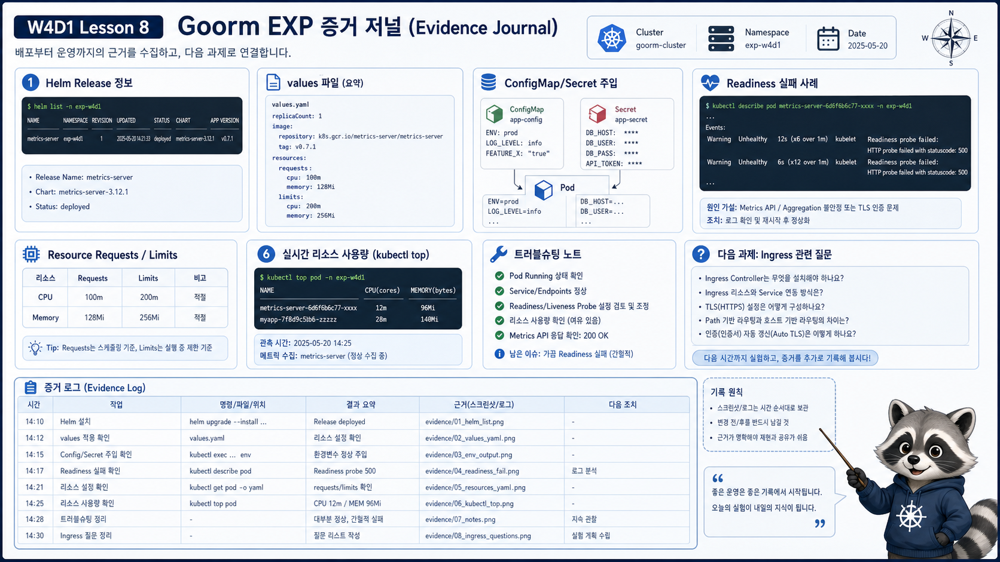

# 8교시: 구름 EXP 배움일기



## 수업 목표
- 오늘 배운 Helm 설치 표준과 운영형 workload 기준을 evidence 중심으로 정리한다.
- 막힌 지점을 명령, 출력, 원인 후보, 해결로 나누어 기록한다.
- W4D2 Ingress 실습으로 이어질 질문을 남긴다.

## 오늘 배운 내용 요약
| 주제 | 핵심 문장 |
|---|---|
| 운영 가능한 workload | Running만으로는 부족하고 config, secret, probe, resource, metric이 필요하다 |
| Helm | chart 설치와 변경 이력을 release로 관리한다 |
| ConfigMap/Secret | image 밖 runtime config 경계를 만든다 |
| Probe | readiness는 traffic, liveness는 restart 기준이다 |
| Resources | requests는 배치 기준, limits는 사용 상한이다 |
| metrics-server | `kubectl top`과 HPA resource metric의 기반이다 |

## 그냥 소감문이 아니라 운영 일지로 쓴다
배움일기는 “오늘 재미있었다”에서 끝나면 아깝다. Kubernetes 수업에서는 나중에 장애를 복기할 수 있는 운영 일지처럼 쓴다.

좋은 기록은 다음을 포함한다.

| 좋은 기록 요소 | 예시 |
|---|---|
| 실행한 명령 | `helm upgrade --install ...` |
| 핵심 출력 | `v1beta1.metrics.k8s.io Available=True` |
| 해석 | Metrics API가 붙었으므로 `kubectl top` 가능 |
| 실패 메시지 | `Readiness probe failed: statuscode 404` |
| 다음 행동 | endpoint 확인, probe path 수정 |

나쁜 기록은 “안 됐다가 됐다”처럼 원인과 증거가 없는 기록이다.

## 배움일기 작성 표
아래 표를 그대로 채워도 된다. 긴 문장보다 evidence가 중요하다.

| 항목 | 기록 |
|---|---|
| 오늘 가장 중요한 개념 |  |
| Helm release 이름/namespace |  |
| 사용한 values file |  |
| ConfigMap으로 분리한 값 |  |
| Secret에서 주의할 점 |  |
| readiness 실패 메시지 |  |
| resource requests/limits 값 |  |
| `kubectl top` 결과 |  |
| 막힌 명령 |  |
| 오류 메시지 핵심 |  |
| 원인 후보 |  |
| 해결 또는 다음 확인 |  |

## 작성 예시
| 항목 | 기록 예시 |
|---|---|
| 오늘 가장 중요한 개념 | Running과 Ready는 다르다 |
| Helm release 이름/namespace | `metrics-server` / `kube-system` |
| 사용한 values file | `week4/day1/labs/helm-metrics-server/values.yaml` |
| ConfigMap으로 분리한 값 | `RESPONSE_MESSAGE`, `LOG_LEVEL` |
| Secret에서 주의할 점 | base64는 암호화가 아니므로 실제 secret은 Git에 넣지 않는다 |
| readiness 실패 메시지 | `Readiness probe failed: HTTP probe failed with statuscode: 404` |
| resource requests/limits 값 | `25m/32Mi`, `100m/64Mi` |
| `kubectl top` 결과 | runtime-api Pod가 약 `1m`, `8Mi` 사용 |
| 막힌 명령 | `kubectl top pod -n week4` |
| 오류 메시지 핵심 | `Metrics API not available` |
| 원인 후보 | metrics-server Pod 준비 전 또는 APIService False |
| 해결 또는 다음 확인 | `kubectl get apiservice`, metrics-server logs 확인 |

## 오늘의 evidence 명령 모음
아래 명령 중 최소 5개는 결과를 남기도록 한다.

```bash
helm list -n kube-system
helm status metrics-server -n kube-system
helm get values metrics-server -n kube-system
kubectl -n week4 get deploy,pod,svc,endpoints -o wide
kubectl -n week4 describe pod -l app=runtime-api
kubectl -n week4 describe pod -l app=runtime-api-bad-readiness
kubectl get apiservice v1beta1.metrics.k8s.io
kubectl top node
kubectl top pod -n week4
```

## 시나리오별 정리 질문
| 시나리오 | 답해야 할 질문 |
|---|---|
| Pod는 Running인데 서비스가 안 됨 | READY와 endpoint는 어떤가 |
| Secret을 만들었음 | 실제 값을 Git에 넣지 않았는가 |
| ConfigMap을 바꿨음 | 기존 Pod가 새 env를 읽는가, rollout이 필요한가 |
| OOMKilled 발생 | memory limit이 너무 낮은가, peak 사용량은 얼마인가 |
| `kubectl top` 실패 | APIService, metrics-server log, values args를 확인했는가 |

## Troubleshooting 기록 예시
```markdown
## 문제
kubectl top pod -n week4 실행 시 Metrics API not available 발생

## 확인
- helm list -n kube-system: metrics-server release 존재
- kubectl get apiservice v1beta1.metrics.k8s.io: AVAILABLE False
- kubectl -n kube-system logs deploy/metrics-server: kubelet TLS 관련 메시지

## 조치
- values.yaml에 --kubelet-insecure-tls가 들어갔는지 확인
- helm upgrade --install 재실행
- 60초 뒤 kubectl top node 재확인
```

## 추가 예시: readiness 실패
```markdown
## 문제
runtime-api-bad-readiness Pod가 Running이지만 READY 0/1

## 확인
- kubectl get pod: STATUS Running, READY 0/1
- kubectl describe pod: Readiness probe failed, statuscode 404
- 원인: readinessProbe path가 /not-ready로 되어 있음

## 해석
process가 죽은 것은 아니지만 Service traffic을 받으면 안 되는 상태다.

## 다음 행동
- readiness path를 실제 ready endpoint로 수정
- rollout status와 endpoint 재확인
```

## 추가 예시: OOMKilled
```markdown
## 문제
oom-demo Pod가 Error 또는 OOMKilled로 종료됨

## 확인
- describe pod에서 Last State Terminated Reason: OOMKilled
- Exit Code: 137
- resources.limits.memory: 48Mi

## 해석
애플리케이션이 정상 종료한 것이 아니라 memory limit 초과로 종료됐다.

## 다음 행동
- 실제 memory peak 확인
- limit 상향 또는 app memory 사용량 개선
- 반복 발생 시 W4D3 metric dashboard에서 추세 확인
```

## W4D2로 이어지는 질문
내일은 Service와 Ingress로 외부 traffic을 다룬다. 오늘 남겨야 할 질문은 다음이다.

| 질문 | W4D2 연결 |
|---|---|
| Service endpoint는 언제 비는가 | readiness와 selector 문제 |
| Pod IP가 바뀌어도 사용자는 어떻게 접근하는가 | Service와 DNS |
| cluster 밖 사용자는 어디로 들어오는가 | ingress-nginx |
| `/api`와 `/`를 다른 서비스로 보낼 수 있는가 | Ingress path routing |

## 마무리 멘트
오늘은 화면상 화려한 dashboard를 만든 날은 아니다. 대신 앞으로 dashboard와 GitOps, policy를 이해하기 위한 가장 중요한 기준을 만들었다.

```text
설정은 image 밖으로 뺀다.
민감정보는 secret 경계로 분리한다.
traffic 준비 여부는 readiness로 판단한다.
재시작 필요 여부는 liveness로 판단한다.
자원은 request/limit으로 선언한다.
사용량은 metric으로 확인한다.
설치와 변경은 Helm release로 추적한다.
```

## 제출 대신 공유할 것
평가 압박을 주지 않기 위해 제출이라는 표현은 쓰지 않는다. 대신 수업 마지막에 서로 공유할 수 있는 형태로 정리한다.

| 공유 항목 | 예시 |
|---|---|
| 오늘 가장 헷갈린 개념 | chart와 release 차이 |
| 내가 확인한 오류 | readiness 404 |
| 다음에 먼저 볼 명령 | `kubectl get endpoints` |
| 내일 확인하고 싶은 것 | Ingress path routing |

## W4D1에서 남겨야 하는 최종 한 장
마지막에는 아래 내용을 한 화면 또는 한 문단으로 남긴다.

```markdown
오늘 나는 Helm으로 metrics-server를 설치했고, release/values/APIService를 확인했다.
runtime-api는 ConfigMap/Secret을 envFrom으로 주입받고, readiness/liveness와 requests/limits를 가진다.
Running이어도 Ready가 아니면 Service endpoint에서 빠질 수 있다는 것을 readiness 실패 예시로 확인했다.
OOMKilled는 memory limit 초과로 발생할 수 있고, Pending은 scheduler event를 먼저 봐야 한다.
다음 시간에는 이 Service를 Ingress로 외부 traffic에 연결하면서 endpoint/selector/path routing 문제를 확인한다.
```

## 한 줄 요약
```text
오늘의 산출물은 manifest보다 운영 판단 기준과 evidence다.
```
