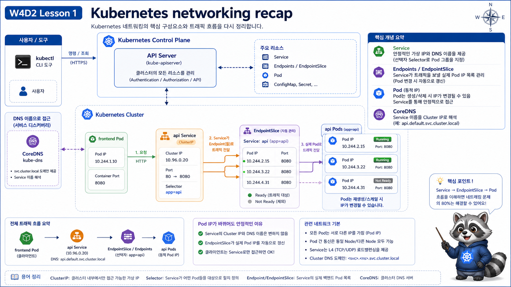

# 1교시: Day1 요약 + Kubernetes Networking 다시 잡기



## 수업 목표
- W4D1의 readiness, endpoint, resource 기준을 traffic 관점으로 다시 연결한다.
- Pod IP, Service, Endpoint, DNS, selector의 역할을 출력으로 설명한다.
- “Service가 있다”와 “traffic이 갈 endpoint가 있다”를 구분한다.

## Day1에서 가져올 핵심
W4D1에서 가장 중요한 문장은 이것이었다.

```text
Running과 Ready는 다르다.
Ready가 아니면 Service endpoint에서 빠질 수 있다.
```

W4D2에서는 이 문장이 외부 traffic 장애로 어떻게 이어지는지 본다.

```text
Pod Running
  -> readiness 실패
  -> Endpoint 없음
  -> Service는 있지만 backend 없음
  -> Gateway 경로에서 503 계열 장애
```

## Kubernetes traffic 기본 흐름
Pod끼리 직접 Pod IP로 통신하지 않는다. Pod IP는 바뀔 수 있으므로 Service를 사용한다.

```text
frontend Pod
  -> api Service DNS
  -> api Endpoint
  -> api Pod IP:containerPort
```

cluster 밖 사용자는 한 단계가 더 필요하다.

```text
사용자
  -> Envoy Gateway data plane
  -> Gateway listener
  -> HTTPRoute rule
  -> Service
  -> Endpoint
  -> Pod
```

## 출력으로 보는 구성요소
```bash
kubectl -n week4 get pod -o wide
```

예상 출력:
```text
NAME                        READY   STATUS    IP
frontend-7b6b6c6d9f-x8k2p   1/1     Running   10.244.0.21
api-6f7dd8d9b9-nq2k4        1/1     Running   10.244.0.31
```

Pod IP는 실제 traffic 도착지지만, 직접 외우거나 고정값으로 쓰면 안 된다.

```bash
kubectl -n week4 get svc,endpoints
```

예상 출력:
```text
NAME               TYPE        CLUSTER-IP      PORT(S)
service/frontend   ClusterIP   10.96.10.101    80/TCP
service/api        ClusterIP   10.96.55.202    80/TCP

NAME                 ENDPOINTS
endpoints/frontend   10.244.0.21:80,10.244.0.22:80
endpoints/api        10.244.0.31:8080,10.244.0.32:8080
```

해석:
| 출력 | 의미 |
|---|---|
| `service/api 80/TCP` | Service는 80번 port로 받음 |
| `endpoints/api 10.244.x.x:8080` | 실제 Pod containerPort는 8080 |
| Endpoint가 2개 | Ready Pod가 2개 |
| Endpoint `<none>` | Service가 traffic을 보낼 Pod가 없음 |

## selector가 traffic을 결정한다
Service는 이름으로 Pod를 찾지 않는다. label selector로 찾는다.

```bash
kubectl -n week4 get svc api -o yaml
kubectl -n week4 get pod -l app=api
```

Service selector:
```yaml
selector:
  app: api
```

Pod label:
```yaml
labels:
  app: api
```

이 둘이 맞아야 Endpoint가 생긴다.

## DNS 이름
같은 namespace에서는 짧게 호출할 수 있다.

```bash
curl http://api/api
```

전체 이름은 다음과 같다.

```text
api.week4.svc.cluster.local
```

DNS가 실패하면 app log보다 먼저 Service 이름, namespace, CoreDNS, NetworkPolicy DNS egress를 확인한다.

## nslookup으로 DNS 확인
curl만으로는 DNS 실패와 connection 실패를 구분하기 어렵다. 필요하면 DNS 조회부터 확인한다.

```bash
kubectl -n week4 run dnscheck --rm -it --restart=Never \
  --image=busybox:1.36 \
  -- nslookup api
```

예상 출력:
```text
Server:    10.96.0.10
Address 1: 10.96.0.10 kube-dns.kube-system.svc.cluster.local

Name:      api
Address 1: 10.96.55.202 api.week4.svc.cluster.local
```

해석:
| 출력 | 의미 |
|---|---|
| `kube-dns.kube-system` | CoreDNS로 질의 중 |
| `api.week4.svc.cluster.local` | 같은 namespace의 Service를 찾음 |
| `can't resolve` | Service 이름, namespace, DNS egress 확인 |

## Pod IP로 직접 호출하지 않는 이유
Pod IP로 직접 호출하면 처음에는 된다.

```bash
curl http://10.244.0.31:8080/api
```

하지만 rollout, reschedule, node 재시작이 있으면 Pod IP는 바뀐다. Service는 selector와 Endpoint를 갱신해 이 변화를 감춘다.

```text
Pod IP 변경
  -> Endpoint 갱신
  -> Service DNS는 그대로
  -> client는 http://api 계속 사용
```

이 감각이 있어야 Gateway API도 이해된다. HTTPRoute는 Pod로 직접 보내지 않고 Service로 보낸다.

## 오늘의 장애 판단 순서
| 순서 | 명령 | 판단 |
|---|---|---|
| 1 | `kubectl -n week4 get gateway,httproute` | Gateway와 Route가 있는가 |
| 2 | `kubectl -n week4 describe httproute paperclip-routes` | parentRefs, host/path/backendRefs가 맞는가 |
| 3 | `kubectl -n week4 get svc,endpoints` | Service와 Endpoint가 있는가 |
| 4 | `kubectl -n week4 get pod` | Ready Pod가 있는가 |
| 5 | `kubectl -n envoy-gateway-system logs deploy/envoy-gateway` | controller가 Gateway/Route를 처리했는가 |

## Evidence Note
```markdown
# W4D2S1 Networking recap
- frontend Pod IP:
- api Service ClusterIP:
- api Endpoint:
- Service selector:
- DNS 조회 결과:
- Endpoint가 `<none>`이면 볼 것:
```

## 한 줄 요약
```text
Kubernetes traffic 장애는 Gateway, HTTPRoute, Service, Endpoint, Pod readiness를 순서대로 좁혀야 한다.
```
