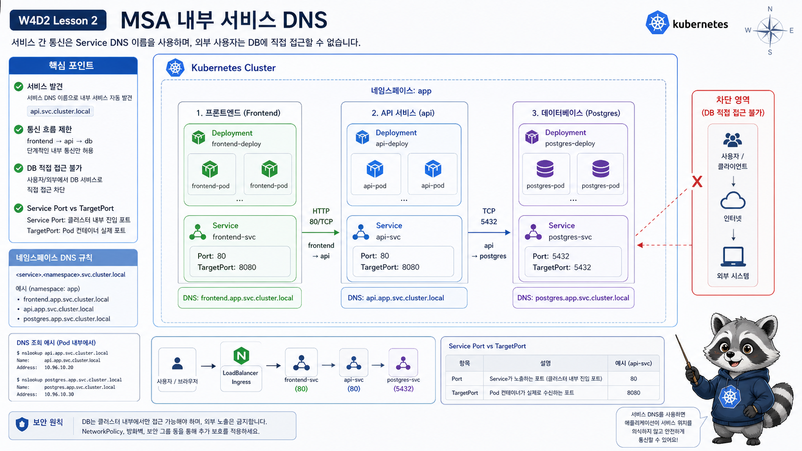

# 2교시: MSA 앱 내부 통신



## 수업 목표
- frontend, api, db workload를 Service DNS로 연결한다.
- Service `port`와 `targetPort` 차이를 출력으로 확인한다.
- frontend -> api, api -> db 구조와 host에서 db에 직접 접근하지 않는 기준을 설명한다.

## 오늘의 앱 구조
오늘의 실습 앱은 단순하지만 MSA traffic 구조를 갖는다.

```text
frontend
  -> api
  -> postgres
```

외부 사용자는 db에 직접 접근하지 않는다. 외부 사용자의 진입점은 Gateway/HTTPRoute이며, db는 cluster 내부 backend만 접근해야 한다.

## 배포
```bash
export NS=week4
export LAB=week4/day2/labs/traffic-routing

kubectl apply -f "$LAB/namespace.yaml"
kubectl apply -f "$LAB/frontend-configmap.yaml"
kubectl apply -f "$LAB/db-secret.yaml"
kubectl apply -f "$LAB/frontend-deployment.yaml"
kubectl apply -f "$LAB/api-deployment.yaml"
kubectl apply -f "$LAB/db-deployment.yaml"
kubectl apply -f "$LAB/services.yaml"
```

상태 확인:
```bash
kubectl -n "$NS" get deploy,pod,svc,endpoints -o wide
```

예상 출력:
```text
deployment.apps/frontend   2/2
deployment.apps/api        2/2
deployment.apps/postgres   1/1

service/frontend   ClusterIP   80/TCP
service/api        ClusterIP   80/TCP
service/postgres   ClusterIP   5432/TCP
```

## Service port와 targetPort
api Service는 80번으로 받고, Pod의 `http` port인 8080으로 보낸다.

```bash
kubectl -n "$NS" get svc api -o yaml
kubectl -n "$NS" get endpoints api
```

출력 예시:
```yaml
ports:
  - name: http
    port: 80
    targetPort: http
```

Endpoint:
```text
api   10.244.0.31:8080,10.244.0.32:8080
```

해석:
| 항목 | 의미 |
|---|---|
| Service `port: 80` | client가 호출하는 port |
| `targetPort: http` | Pod containerPort 이름 |
| Endpoint `:8080` | 실제 Pod가 듣는 port |

## 내부 DNS 호출
```bash
kubectl -n "$NS" run curlbox --rm -it --restart=Never \
  --image=curlimages/curl:8.10.1 \
  -- curl -s http://api/api
```

기대 출력:
```json
{"service":"api","version":"v1","status":"ok"}
```

만약 다음 오류가 나오면 DNS와 Service부터 확인한다.

```text
curl: (6) Could not resolve host: api
```

확인:
```bash
kubectl -n "$NS" get svc api
kubectl -n "$NS" get endpoints api
kubectl -n kube-system get pod -l k8s-app=kube-dns
```

connection 계열 오류라면 DNS는 됐지만 endpoint나 port가 문제일 수 있다.

```text
curl: (7) Failed to connect to api port 80
```

frontend 호출:
```bash
kubectl -n "$NS" run curlbox --rm -it --restart=Never \
  --image=curlimages/curl:8.10.1 \
  -- curl -s http://frontend/ | head
```

## db 접근 기준
db Service는 ClusterIP다.

```bash
kubectl -n "$NS" get svc postgres
```

예상 출력:
```text
NAME       TYPE        CLUSTER-IP      PORT(S)
postgres   ClusterIP   10.96.x.x       5432/TCP
```

host에서 db에 직접 접근하는 구조로 만들지 않는다. 외부 사용자는 frontend/API traffic만 보내고, db는 backend 내부 dependency로 둔다.

## api -> db 연결 확인 기준
오늘 api container는 실제 DB client를 포함하지 않으므로 DB 접속 성공까지 깊게 실습하지 않는다. 대신 service 구조와 policy 기준을 확인한다.

```bash
kubectl -n "$NS" get svc postgres
kubectl -n "$NS" get endpoints postgres
kubectl -n "$NS" describe pod -l app=postgres
```

예상 출력:
```text
service/postgres   ClusterIP   5432/TCP
endpoints/postgres 10.244.0.41:5432
Readiness probe passed
```

이 상태면 cluster 내부에서 backend가 `postgres:5432`로 접근할 수 있는 기반이 만들어진 것이다.

## frontend가 db를 직접 알면 안 되는 이유
frontend가 db endpoint를 알고 직접 접근하는 구조는 피한다.

| 문제 | 설명 |
|---|---|
| 보안 | browser/client 계층이 DB 정보를 알게 됨 |
| 네트워크 경계 | db를 내부 backend dependency로 숨기기 어려움 |
| 변경 영향 | DB 교체/분리 시 frontend까지 영향 |
| 권한 | frontend에 과도한 DB 접근 권한이 필요 |

Kubernetes에서도 이 원칙은 같다. Service가 있다고 해서 모두에게 열어야 하는 것은 아니다.

## 내부 통신 장애 판단
| 증상 | 먼저 볼 명령 | 이유 |
|---|---|---|
| `Could not resolve host: api` | `kubectl -n week4 get svc api` | Service 이름/namespace 확인 |
| connection refused | `kubectl -n week4 get endpoints api` | endpoint/port 확인 |
| timeout | NetworkPolicy, Pod readiness | traffic 차단 또는 준비 실패 |
| API 응답 이상 | `kubectl -n week4 logs deploy/api` | app process 확인 |

## Evidence Note
```markdown
# W4D2S2 Internal service DNS
- frontend Service:
- api Service:
- postgres Service:
- api Endpoint:
- 내부 curl 결과:
- DNS 실패와 connection 실패 차이:
```

## 한 줄 요약
```text
내부 통신은 Service DNS로 하고, Service port와 targetPort를 구분해야 장애를 빨리 찾는다.
```
