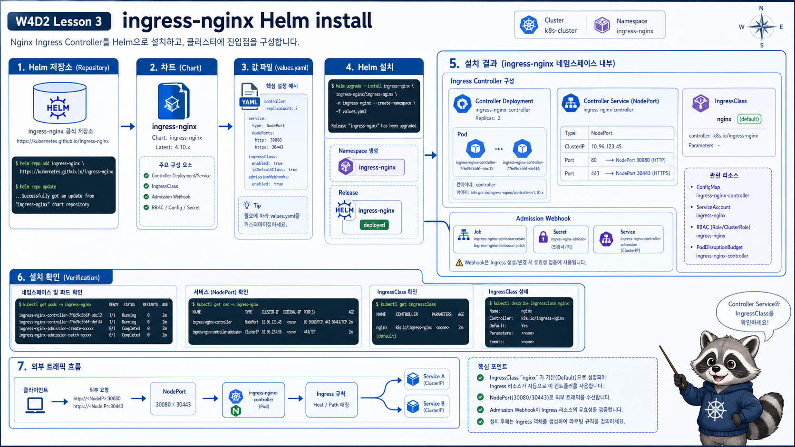

# 3교시: ingress-nginx 설치



## 수업 목표
- Ingress object와 Ingress Controller의 차이를 설명한다.
- ingress-nginx를 Helm으로 설치하고 release, Pod, Service, IngressClass를 확인한다.
- kind/local 환경에서 NodePort와 port-forward 확인 방식을 구분한다.

## Ingress만으로는 동작하지 않는다
Ingress는 rule이다. rule을 실제 proxy 설정으로 반영하는 controller가 필요하다.

```text
Ingress object
  -> "paperclip.local /api는 api Service로 보내라"라는 선언

Ingress Controller
  -> 그 선언을 읽고 NGINX 설정으로 반영하는 실행체
```

오늘은 Ingress Controller로 `ingress-nginx`를 설치한다.

## Helm values 확인
```bash
cat week4/day2/labs/ingress-nginx/values.yaml
```

핵심 설정:
```yaml
controller:
  ingressClass: nginx
  ingressClassResource:
    name: nginx
    enabled: true
    default: false
  service:
    type: NodePort
    nodePorts:
      http: 30080
      https: 30443
```

해석:
| 설정 | 의미 |
|---|---|
| `ingressClass: nginx` | Ingress rule이 사용할 class 이름 |
| `default: false` | className 없는 Ingress를 자동 처리하지 않음 |
| `service.type: NodePort` | bare metal/kind 확인을 위한 Service 타입 |
| `nodePorts.http: 30080` | cluster node의 30080으로 http 노출 |

kind cluster가 host port mapping 없이 만들어졌다면 host의 `localhost:30080`이 바로 동작하지 않을 수 있다. 이 경우 `port-forward`로 확인한다.

## Helm 설치
```bash
helm repo add ingress-nginx https://kubernetes.github.io/ingress-nginx
helm repo update

helm upgrade --install ingress-nginx ingress-nginx/ingress-nginx \
  --namespace ingress-nginx \
  --create-namespace \
  -f week4/day2/labs/ingress-nginx/values.yaml
```

예상 출력:
```text
Release "ingress-nginx" does not exist. Installing it now.
NAME: ingress-nginx
NAMESPACE: ingress-nginx
STATUS: deployed
REVISION: 1
```

이미 설치되어 있으면 upgrade 출력이 나온다.

## release 확인
```bash
helm list -n ingress-nginx
helm status ingress-nginx -n ingress-nginx
helm get values ingress-nginx -n ingress-nginx
```

예상 출력:
```text
NAME            NAMESPACE       REVISION  STATUS    CHART
ingress-nginx   ingress-nginx   1         deployed  ingress-nginx-x.x.x
```

`STATUS=deployed`는 Helm release가 배포됐다는 뜻이다. controller Pod가 Ready인지는 별도로 본다.

## controller 리소스 확인
```bash
kubectl -n ingress-nginx get deploy,pod,svc
kubectl get ingressclass
```

예상 출력:
```text
NAME                                       READY   UP-TO-DATE   AVAILABLE
deployment.apps/ingress-nginx-controller   1/1     1            1

NAME                                  READY   STATUS
pod/ingress-nginx-controller-xxxxx    1/1     Running

NAME                                 TYPE       PORT(S)
service/ingress-nginx-controller     NodePort   80:30080/TCP,443:30443/TCP
```

IngressClass:
```text
NAME    CONTROLLER
nginx   k8s.io/ingress-nginx
```

## admission job 확인
ingress-nginx chart는 admission webhook 관련 Job/Secret을 만들 수 있다.

```bash
kubectl -n ingress-nginx get job,secret | grep admission
```

예상:
```text
job.batch/ingress-nginx-admission-create
job.batch/ingress-nginx-admission-patch
secret/ingress-nginx-admission
```

admission webhook은 잘못된 Ingress 설정을 API Server 단계에서 검증하는 데 쓰인다. 오늘은 깊게 파지 않고, 설치 시 함께 생성되는 구성요소라는 점만 확인한다.

## controller log 읽기
Ingress가 동작하지 않을 때 controller log를 본다.

```bash
kubectl -n ingress-nginx logs deploy/ingress-nginx-controller --tail=80
```

정상적으로 rule을 읽으면 reload 또는 sync 관련 메시지가 보일 수 있다. 오류가 있으면 service endpoint, class, backend 관련 메시지가 단서가 된다.

확인 기준:
| log 단서 | 의미 |
|---|---|
| ingress class mismatch | controller가 해당 Ingress를 처리하지 않음 |
| service not found | backend Service 이름 오류 |
| endpoint not found | Service endpoint 없음 |
| port not found | backend service port 오류 |

## NodePort와 port-forward 차이
둘 다 host에서 확인하는 방법이지만 의미가 다르다.

| 방식 | 명령/URL | 특징 |
|---|---|---|
| NodePort | `http://paperclip.local:30080` | node port를 통해 접근 |
| port-forward | `kubectl port-forward svc/... 8080:80` | kubectl이 임시 터널 생성 |

kind에서 NodePort를 host로 바로 쓰려면 cluster 생성 시 extraPortMappings가 필요할 수 있다. 수업에서는 환경 편차를 줄이기 위해 port-forward를 기본 확인 방법으로 둔다.

## port-forward 준비
kind/local에서 가장 안정적인 확인 방법:

```bash
kubectl -n ingress-nginx port-forward svc/ingress-nginx-controller 8080:80
```

이 명령은 터미널을 점유한다. 다른 터미널에서 curl을 실행한다.

```bash
curl -H "Host: paperclip.local" http://localhost:8080/
```

아직 Ingress rule을 만들지 않았다면 404가 나올 수 있다. 이것은 controller가 죽었다는 뜻이 아니라 rule이 없다는 뜻일 수 있다.

## 장애 판단
| 증상 | 확인 |
|---|---|
| Helm chart를 못 찾음 | `helm repo list`, `helm repo update` |
| controller Pod가 Pending | `kubectl -n ingress-nginx describe pod` |
| controller Pod가 CrashLoop | `kubectl -n ingress-nginx logs deploy/ingress-nginx-controller` |
| IngressClass 없음 | `kubectl get ingressclass` |
| localhost:30080 안 됨 | kind port mapping 여부, port-forward 사용 |

## Evidence Note
```markdown
# W4D2S3 ingress-nginx
- Helm release:
- controller Pod READY:
- controller Service type/ports:
- IngressClass:
- port-forward 명령:
- controller log에서 본 단서:
```

## 한 줄 요약
```text
Ingress rule은 길 안내판이고, ingress-nginx controller는 실제 traffic을 라우팅하는 실행체다.
```
