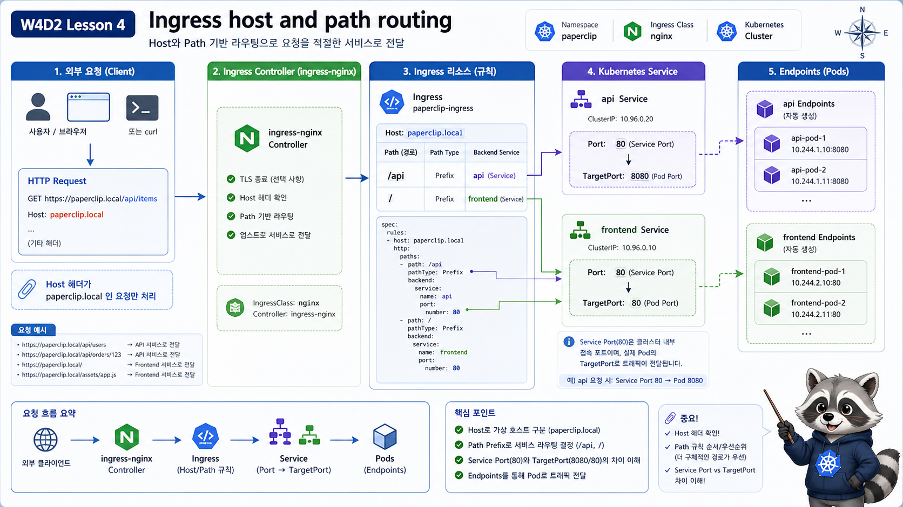

# 4교시: Ingress Rule 작성



## 수업 목표
- Ingress `host`, `path`, `pathType`, `backend service`, `service port`를 구분한다.
- `/`는 frontend, `/api`는 api로 routing한다.
- curl과 browser 관점에서 Host header 확인 방법을 익힌다.

## Ingress manifest
```bash
cat week4/day2/labs/traffic-routing/ingress.yaml
```

핵심:
```yaml
spec:
  ingressClassName: nginx
  rules:
    - host: paperclip.local
      http:
        paths:
          - path: /api
            pathType: Prefix
            backend:
              service:
                name: api
                port:
                  number: 80
          - path: /
            pathType: Prefix
            backend:
              service:
                name: frontend
                port:
                  number: 80
```

해석:
| 필드 | 의미 |
|---|---|
| `ingressClassName: nginx` | ingress-nginx controller가 처리 |
| `host: paperclip.local` | Host header 기준 |
| `path: /api` | API traffic |
| `path: /` | frontend traffic |
| backend `service.name` | 연결할 Service |
| backend `port.number` | Service port |

## 적용과 확인
```bash
kubectl apply -f week4/day2/labs/traffic-routing/ingress.yaml
kubectl -n week4 get ingress
kubectl -n week4 describe ingress paperclip
```

예상 출력:
```text
Name:             paperclip
Namespace:        week4
Ingress Class:    nginx
Rules:
  Host             Path  Backends
  paperclip.local
                   /api  api:80
                   /     frontend:80
```

`Backends`에 service 이름과 port가 보인다. 하지만 이 출력만으로 endpoint가 있다고 보장하지 않는다.

```bash
kubectl -n week4 get svc,endpoints api frontend
```

## curl로 확인
port-forward 터미널:
```bash
kubectl -n ingress-nginx port-forward svc/ingress-nginx-controller 8080:80
```

확인 터미널:
```bash
curl -H "Host: paperclip.local" http://localhost:8080/
curl -H "Host: paperclip.local" http://localhost:8080/api
```

예상:
```text
첫 번째 요청: Paperclip W4D2 Frontend HTML
두 번째 요청: {"service":"api","version":"v1","status":"ok"}
```

Host header가 중요하다. Ingress rule의 host가 `paperclip.local`이므로 그냥 `curl http://localhost:8080/api`를 보내면 rule과 맞지 않아 404가 날 수 있다.

## browser 확인
브라우저에서 확인하려면 hosts 파일에 다음을 추가한다.

```text
127.0.0.1 paperclip.local
```

그다음 port-forward가 켜진 상태에서 접속한다.

```text
http://paperclip.local:8080/
http://paperclip.local:8080/api
```

NodePort를 직접 쓸 경우:
```text
http://paperclip.local:30080/
http://paperclip.local:30080/api
```

단, kind cluster 생성 시 host port mapping이 없었다면 NodePort는 host browser에서 바로 안 될 수 있다.

## pathType Prefix
`pathType: Prefix`는 `/api` 아래 경로도 같은 backend로 보낼 수 있다는 뜻이다.

| 요청 | backend |
|---|---|
| `/api` | api Service |
| `/api/orders` | api Service |
| `/` | frontend Service |
| `/about` | frontend Service |

경로가 겹칠 때는 더 구체적인 path가 먼저 적용된다. 그래서 `/api`와 `/`를 함께 둘 수 있다.

## Host header를 빼면 왜 실패할 수 있나
Ingress rule은 `host: paperclip.local`을 기준으로 한다.

```bash
curl http://localhost:8080/api
```

이 요청의 Host header는 보통 `localhost:8080`이다. Ingress rule의 host와 다르다.

```bash
curl -H "Host: paperclip.local" http://localhost:8080/api
```

이 요청은 Host header가 `paperclip.local`이므로 rule과 맞는다.

확인:
| 요청 | Host header | 예상 |
|---|---|---|
| `curl http://localhost:8080/api` | `localhost:8080` | 404 가능 |
| `curl -H "Host: paperclip.local" ...` | `paperclip.local` | api 응답 |
| browser `paperclip.local:8080` | `paperclip.local:8080` | hosts 설정 필요 |

## Ingress는 Service port를 본다
api Pod는 8080을 listen하지만, Ingress backend에는 Service port 80을 쓴다.

```text
Ingress backend port 80
  -> api Service port 80
  -> targetPort http
  -> api Pod containerPort 8080
```

이 구분을 못 하면 backend port 오류가 자주 난다.

## 확인 순서
| 확인 | 명령 |
|---|---|
| Ingress rule | `kubectl -n week4 describe ingress paperclip` |
| Service | `kubectl -n week4 get svc api frontend` |
| Endpoint | `kubectl -n week4 get endpoints api frontend` |
| Controller | `kubectl -n ingress-nginx get pod` |
| Access | `curl -H "Host: paperclip.local" http://localhost:8080/api` |

## Evidence Note
```markdown
# W4D2S4 Ingress rule
- host:
- path `/` backend:
- path `/api` backend:
- curl `/` 결과:
- curl `/api` 결과:
- Host header를 넣어야 하는 이유:
```

## 한 줄 요약
```text
Ingress는 host와 path를 기준으로 외부 요청을 Kubernetes Service에 연결한다.
```
