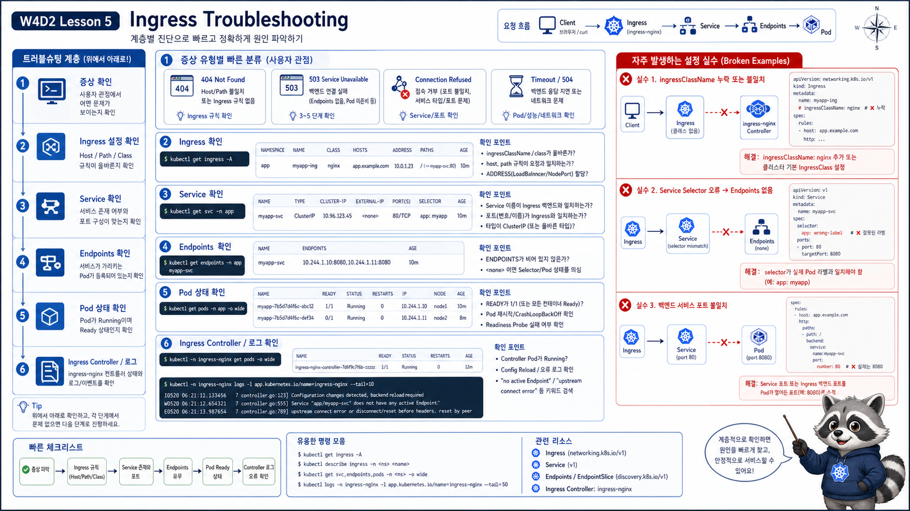

# 5교시: Ingress 장애 분석



## 수업 목표
- 404, 503, connection refused, timeout을 한 덩어리로 보지 않는다.
- className 누락, Service selector 오류, backend port 오류를 출력으로 구분한다.
- Ingress 장애에서 먼저 볼 증거 순서를 익힌다.

## 장애 분석 기본 순서
```text
curl/browser 증상
  -> Ingress host/path/class
  -> Service name/port
  -> Endpoint 존재
  -> Pod readiness
  -> controller log
```

처음부터 app log만 보면 traffic이 app까지 도달하지 않은 경우를 놓친다.

## 증상별 첫 판단
| 증상 | 원인 후보 | 먼저 볼 명령 |
|---|---|---|
| 404 | host/path rule 불일치, class 처리 안 됨 | `describe ingress` |
| 503 | endpoint 없음, readiness 실패 | `get endpoints` |
| connection refused | controller Service/port-forward 문제 | `get svc -n ingress-nginx` |
| timeout | NetworkPolicy, backend 지연, controller 문제 | endpoint, logs |
| DNS failure | hosts/CoreDNS/Service 이름 | hosts, svc |

## 장애 1: className 누락
```bash
kubectl apply -f week4/day2/labs/traffic-routing/broken-ingress-no-class.yaml
kubectl -n week4 describe ingress paperclip-no-class
curl -H "Host: broken.paperclip.local" http://localhost:8080/
```

manifest에는 `ingressClassName`이 없다.

```yaml
spec:
  rules:
    - host: broken.paperclip.local
```

W4D2 values에서는 default ingress class를 사용하지 않으므로, controller가 이 rule을 처리하지 않을 수 있다.

확인:
```bash
kubectl get ingressclass
kubectl -n week4 get ingress paperclip-no-class -o yaml
kubectl -n ingress-nginx logs deploy/ingress-nginx-controller --tail=80
```

## 장애 2: Service selector 오류
```bash
kubectl apply -f week4/day2/labs/traffic-routing/broken-service-wrong-selector.yaml
kubectl -n week4 get svc,endpoints api-broken-selector
```

예상 출력:
```text
NAME                          TYPE        CLUSTER-IP
service/api-broken-selector   ClusterIP   10.96.x.x

NAME                            ENDPOINTS
endpoints/api-broken-selector   <none>
```

Service는 있지만 endpoint가 없다. selector가 실제 Pod label과 맞지 않기 때문이다.

확인:
```bash
kubectl -n week4 get svc api-broken-selector -o yaml
kubectl -n week4 get pod --show-labels | grep api
```

판단:
| 출력 | 의미 |
|---|---|
| Service 존재 | DNS와 ClusterIP는 생김 |
| Endpoint `<none>` | traffic을 받을 Ready Pod가 없음 |
| Pod label `app=api` | Service selector가 `app=api-missing`이면 불일치 |

## 장애 3: backend port 오류
```bash
kubectl apply -f week4/day2/labs/traffic-routing/broken-ingress-wrong-port.yaml
kubectl -n week4 describe ingress paperclip-wrong-port
curl -H "Host: wrong-port.paperclip.local" http://localhost:8080/api
```

Ingress는 Service의 `port`를 참조해야 한다. api Service는 80번 port를 제공하고, targetPort로 Pod의 8080에 보낸다. Ingress backend에 8080을 쓰면 Service port와 맞지 않는다.

확인:
```bash
kubectl -n week4 get svc api -o yaml
kubectl -n week4 describe ingress paperclip-wrong-port
```

정상 Service:
```yaml
ports:
  - port: 80
    targetPort: http
```

Ingress backend는 `number: 80`이어야 한다.

## 장애 4: readiness 실패와 endpoint 없음
Pod가 Running이어도 Ready가 아니면 endpoint에서 빠진다.

```bash
kubectl -n week4 get pod
kubectl -n week4 get endpoints api
kubectl -n week4 describe pod -l app=api
```

출력 예시:
```text
READY   STATUS
0/1     Running

endpoints/api   <none>

Readiness probe failed
```

이 경우 Ingress는 정상이어도 503 계열 장애로 보일 수 있다.

## controller가 보는 backend 상태
ingress-nginx controller는 Kubernetes API에서 Ingress, Service, Endpoint 정보를 읽어 NGINX 설정을 만든다. 따라서 backend Service가 없거나 endpoint가 비면 controller log에도 단서가 남을 수 있다.

```bash
kubectl -n ingress-nginx logs deploy/ingress-nginx-controller --tail=100
```

볼 수 있는 단서:
```text
Service "week4/api" does not have any active Endpoint.
```

이 문장은 app log가 아니라 traffic layer의 증거다. app container가 요청을 받기도 전에 Ingress -> Service -> Endpoint 단계에서 막힌 것이다.

## 장애별 curl 출력 예시
| curl 출력 | 해석 시작점 |
|---|---|
| `404 Not Found` | host/path/class mismatch |
| `503 Service Temporarily Unavailable` | endpoint 없음, readiness 실패 |
| `Failed to connect to localhost port 8080` | port-forward/controller 접근 문제 |
| `Could not resolve host` | hosts 파일 또는 DNS 문제 |
| 응답은 200인데 body가 예상과 다름 | path가 다른 backend로 갔을 가능성 |

## 빠른 비교 명령
정상 Ingress와 broken Ingress를 나란히 비교한다.

```bash
kubectl -n week4 describe ingress paperclip
kubectl -n week4 describe ingress paperclip-no-class
kubectl -n week4 describe ingress paperclip-wrong-port
```

정상 Service와 broken Service를 비교한다.

```bash
kubectl -n week4 get svc api api-broken-selector -o wide
kubectl -n week4 get endpoints api api-broken-selector
```

비교의 핵심:
| 비교 | 정상 | 문제 |
|---|---|---|
| ingressClassName | `nginx` | 없음 |
| backend service port | `80` | `8080` |
| endpoint | Pod IP 목록 | `<none>` |
| Pod READY | `1/1` | `0/1` |

## 장애 분석 템플릿
```markdown
## 증상
- curl/browser:

## Ingress
- host/path:
- ingressClassName:
- backend service/port:

## Service/Endpoint
- service port:
- endpoint:

## Pod
- READY:
- event:

## 판단
- 원인 후보:
- 다음 조치:
```

## Evidence Note
```markdown
# W4D2S5 Ingress troubleshooting
- 내가 본 증상:
- HTTP status 또는 curl error:
- Ingress host/path/class:
- Service port와 targetPort:
- Endpoint 상태:
- Pod READY/event:
- 가장 가능성 높은 원인:
```

## 한 줄 요약
```text
Ingress 장애는 controller, rule, service, endpoint, readiness를 층별로 나누어 확인한다.
```
