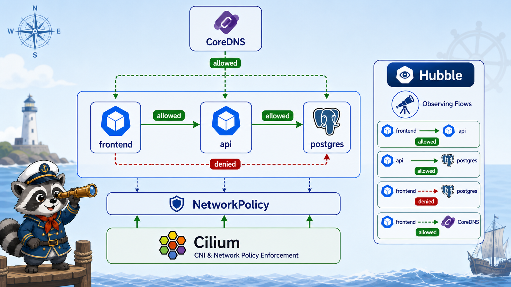

# 6교시: NetworkPolicy와 Cilium/Hubble Preview



## 수업 목표
- frontend -> api -> db traffic 허용선을 설계한다.
- NetworkPolicy가 왜 DNS egress를 고려해야 하는지 설명한다.
- kind 기본 CNI에서는 NetworkPolicy가 강제되지 않을 수 있음을 명확히 구분한다.
- Cilium/Hubble이 NetworkPolicy enforcement와 flow observability에서 어떤 역할을 하는지 preview한다.

## 왜 NetworkPolicy가 필요한가
Service와 Ingress는 “어디로 보낼 것인가”를 다룬다. NetworkPolicy는 “누가 누구에게 갈 수 있는가”를 다룬다.

Kubernetes namespace는 기본적으로 이름을 나누는 경계이지, 항상 network를 자동 차단하는 방화벽은 아니다. NetworkPolicy가 없고 CNI가 기본 허용 모델이면 다른 namespace Service도 DNS 이름으로 호출될 수 있다.

```text
frontend.week4
  -> http://api.week4.svc.cluster.local
  -> http://api.other-namespace.svc.cluster.local
```

따라서 "namespace가 다르면 못 간다"가 아니라 "NetworkPolicy 또는 CNI/보안 설정으로 막아야 못 간다"가 정확하다.

운영 기준:
```text
사용자 -> Ingress -> frontend/api
frontend -> api 허용
api -> db 허용
frontend -> db 차단
알 수 없는 Pod -> db 차단
DNS egress 허용
```

host에서 db에 직접 접근하는 구조는 만들지 않는다. db는 내부 backend dependency로 남겨둔다.

## 기본 허용과 정책 적용 후 모델
NetworkPolicy를 이해할 때는 적용 전과 적용 후를 나누어야 한다.

| 상태 | 의미 |
|---|---|
| NetworkPolicy 없음 | CNI 기본값에 따라 Pod 간 통신이 대부분 허용될 수 있음 |
| 특정 Pod에 ingress policy 존재 | 그 Pod로 들어오는 traffic은 허용 rule에 맞아야 함 |
| 특정 Pod에 egress policy 존재 | 그 Pod에서 나가는 traffic은 허용 rule에 맞아야 함 |
| default deny ingress/egress | 명시적으로 연 traffic만 통과 |

NetworkPolicy는 "Service를 없애는 것"이 아니다. Service DNS와 Endpoint가 있어도 policy가 막으면 packet이 통과하지 못한다.

```text
Service exists
Endpoint exists
DNS resolves
NetworkPolicy denies
  -> timeout 또는 connection failure
```

그래서 network 장애를 볼 때는 `Service/DNS/Endpoint`와 `NetworkPolicy`를 분리해서 확인해야 한다.

## 오늘 manifest 보기
```bash
cat week4/day2/labs/traffic-routing/networkpolicy-preview.yaml
```

적용:
```bash
kubectl apply -f week4/day2/labs/traffic-routing/networkpolicy-preview.yaml
kubectl -n week4 get networkpolicy
```

예상 출력:
```text
NAME                           POD-SELECTOR   AGE
default-deny-all               <none>         5s
allow-dns-egress               <none>         5s
allow-frontend-to-api          app=api        5s
allow-frontend-egress-to-api   app=frontend   5s
allow-api-to-db                app=postgres   5s
allow-api-egress-to-db         app=api        5s
```

`default-deny-all`과 `allow-dns-egress`의 `podSelector: {}`는 namespace 안 모든 Pod를 대상으로 한다. 그 위에 역할별 허용 policy를 추가해 필요한 통신만 열어준다.

## selector를 정확히 읽는다
NetworkPolicy는 이름이 아니라 label selector로 대상을 고른다.

| selector | 범위 |
|---|---|
| `podSelector: {}` | policy가 있는 namespace의 모든 Pod |
| `podSelector.matchLabels.app: api` | policy가 있는 namespace의 `app=api` Pod |
| `from.podSelector.app: frontend` | 같은 namespace의 `app=frontend` Pod |
| `from.namespaceSelector...` | 조건에 맞는 namespace의 Pod |

이 수업의 manifest는 `week4` namespace 내부의 `frontend -> api -> postgres`를 다룬다. 다른 namespace에서 들어오는 traffic까지 허용하려면 `namespaceSelector`가 필요하다.

예시:
```yaml
from:
  - namespaceSelector:
      matchLabels:
        kubernetes.io/metadata.name: partner
    podSelector:
      matchLabels:
        app: caller
```

이 rule은 `partner` namespace 안의 `app=caller` Pod를 뜻한다. `podSelector`만 쓰면 policy가 있는 namespace 안에서만 찾는다고 이해하면 된다.

## CNI 주의
NetworkPolicy는 Kubernetes API object지만, 실제 packet 차단은 CNI plugin이 수행한다.

| 환경 | 주의 |
|---|---|
| kind 기본 CNI | NetworkPolicy enforcement가 기대처럼 동작하지 않을 수 있음 |
| Calico/Cilium | NetworkPolicy enforcement 가능 |
| cloud managed cluster | provider/CNI 설정 확인 필요 |

따라서 오늘은 정책 강제 실험보다 “어떤 traffic을 허용해야 하는가”를 preview로 본다.

## DNS egress를 빼먹으면 생기는 문제
Service 이름 호출은 DNS가 필요하다.

```bash
curl http://api
```

이 요청은 먼저 `api.week4.svc.cluster.local`을 DNS로 해석한다. egress policy에서 kube-dns/CoreDNS로 가는 53번 UDP/TCP를 막으면 Service 이름이 풀리지 않는다.

대표 증상:
```text
Could not resolve host: api
```

이때 app이 죽은 것이 아니라 DNS egress가 막혔을 수 있다.

DNS는 보통 `kube-system` namespace의 CoreDNS Pod로 간다. 그러므로 default deny egress를 적용했다면 application namespace 밖으로 나가는 DNS traffic도 열어야 한다.

```text
app Pod in week4
  -> kube-dns Service
  -> CoreDNS Pod in kube-system
  -> service name resolved
```

여기서도 "다른 namespace라서 무조건 막힘/허용"이 아니라, egress policy와 CNI enforcement가 실제 결과를 결정한다.

## traffic matrix
| Source | Destination | 허용 여부 | 이유 |
|---|---|---|---|
| frontend | api | 허용 | 사용자 기능 호출 |
| api | postgres | 허용 | 데이터 접근 |
| frontend | postgres | 차단 의도 | db 직접 접근 방지 |
| unknown Pod | postgres | 차단 의도 | lateral movement 방지 |
| app Pod | kube-dns | 허용 | Service DNS 필요 |
| app Pod | 다른 namespace Service | 기본은 가능할 수 있음 | 정책이 없으면 namespace만으로 차단되지 않음 |

## 정책별 의미
| Policy | 대상 | 의미 |
|---|---|---|
| `default-deny-all` | 모든 Pod | 기본 ingress/egress 차단 |
| `allow-dns-egress` | 모든 Pod | kube-dns 53번 허용 |
| `allow-frontend-to-api` | api Pod ingress | frontend에서 api로 들어오는 traffic 허용 |
| `allow-frontend-egress-to-api` | frontend Pod egress | frontend가 api로 나가는 traffic 허용 |
| `allow-api-to-db` | postgres Pod ingress | api에서 db로 들어오는 traffic 허용 |
| `allow-api-egress-to-db` | api Pod egress | api가 db로 나가는 traffic 허용 |

NetworkPolicy는 ingress와 egress 양쪽을 나누어 생각해야 한다. egress default deny가 걸려 있으면 source Pod에서 나가는 것도 열어야 한다.

## NetworkPolicy와 Gateway API는 다른 문제다
Gateway/HTTPRoute는 외부 요청을 Service로 보낸다. NetworkPolicy는 Pod 간 network path를 제한한다.

```text
Gateway 정상
HTTPRoute 정상
Service 정상
Endpoint 정상
NetworkPolicy가 backend traffic 차단
  -> timeout 또는 connection 문제
```

즉 Gateway/HTTPRoute rule이 맞아도 NetworkPolicy 때문에 backend 연결이 안 될 수 있다.

## Cilium과 Hubble preview
Kubernetes NetworkPolicy는 표준 API지만 실제 packet 차단은 CNI가 수행한다. Cilium은 eBPF 기반 CNI로 NetworkPolicy와 CiliumNetworkPolicy를 처리할 수 있고, Hubble은 service 간 flow를 관찰하는 도구다.

| 도구 | 역할 |
|---|---|
| Cilium | CNI, NetworkPolicy enforcement, eBPF 기반 datapath |
| CiliumNetworkPolicy | Kubernetes NetworkPolicy보다 확장된 정책 표현 |
| Hubble | flow, service dependency, drop reason 관찰 |
| Hubble UI/CLI | 어떤 Pod가 어떤 Service로 통신했는지 시각화/조회 |

수업에서는 깊은 설치보다 다음 질문을 남긴다.

```text
Service/DNS/Endpoint는 정상인데 timeout이 난다면
NetworkPolicy 또는 CNI 레벨에서 packet이 drop되는지 어떻게 볼 것인가?
```

Prometheus/Grafana가 resource와 application metric을 보여준다면, Hubble은 network flow evidence를 보강한다.

```text
frontend -> api flow allowed
frontend -> postgres flow denied
api -> postgres flow allowed
unknown -> postgres flow denied
```

이 관점은 W4D5 Istio와도 연결된다. Istio는 sidecar/service mesh 계층에서 traffic policy와 telemetry를 제공하고, Cilium은 CNI/eBPF datapath 계층에서 network policy와 flow 관찰을 제공한다. 둘은 같은 문제가 아니라 서로 다른 계층을 다룬다.

## 강제되지 않는 환경에서의 확인법
kind 기본 CNI처럼 policy가 강제되지 않는 환경에서는 정책을 적용해도 통신이 계속 될 수 있다.

```bash
kubectl -n week4 get networkpolicy
kubectl -n week4 describe networkpolicy allow-frontend-to-api
```

이 경우 오늘의 목표는 “차단 결과”가 아니라 “어떤 label과 port를 기준으로 정책을 작성하는가”다. 실제 차단 효과는 Calico/Cilium 같은 CNI 환경에서 확인하는 것이 맞다.

## 확인 명령
```bash
kubectl -n week4 describe networkpolicy default-deny-all
kubectl -n week4 describe networkpolicy allow-frontend-to-api
kubectl -n week4 describe networkpolicy allow-api-to-db
kubectl -n week4 get pod --show-labels
kubectl get ns --show-labels
kubectl -n kube-system get pod -l k8s-app=kube-dns --show-labels
```

확인할 것:
| 확인 | 이유 |
|---|---|
| Pod label | policy selector가 label 기반 |
| kube-dns label | DNS egress rule 대상 |
| namespace label | `kubernetes.io/metadata.name` 사용 여부 |

정책 적용 전/후를 비교할 때는 다음 순서로 본다.

```bash
kubectl -n week4 get svc,endpoints
kubectl -n week4 get networkpolicy
kubectl -n week4 describe networkpolicy default-deny-all
```

Service와 Endpoint가 정상인데 timeout이면 NetworkPolicy 가능성이 커진다. DNS resolve 자체가 실패하면 DNS egress를 먼저 본다.

## 운영에서 더 나은 구성
오늘 manifest도 역할별로 나누어 둔다. 운영에서는 여기에 namespace, ServiceAccount, app tier, environment label을 더해 정책을 세분화한다.

| Policy | 목적 |
|---|---|
| `allow-envoy-gateway-to-frontend` | Gateway data plane이 frontend Pod로 진입 |
| `allow-envoy-gateway-to-api` | Gateway data plane이 api Pod로 진입 |
| `allow-frontend-to-api` | frontend가 api 호출 |
| `allow-api-to-db` | api가 db 호출 |
| `allow-dns-egress` | DNS 해석 허용 |
| `default-deny` | 나머지 기본 차단 |

## label이 정책의 API다
NetworkPolicy는 Pod 이름이 아니라 label을 본다. 그래서 label 설계가 곧 network policy 설계가 된다.

```bash
kubectl -n week4 get pod --show-labels
```

예상 출력:
```text
frontend-xxxxx   app=frontend,tier=web
api-yyyyy        app=api,tier=api
postgres-zzzzz   app=postgres,tier=db
```

정책은 이 label을 기준으로 source와 destination을 고른다. label이 부정확하면 정책도 부정확해진다.

## 잘못된 policy의 흔한 결과
| 실수 | 증상 |
|---|---|
| DNS egress 누락 | `Could not resolve host: api` |
| egress만 열고 ingress를 안 엶 | source는 나가려 하지만 destination이 거부 |
| ingress만 열고 egress를 안 엶 | source Pod에서 나가는 traffic이 차단 |
| port를 Service port로 착각 | 실제 Pod port 기준과 불일치 |
| label 오타 | policy가 기대한 Pod에 적용되지 않음 |

NetworkPolicy의 port는 일반적으로 Pod가 실제로 받는 port를 기준으로 생각해야 한다. Service port와 targetPort가 다른 경우 특히 주의한다.

## 오늘은 차단 실험보다 설계 실험이다
강제 가능한 CNI가 있는 환경이라면 다음을 테스트할 수 있다.

```bash
frontend -> api 성공
frontend -> postgres 실패
api -> postgres 성공
unknown pod -> api/db 실패
```

하지만 kind 기본 CNI에서는 결과가 다를 수 있으므로, 오늘은 manifest를 읽고 traffic matrix를 설명하는 것을 성공 기준으로 둔다.

## Evidence Note
```markdown
# W4D2S6 NetworkPolicy preview
- default deny policy:
- DNS egress policy:
- frontend -> api policy:
- api -> db policy:
- kind 기본 CNI 주의:
- Cilium/Hubble로 보고 싶은 flow:
- DNS egress를 빼먹으면 생기는 증상:
- namespace만으로 network가 자동 차단되지 않는 이유:
- podSelector와 namespaceSelector 차이:
- label이 틀리면 생기는 문제:
```

## 한 줄 요약
```text
NetworkPolicy는 namespace 자동 격리가 아니라 label 기반 허용선이며, Cilium/Hubble은 그 허용선과 실제 network flow를 더 깊게 관찰하는 선택지다.
```
