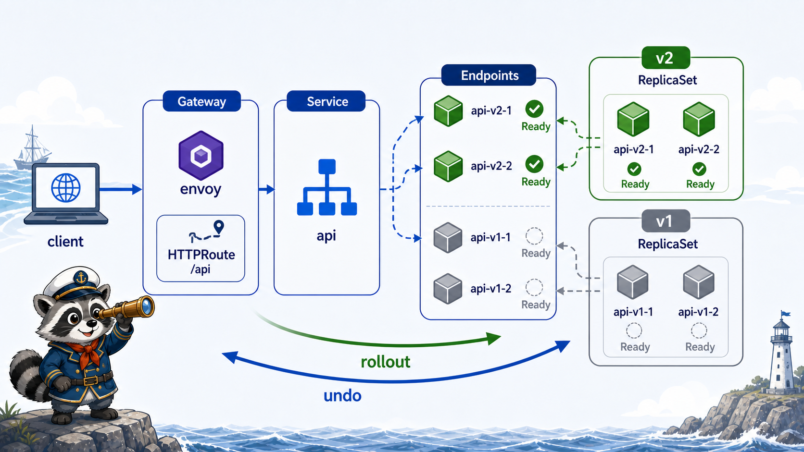

# 7교시: Rollout과 External Traffic



## 수업 목표
- Deployment rollout이 Gateway 외부 traffic에 어떻게 보이는지 확인한다.
- API v1 -> v2 변경을 외부 경로 `/api`로 검증한다.
- rollout status/history/undo와 Gateway response를 연결한다.

## 현재 API 확인
port-forward가 켜져 있다고 가정한다.

```bash
curl -H "Host: paperclip.local" http://localhost:8080/api
```

예상 출력:
```json
{"service":"api","version":"v1","status":"ok"}
```

이 출력은 다음 경로가 모두 맞다는 증거다.

```text
curl
  -> Envoy Gateway data plane
  -> Gateway listener
  -> HTTPRoute /api rule
  -> api Service
  -> api Endpoint
  -> api Pod
```

## v2 배포
```bash
kubectl apply -f week4/day2/labs/traffic-routing/api-deployment-v2.yaml
kubectl -n week4 rollout status deploy/api
kubectl -n week4 rollout history deploy/api
```

예상 출력:
```text
deployment "api" successfully rolled out

REVISION  CHANGE-CAUSE
1         <none>
2         <none>
```

실제 응답 확인:
```bash
curl -H "Host: paperclip.local" http://localhost:8080/api
```

예상:
```json
{"service":"api","version":"v2","status":"ok"}
```

## rollout 중 traffic은 어떻게 되는가
Deployment는 새 ReplicaSet을 만들고 Ready가 된 Pod부터 traffic에 넣는다.

```bash
kubectl -n week4 get deploy,rs,pod -l app=api
kubectl -n week4 get endpoints api
```

정상 흐름:
```text
old Pod Ready
new Pod 생성
new Pod Ready
Endpoint에 new Pod 추가
old Pod 제거
```

readiness가 있어야 “준비되지 않은 새 Pod”가 traffic을 받지 않는다.

## rollout을 watch하면서 보기
터미널을 나누어 확인하면 좋다.

터미널 1:
```bash
kubectl -n week4 get pod,endpoints -l app=api -w
```

터미널 2:
```bash
while true; do
  curl -s -H "Host: paperclip.local" http://localhost:8080/api
  echo
  sleep 1
done
```

터미널 3:
```bash
kubectl apply -f week4/day2/labs/traffic-routing/api-deployment-v2.yaml
```

이렇게 보면 Pod 교체와 외부 응답 변화가 연결된다. 실무에서는 이런 흐름을 Grafana나 tracing으로 더 체계적으로 본다.

## rollback
```bash
kubectl -n week4 rollout undo deploy/api
kubectl -n week4 rollout status deploy/api
curl -H "Host: paperclip.local" http://localhost:8080/api
```

예상:
```json
{"service":"api","version":"v1","status":"ok"}
```

rollback은 Deployment revision 기준이다. Gateway나 HTTPRoute rule을 되돌리는 것이 아니라 api Deployment의 Pod template을 이전 revision으로 되돌린다.

## 장애 rollout 시나리오
새 버전이 readiness를 통과하지 못하면 외부 응답은 어떻게 보일까?

```text
새 ReplicaSet 생성
새 Pod Running but Ready 0/1
Endpoint에는 기존 Ready Pod만 남음
rollout status가 대기
외부 traffic은 기존 Pod로 계속 갈 수 있음
```

확인:
```bash
kubectl -n week4 rollout status deploy/api
kubectl -n week4 get pod -l app=api
kubectl -n week4 get endpoints api
kubectl -n week4 describe pod -l app=api
```

예상 판단:
| 상태 | 사용자 영향 |
|---|---|
| 기존 Pod Ready 유지 | 사용자는 기존 버전 응답을 계속 받을 수 있음 |
| 새 Pod Ready 실패 | rollout이 멈추거나 지연 |
| 모든 endpoint 없음 | Gateway 경로에서 503 계열 가능 |
| readiness 없이 배포 | 준비 안 된 Pod가 traffic을 받을 위험 |

## image tag와 rollout
실무에서는 image tag가 중요하다. 같은 `latest`를 계속 쓰면 어떤 버전이 배포됐는지 추적하기 어렵다.

권장:
| 기준 | 예시 |
|---|---|
| app version | `api:1.4.2` |
| git sha | `api:sha-abc1234` |
| environment promotion | 같은 digest를 dev -> staging -> prod로 승격 |

Kubernetes rollout에서 “무엇이 바뀌었는지”를 설명하려면 image tag/digest와 GitHub Actions build evidence가 연결되어야 한다.

## rollout이 느려지는 이유
rollout은 단순히 image를 바꾸는 명령이 아니다. 새 Pod 생성, image pull, container start, readiness 통과, endpoint 반영이 모두 필요하다.

| 지연 지점 | 증상 |
|---|---|
| image pull | `ContainerCreating`, `ImagePullBackOff` |
| app start | Pod Running이지만 Ready 지연 |
| readiness 실패 | 새 Pod가 endpoint에 들어오지 않음 |
| resource 부족 | Pending |
| registry/network 지연 | rollout status가 오래 대기 |

외부 traffic 기준에서는 “새 Pod가 만들어졌는가”보다 “새 Pod가 Ready endpoint에 들어왔는가”가 더 중요하다.

## 외부 traffic 기준 evidence
```markdown
# W4D2S7 rollout evidence
- 배포 전 /api 응답:
- rollout status:
- rollout history:
- 배포 후 /api 응답:
- rollback 후 /api 응답:
- endpoint 변화:
- rollout이 느려진 원인 후보:
```

## cleanup 기준
rollout 실습 후 v1으로 되돌릴지 v2로 남길지 결정한다.

| 선택 | 기준 |
|---|---|
| v1 rollback | 장애 분석 수업 흐름을 다시 맞추고 싶을 때 |
| v2 유지 | 다음 observability 수업에서 변경된 version metric/log를 보고 싶을 때 |

수업 evidence에는 어떤 상태로 남겼는지 기록한다.

## 한 줄 요약
```text
rollout은 Pod 교체이고, Gateway 외부 응답은 Service endpoint에 들어온 Ready Pod 기준으로 바뀐다.
```
