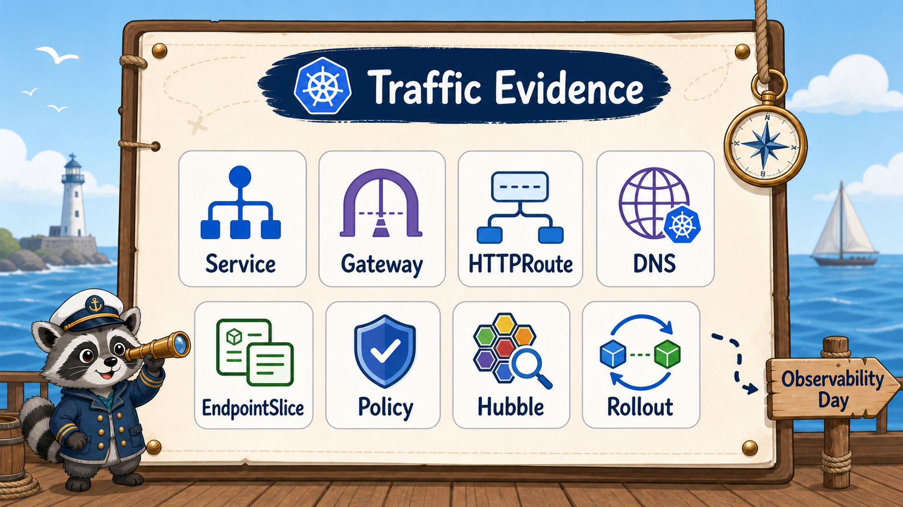

# 8교시: 구름 EXP 배움일기



## 수업 목표
- Service, DNS, Gateway, HTTPRoute, EndpointSlice의 차이를 evidence 중심으로 정리한다.
- traffic 장애를 404/503/connection refused/timeout으로 나누어 기록한다.
- W4D3 observability와 Cilium/Hubble preview로 이어질 질문을 남긴다.

## 오늘 배운 내용 요약
| 주제 | 핵심 문장 |
|---|---|
| Service | Pod IP 변화를 가리는 안정적인 내부 진입점 |
| EndpointSlice | 실제 traffic을 받을 Ready Pod IP 목록 |
| DNS | Service 이름을 ClusterIP로 해석 |
| GatewayClass | 어떤 controller가 Gateway를 처리할지 지정 |
| Gateway | listener, port, protocol, hostname을 선언 |
| HTTPRoute | host/path 조건으로 Service backend를 선택 |
| Envoy Gateway | Gateway API object를 Envoy data plane으로 반영 |
| NetworkPolicy | 누가 누구에게 갈 수 있는지 제한 |
| Cilium/Hubble | network policy enforcement와 flow 관찰 후보 |
| rollout | Ready Pod 교체가 외부 응답으로 드러남 |

## 배움일기 작성 표
| 항목 | 기록 |
|---|---|
| Envoy Gateway release/namespace |  |
| GatewayClass 이름 |  |
| Gateway listener |  |
| HTTPRoute parentRefs |  |
| frontend Service port/endpoint |  |
| api Service port/endpoint |  |
| `/` 응답 확인 |  |
| `/api` 응답 확인 |  |
| 가장 헷갈린 장애 |  |
| 404 원인 후보 |  |
| 503 원인 후보 |  |
| connection refused 원인 후보 |  |
| NetworkPolicy에서 DNS가 필요한 이유 |  |
| Cilium/Hubble로 보고 싶은 flow |  |
| rollout 전/후 API 응답 |  |

## 작성 예시
| 항목 | 기록 예시 |
|---|---|
| Envoy Gateway release/namespace | `envoy-gateway` / `envoy-gateway-system` |
| GatewayClass 이름 | `envoy-gateway` |
| Gateway listener | `paperclip.local:80 HTTP` |
| HTTPRoute parentRefs | `paperclip-gateway` |
| frontend Service port/endpoint | `80 -> 10.244.x.x:80` |
| api Service port/endpoint | `80 -> 10.244.x.x:8080` |
| `/` 응답 확인 | frontend HTML 확인 |
| `/api` 응답 확인 | `{"service":"api","version":"v1","status":"ok"}` |
| 가장 헷갈린 장애 | HTTPRoute는 있는데 parentRefs가 잘못된 상황 |
| 404 원인 후보 | host/path 불일치, HTTPRoute attach 실패 |
| 503 원인 후보 | endpoint 없음, readiness 실패 |
| connection refused 원인 후보 | port-forward/data plane Service 문제 |
| NetworkPolicy에서 DNS가 필요한 이유 | Service 이름 해석에 kube-dns가 필요 |
| rollout 전/후 API 응답 | v1 -> v2 -> rollback v1 |

## Traffic 장애 기록 템플릿
```markdown
## 증상
- 요청:
- 응답 코드/메시지:

## Gateway
- GatewayClass:
- listener:
- condition:

## HTTPRoute
- parentRefs:
- host:
- path:
- backendRefs:
- Accepted/ResolvedRefs:

## Service/Endpoint
- service port:
- targetPort:
- endpoint:

## Pod
- READY:
- logs/event:

## 판단
- 가장 가능성 높은 원인:
- 다음 확인:
```

## 오늘의 evidence 명령
```bash
bash week4/scripts/ensure-kind-context.sh paperclip-w4d2
helm list -n envoy-gateway-system
kubectl get gatewayclass
kubectl -n envoy-gateway-system get deploy,pod,svc
kubectl -n week4 get gateway,httproute
kubectl -n week4 describe gateway paperclip-gateway
kubectl -n week4 describe httproute paperclip-routes
kubectl -n week4 get svc,endpoints,endpointslice -o wide
curl -H "Host: paperclip.local" http://localhost:8080/
curl -H "Host: paperclip.local" http://localhost:8080/api
kubectl -n week4 rollout history deploy/api
```

kind에서는 Gateway의 `PROGRAMMED`가 `False`로 보여도 `describe gateway`의 이유가 `AddressNotAssigned`라면 LoadBalancer 외부 주소가 없다는 뜻일 수 있다. 이 경우 Envoy data plane Service로 port-forward한 curl 검증이 실제 traffic path evidence다.

S6-S8 전체를 재검증하려면 다음 스크립트를 실행한다.

```bash
bash week4/day2/labs/traffic-routing/verify-s6-s8.sh
```

## 수업 종료 cluster 정리
오늘 cluster를 다음 W4D3에서 그대로 이어 쓸지, 완전히 지울지 결정한다. 헷갈림을 줄이려면 수업 종료 시점에 반드시 둘 중 하나를 말로 정하고 evidence를 남긴다.

유지하는 경우:
```bash
bash week4/scripts/ensure-kind-context.sh paperclip-w4d2
kind get clusters
kubectl get ns
helm list -A
```

삭제하는 경우:
```bash
bash week4/scripts/delete-kind-cluster.sh paperclip-w4d2
kind get clusters
kubectl config current-context
```

삭제 후 `kubectl config current-context`가 에러를 내거나 다른 context를 보여도 놀라지 않는다. 중요한 것은 다음 수업 시작 때 다시 `create-kind-cluster.sh`로 오늘 cluster를 명확히 잡는 것이다.

## 장애별 한 줄 판별법
| 증상 | 한 줄 판별 |
|---|---|
| 404 | Gateway host/listener와 HTTPRoute parentRefs/path부터 본다 |
| 503 | Service endpoint와 Pod readiness부터 본다 |
| connection refused | port-forward 또는 Envoy data plane Service 접근부터 본다 |
| DNS failure | Service 이름, namespace, CoreDNS, NetworkPolicy DNS egress를 본다 |
| v1/v2 응답 혼재 | rollout 중 endpoint와 ReplicaSet을 본다 |

## 좋은 기록과 아쉬운 기록
| 아쉬운 기록 | 좋은 기록 |
|---|---|
| Gateway가 안 됐다 | `curl -H Host... /api`가 503, `endpoints/api <none>` 확인 |
| DNS 문제였다 | `nslookup api` 실패, CoreDNS와 NetworkPolicy DNS egress 확인 |
| 배포했다 | `rollout status deploy/api` 성공, `/api` 응답 v1 -> v2 확인 |
| 헷갈렸다 | HTTPRoute backendRef port는 Service port 80이어야 한다고 기록 |

## W4D3로 이어지는 질문
내일은 observability로 넘어간다. 오늘 남겨야 할 질문은 다음이다.

| 질문 | W4D3 연결 |
|---|---|
| 503이 늘어났는지 어떻게 알 수 있는가 | gateway/controller metric |
| endpoint가 줄어든 순간을 dashboard로 볼 수 있는가 | Pod readiness/restart metric |
| CPU/memory 증가와 latency를 같이 볼 수 있는가 | Prometheus/Grafana |
| 어떤 Pod가 어떤 Pod로 통신했는지 볼 수 있는가 | Cilium/Hubble preview |
| target down은 어디서 확인하는가 | Prometheus target |
| 운영팀에 어떤 정보를 전달해야 하는가 | runbook과 dashboard 링크 |

## W4D3 준비 메모
W4D3에서는 같은 traffic을 dashboard와 metric으로 본다. 오늘의 evidence가 있어야 내일 metric을 해석할 수 있다.

| 오늘 증거 | 내일 연결 |
|---|---|
| endpoint `<none>` | ready replica, endpoint, gateway 5xx |
| rollout v1 -> v2 | deployment revision, restart, latency 변화 |
| Envoy Gateway log/condition | gateway controller 상태와 routing 장애 |
| NetworkPolicy preview | policy로 인한 timeout 해석 |
| Service DNS | CoreDNS와 target discovery |
| Cilium/Hubble 질문 | network flow observability |

## 오늘의 runbook 초안
```markdown
## External traffic runbook

1. 사용자가 본 URL과 status code를 확인한다.
2. GatewayClass와 Gateway listener가 맞는지 확인한다.
3. HTTPRoute parentRefs, host, path, backendRefs가 맞는지 확인한다.
4. backend Service 이름과 port가 맞는지 확인한다.
5. Endpoint가 비어 있지 않은지 확인한다.
6. Pod READY와 event를 확인한다.
7. Envoy Gateway controller log와 data plane 접근을 확인한다.
8. rollout 직후라면 ReplicaSet과 endpoint 변화를 확인한다.
9. NetworkPolicy가 있다면 DNS egress와 backend 허용선을 확인한다.
```

## 최종 한 문단
```markdown
오늘은 frontend/api/db 구조를 Service DNS로 연결하고, Envoy Gateway를 Helm으로 설치해 Gateway/HTTPRoute로 `/`와 `/api`를 외부 경로로 노출했다. Service가 있어도 EndpointSlice가 비면 traffic은 갈 곳이 없고, Gateway 장애는 GatewayClass/Gateway/HTTPRoute/Service/EndpointSlice/readiness 순서로 좁혀야 한다. NetworkPolicy는 routing이 아니라 허용선이며 DNS egress를 잊으면 Service 이름 해석부터 실패할 수 있다. rollout은 Ready endpoint를 통해 외부 응답에 반영된다.
```

## Evidence Note
```markdown
# W4D2S8 final journal
- cluster 유지/삭제 결정:
- 오늘 확인한 정상 경로:
- 가장 이해가 어려웠던 계층:
- 내가 본 장애 출력:
- 그 출력의 원인 후보:
- W4D3에서 dashboard로 보고 싶은 지표:
- Cilium/Hubble로 보고 싶은 network flow:
- 내 runbook의 첫 번째 확인 명령:
```

## 한 줄 요약
```text
W4D2의 핵심은 외부 traffic을 Gateway에서 Pod endpoint까지 층별 증거로 추적하는 것이다.
```
