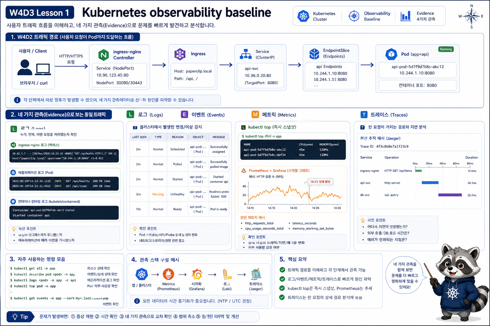

# 1교시: Day2 요약 + Kubernetes Observability 기준



## 수업 목표
- W4D2 traffic 장애를 observability 질문으로 바꾼다.
- logs, events, metrics, traces의 차이를 구분한다.
- `kubectl top`과 Prometheus/Grafana의 역할 차이를 설명한다.

## Day2에서 가져올 질문
W4D2에서는 다음 흐름을 확인했다.

```text
사용자
  -> ingress-nginx
  -> Ingress rule
  -> Service
  -> Endpoint
  -> Ready Pod
```

오늘은 질문이 달라진다.

| W4D2 질문 | W4D3 질문 |
|---|---|
| `/api`가 응답하는가 | `/api` 실패가 언제부터 늘었는가 |
| Endpoint가 있는가 | Ready replica가 시간에 따라 어떻게 변했는가 |
| Pod가 Running인가 | restart가 증가했는가 |
| CPU/memory를 지금 볼 수 있는가 | namespace와 Pod별 사용량 추세가 보이는가 |
| controller log에 단서가 있는가 | target, alert, dashboard로 반복 장애를 볼 수 있는가 |

## 네 가지 증거
| 증거 | 명령/도구 | 잘 보이는 것 |
|---|---|---|
| Logs | `kubectl logs` | app stdout/stderr |
| Events | `kubectl describe` | scheduling, probe, image pull, kill reason |
| Metrics | Prometheus/Grafana | 시간 흐름, 추세, 비율 |
| Traces | OpenTelemetry | 요청 경로와 span |

오늘은 metrics를 중심으로 다룬다. traces는 preview만 언급한다.

## `kubectl top`과 Prometheus 차이
W4D1의 metrics-server는 현재 CPU/memory를 빠르게 보는 데 좋다.

```bash
kubectl top pod -n week4
```

하지만 다음 질문에는 부족하다.

```text
한 시간 전부터 CPU가 올랐는가?
어느 Pod가 restart를 반복했는가?
Ingress 5xx와 readiness 실패가 같은 시점인가?
node 전체 문제인가, 특정 namespace 문제인가?
```

이런 질문에는 Prometheus와 Grafana가 필요하다.

## 실습 기준선
오늘 실습은 kind cluster 하나를 기준으로 한다.

```bash
kubectl config current-context
kind get clusters
kubectl get nodes
```

수업 중 관찰이 이상하면 Prometheus query보다 먼저 내가 어느 cluster를 보고 있는지 확인한다.

| 확인 | 정상 기준 |
|---|---|
| context | `kind-...` 형태 |
| node | control-plane node `Ready` |
| monitoring namespace | Prometheus/Grafana/Alertmanager Running |
| scenario namespace | `week4-observe` 장애 Pod 확인 가능 |

context가 다르면 Grafana는 열리는데 metric이 비거나, Service 이름이 없거나, 예전 cluster의 namespace를 보고 있을 수 있다. observability 수업에서는 도구보다 관찰 대상이 먼저 맞아야 한다.

## 같은 증상을 다른 증거로 보기
예를 들어 사용자가 `/api`가 느리다고 말한다.

| 증거 | 확인 | 알 수 있는 것 |
|---|---|---|
| curl | `curl -w "%{http_code} %{time_total}"` | 지금 응답 코드와 지연 |
| Ingress log | controller log | 요청이 controller까지 왔는지 |
| Service/Endpoint | `kubectl get svc,endpoints` | traffic을 받을 Pod가 있는지 |
| Pod event | `kubectl describe pod` | readiness, OOMKilled, scheduling |
| Pod log | `kubectl logs` | app 내부 오류 |
| Metric | Grafana/PromQL | 언제부터, 얼마나 자주, 어느 범위인지 |

이 중 하나만으로 결론 내리면 위험하다. metrics는 추세를 보여주지만 원인을 자동으로 말해주지는 않는다.

## 시간 축이 필요한 순간
`kubectl get pod`는 지금 상태만 보여준다.

```bash
kubectl -n week4 get pod
```

예상:
```text
NAME                    READY   STATUS    RESTARTS
api-6f7dd8d9b9-nq2k4    1/1     Running   3
```

이 출력만으로는 restart 3회가 방금 발생했는지, 어제 발생했는지 알기 어렵다. Prometheus에서는 증가량을 볼 수 있다.

```promql
increase(kube_pod_container_status_restarts_total{namespace="week4"}[10m])
```

해석:
| 결과 | 의미 |
|---|---|
| `0` | 최근 10분 restart 없음 |
| `1 이상` | 최근 10분 restart 증가 |
| series 없음 | 해당 metric/label이 없거나 target 문제 |

## metric 이름을 처음 볼 때의 기준
Prometheus metric 이름은 길다. 처음부터 외우지 않는다.

| prefix | 대략 의미 |
|---|---|
| `kube_` | kube-state-metrics가 만든 Kubernetes object 상태 |
| `container_` | cAdvisor/kubelet 계열 container resource |
| `node_` | node-exporter 계열 node metric |
| `prometheus_` | Prometheus 자체 상태 |
| `nginx_ingress_` | ingress-nginx controller metric |

W4D3에서는 이 prefix 감각만 잡아도 dashboard를 읽는 속도가 빨라진다.

## 오늘의 확인 계층
```text
Prometheus target
  -> metric 수집 여부
Grafana dashboard
  -> 사용량과 상태 시각화
PromQL
  -> 특정 질문을 query로 확인
Alert rule
  -> 사람이 개입할 조건 정의
Runbook
  -> 증상별 확인 순서 정리
```

이 계층은 순서가 중요하다. target이 없으면 dashboard가 비고, dashboard가 비면 alert도 제대로 판단할 수 없다. 반대로 alert가 firing되더라도 target과 metric label을 확인하지 않으면 어떤 Pod의 문제인지 놓칠 수 있다.

## 오늘의 기본 PromQL
```promql
up
```

```promql
sum by (namespace) (container_memory_working_set_bytes{container!="", image!=""})
```

```promql
sum by (namespace, pod) (rate(container_cpu_usage_seconds_total{container!="", image!=""}[5m]))
```

```promql
increase(kube_pod_container_status_restarts_total[10m])
```

각 query는 “정답”이 아니라 출발점이다. label을 좁혀가며 원하는 namespace, pod, container를 찾아야 한다.

## Evidence Note
```markdown
# W4D3S1 Observability baseline
- logs로 볼 것:
- events로 볼 것:
- metrics로 볼 것:
- 오늘 가장 보고 싶은 dashboard:
- W4D2 장애 중 metric으로 보고 싶은 것:
```

## 한 줄 요약
```text
observability는 화면을 예쁘게 만드는 일이 아니라, 장애 질문을 증거로 좁히는 방식이다.
```
