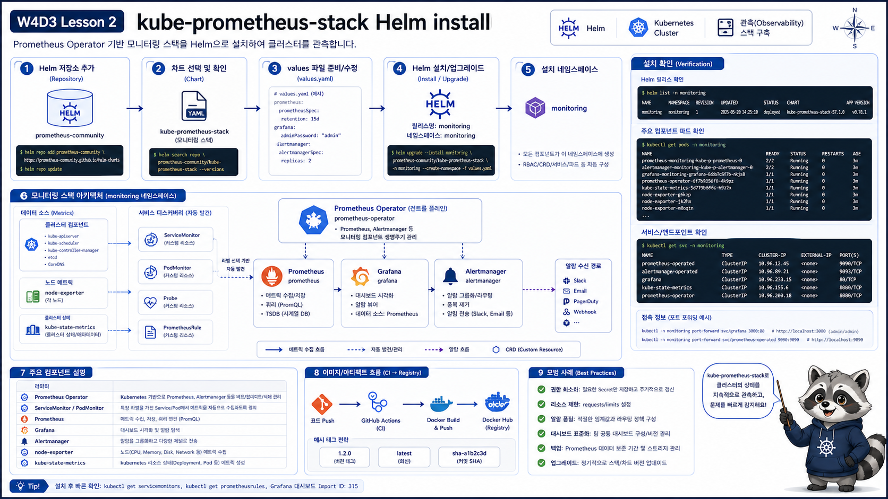

# 2교시: kube-prometheus-stack 설치



## 수업 목표
- kube-prometheus-stack 구성요소를 설명한다.
- Helm values file로 Prometheus/Grafana/Alertmanager를 설치한다.
- 설치 후 release, Pod, Service, CRD를 검증한다.

## 구성요소
| 구성요소 | 역할 |
|---|---|
| Prometheus Operator | monitoring CRD reconcile |
| Prometheus | metric scrape, 저장, query |
| Grafana | dashboard |
| Alertmanager | alert routing/silence |
| node-exporter | node metric |
| kube-state-metrics | Kubernetes object 상태 metric |

## values 확인
```bash
cat week4/day3/labs/kube-prometheus-stack/values.yaml
```

핵심:
```yaml
grafana:
  adminPassword: "paperclip-local"
prometheus:
  prometheusSpec:
    serviceMonitorSelectorNilUsesHelmValues: false
    podMonitorSelectorNilUsesHelmValues: false
    ruleSelectorNilUsesHelmValues: false
```

수업용으로 custom ServiceMonitor/PodMonitor/PrometheusRule을 쉽게 읽도록 selector 제한을 풀어둔다.

## Helm 설치
```bash
helm repo add prometheus-community https://prometheus-community.github.io/helm-charts
helm repo update

helm upgrade --install kube-prometheus-stack prometheus-community/kube-prometheus-stack \
  --namespace monitoring \
  --create-namespace \
  -f week4/day3/labs/kube-prometheus-stack/values.yaml
```

예상 출력:
```text
NAME: kube-prometheus-stack
NAMESPACE: monitoring
STATUS: deployed
REVISION: 1
```

kind 검증 기준:
```bash
kind version
kubectl config current-context
kubectl get nodes -o wide
```

예시:
```text
kind v0.32.0
kind-paperclip-w4d3
paperclip-w4d3-control-plane   Ready   control-plane   v1.31.x
```

과정에서는 kind만 기준으로 둔다. 다른 local Kubernetes가 남아 있으면 context, namespace, Service 이름이 섞일 수 있으므로 설치 전 current-context를 반드시 확인한다.

## 설치 확인
```bash
helm list -n monitoring
kubectl -n monitoring get pod,svc
kubectl get crd | grep monitoring.coreos.com
```

성공 기준:
```text
prometheus-kube-prometheus-stack-prometheus-0   2/2 Running
kube-prometheus-stack-grafana-xxxxx            3/3 Running
alertmanager-kube-prometheus-stack-alertmanager-0 2/2 Running
```

실제 검증 예시:
```text
alertmanager-kube-prometheus-stack-alertmanager-0          2/2 Running
kube-prometheus-stack-grafana-...                          3/3 Running
kube-prometheus-stack-kube-state-metrics-...               1/1 Running
kube-prometheus-stack-operator-...                         1/1 Running
kube-prometheus-stack-prometheus-node-exporter-...          1/1 Running
prometheus-kube-prometheus-stack-prometheus-0              2/2 Running
```

CRD:
```text
servicemonitors.monitoring.coreos.com
podmonitors.monitoring.coreos.com
prometheusrules.monitoring.coreos.com
```

## Service 이름 확인
chart는 여러 Service를 만든다.

```bash
kubectl -n monitoring get svc
```

예상:
```text
kube-prometheus-stack-grafana       ClusterIP   80/TCP
kube-prometheus-stack-prometheus    ClusterIP   9090/TCP
kube-prometheus-stack-alertmanager  ClusterIP   9093/TCP
```

port-forward 대상은 Service 이름을 정확히 사용한다. 이름이 다르면 `kubectl get svc -n monitoring` 출력으로 현재 cluster의 이름을 먼저 확인한다.

## Helm values와 실제 적용 비교
```bash
helm get values kube-prometheus-stack -n monitoring
helm get manifest kube-prometheus-stack -n monitoring | grep -E "kind: Prometheus|kind: Grafana|kind: ServiceMonitor" -n
```

확인할 것:
| 확인 | 이유 |
|---|---|
| Grafana password | 수업 로그인 기준 |
| retention | local disk 사용량 통제 |
| rule selector | custom PrometheusRule 읽기 |
| serviceMonitor selector | custom ServiceMonitor 읽기 |

values에 썼다고 실제로 적용됐다고 가정하지 않는다. Helm에서는 `helm get values`, Kubernetes에서는 `kubectl get`으로 확인한다.

## port-forward
Prometheus:
```bash
kubectl -n monitoring port-forward svc/kube-prometheus-stack-prometheus 9090:9090
```

Grafana:
```bash
kubectl -n monitoring port-forward svc/kube-prometheus-stack-grafana 3000:80
```

Grafana login:
```text
admin / paperclip-local
```

## 자주 보는 문제
| 증상 | 확인 |
|---|---|
| Pod Pending | node resource 부족 |
| Grafana login 실패 | values password, secret 확인 |
| CRD 없음 | Helm install 실패 또는 chart 렌더링 문제 |
| Prometheus target 없음 | ServiceMonitor selector/namespace/port 확인 |
| kind cluster 생성 실패 | kind version, Docker Engine version 확인 |

오래된 kind와 최신 Docker 조합에서는 cluster 생성 중 다음과 같은 오류가 날 수 있다.

```text
failed to create cluster: could not find a log line that matches "Reached target .*Multi-User System.*|detected cgroup v1"
```

이때는 설치 명령 자체가 아니라 kind binary 호환성 문제일 수 있다.

```bash
go install sigs.k8s.io/kind@latest
~/go/bin/kind version
~/go/bin/kind create cluster --name paperclip-w4d3
```

## resource가 부족할 때
kube-prometheus-stack은 가벼운 chart가 아니다. kind node가 작으면 Pending이나 OOM이 생길 수 있다.

```bash
kubectl -n monitoring get pod
kubectl -n monitoring describe pod <pending-or-crash-pod>
```

대표 메시지:
```text
0/1 nodes are available: insufficient memory
OOMKilled
```

해결 방향:
| 상황 | 조치 |
|---|---|
| local memory 부족 | Docker Desktop/WSL memory 상향 |
| Prometheus OOM | retention/limit 조정 |
| Grafana만 필요 | chart values로 일부 component 조정 |
| 실습 후 정리 | `helm uninstall`과 namespace 삭제 |

## Evidence Note
```markdown
# W4D3S2 kube-prometheus-stack
- Helm release:
- Prometheus Pod:
- Grafana Pod:
- Alertmanager Pod:
- CRD 확인:
- 접속 URL:
```

## 한 줄 요약
```text
kube-prometheus-stack은 Prometheus/Grafana만이 아니라 operator, exporter, rule, alert를 묶은 monitoring stack이다.
```
