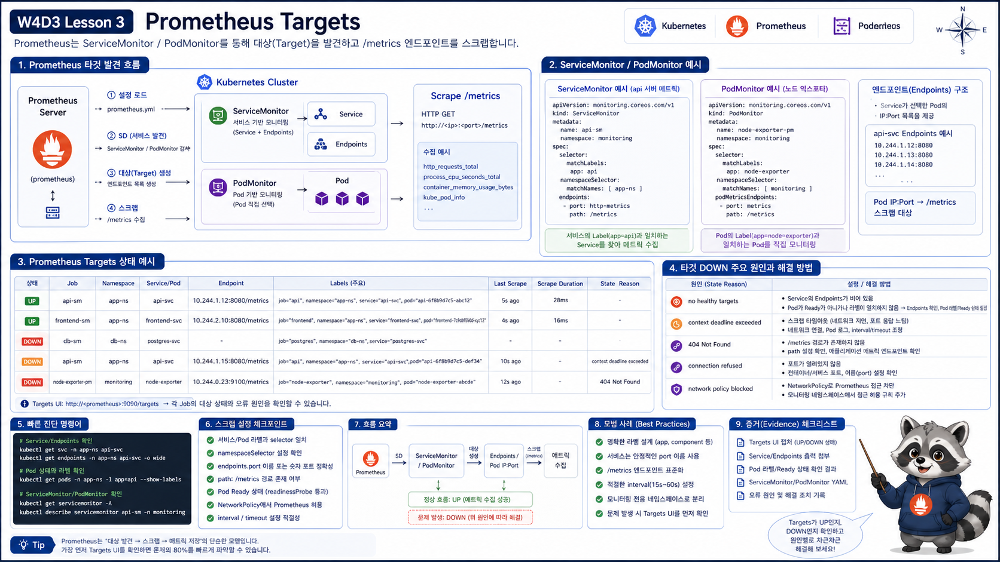

# 3교시: Prometheus Target 확인



## 수업 목표
- Prometheus target의 `UP/DOWN` 의미를 설명한다.
- ServiceMonitor, PodMonitor가 target을 만드는 방식을 이해한다.
- target down 원인을 namespace, selector, port, endpoint 기준으로 나눈다.

## Target이란 무엇인가
Prometheus는 endpoint를 주기적으로 scrape한다.

```text
Prometheus
  -> target endpoint scrape
  -> metric 저장
  -> PromQL query
```

target이 `UP`이어야 metric이 들어온다.

## UI에서 확인
Prometheus 접속:
```bash
kubectl -n monitoring port-forward svc/kube-prometheus-stack-prometheus 9090:9090
```

브라우저:
```text
http://localhost:9090/targets
```

확인할 것:
| 항목 | 의미 |
|---|---|
| State `UP` | scrape 성공 |
| State `DOWN` | scrape 실패 |
| Last Scrape | 마지막 수집 시각 |
| Error | 실패 이유 |
| Labels | job, namespace, service, pod |

## PromQL로 확인
```promql
up
```

namespace별 target:
```promql
up{namespace="monitoring"}
```

값 해석:
| 값 | 의미 |
|---|---|
| `1` | target UP |
| `0` | target DOWN |
| series 없음 | target 자체가 discovery되지 않음 |

kind/local 검증에서 볼 수 있는 예:
```text
up{job="kube-scheduler"} 0
up{job="kube-apiserver"} 1
up{job="kube-state-metrics"} 1
```

`kube-scheduler`가 `DOWN`이라고 해서 Prometheus 설치가 실패했다는 뜻은 아니다. local kind에서는 control plane component endpoint 노출 방식 때문에 일부 target이 기대와 다르게 보일 수 있다. 이때는 `up` 값만 보고 결론 내리지 말고 target error, ServiceMonitor, Endpoints를 같이 본다.

## `up == 0`과 series 없음의 차이
둘은 다르다.

```promql
up{job="kube-state-metrics"} == 0
```

은 target은 발견됐지만 scrape가 실패했다는 뜻이다.

반면 query 결과가 아예 없으면 Prometheus가 target을 발견하지 못했을 수 있다.

| 상태 | 의미 | 볼 것 |
|---|---|---|
| `up=1` | scrape 성공 | 정상 |
| `up=0` | target 발견, scrape 실패 | target error |
| 결과 없음 | target discovery 실패 | ServiceMonitor/selector |

이 차이를 모르면 target down과 설정 누락을 같은 문제로 착각한다.

## ServiceMonitor와 PodMonitor
Prometheus Operator는 ServiceMonitor/PodMonitor를 읽어 scrape target을 만든다.

```bash
kubectl get servicemonitor,podmonitor -A
```

예상 출력:
```text
monitoring   kube-prometheus-stack-kubelet
monitoring   kube-prometheus-stack-prometheus
monitoring   kube-prometheus-stack-grafana
```

ServiceMonitor가 target을 만들려면 다음이 맞아야 한다.

| 조건 | 확인 |
|---|---|
| namespace selector | 대상 namespace를 보는가 |
| service selector | label이 맞는가 |
| endpoint port name | Service port 이름이 맞는가 |
| endpoint path | `/metrics`가 맞는가 |
| Pod readiness/network | scrape 가능한가 |

## port 이름이 중요한 이유
ServiceMonitor는 보통 Service port 이름을 참조한다.

```yaml
endpoints:
  - port: http-metrics
```

그런데 Service가 이렇게 되어 있으면 target이 안 잡힐 수 있다.

```yaml
ports:
  - name: http
    port: 8080
```

이 경우 `http-metrics`라는 port 이름이 없기 때문이다. Prometheus target 문제에서 port name mismatch는 흔하다.

## target error 예시
| Error | 해석 |
|---|---|
| `context deadline exceeded` | timeout, network, policy |
| `connection refused` | endpoint는 있으나 port가 안 열림 |
| `server returned HTTP status 404` | `/metrics` path 없음 |
| `no such host` | DNS 문제 |
| `server returned HTTP status 403` | auth/RBAC/proxy 문제 |

## target down 원인
| 원인 | 증상 | 확인 |
|---|---|---|
| Service 없음 | target discovery 안 됨 | `kubectl get svc` |
| selector 불일치 | endpoint 없음 | `kubectl get endpoints` |
| port 이름 불일치 | target 생성 실패 | ServiceMonitor endpoint port |
| `/metrics` 없음 | scrape HTTP error | target error message |
| NetworkPolicy | timeout | policy, DNS, egress |
| Pod down | connection refused | Pod READY/logs |

kind에서 control plane target이 `DOWN`일 때 확인 순서:
```bash
kubectl -n monitoring get servicemonitor | grep scheduler
kubectl -n kube-system get endpoints kube-scheduler
kubectl -n monitoring logs deploy/kube-prometheus-stack-operator
```

운영 판단:
| 상황 | 판단 |
|---|---|
| Grafana/Prometheus/kube-state-metrics가 정상 | stack 설치 자체는 성공 |
| 특정 target만 `up=0` | target endpoint 또는 scrape 설정 문제 |
| 대부분 target이 없음 | selector/CRD/operator 문제 |

## Target Down 분석 템플릿
```markdown
## Target
- job:
- namespace:
- endpoint:
- state:
- error:

## Kubernetes object
- Service:
- Endpoint:
- Pod READY:
- ServiceMonitor selector/port:

## 판단
- 원인 후보:
- 다음 확인:
```

## Evidence Note
```markdown
# W4D3S3 Prometheus targets
- UP target 1개:
- DOWN target 또는 없었던 target:
- target label:
- target error:
- 관련 ServiceMonitor:
```

## 한 줄 요약
```text
Prometheus target이 없거나 DOWN이면 dashboard보다 먼저 discovery, Service, Endpoint, port를 확인한다.
```
