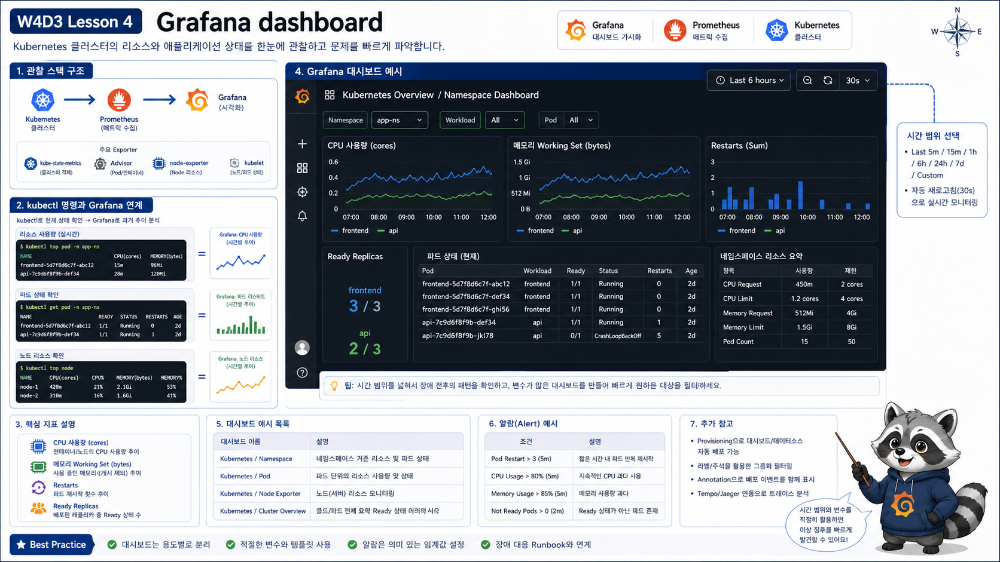

# 4교시: Grafana Dashboard 확인



## 수업 목표
- Grafana에서 Kubernetes dashboard를 찾고 읽는다.
- node/pod CPU, memory, restart, namespace resource 사용량을 확인한다.
- dashboard 수치와 kubectl 명령을 연결한다.

## Grafana 접속
```bash
kubectl -n monitoring port-forward svc/kube-prometheus-stack-grafana 3000:80
```

브라우저:
```text
http://localhost:3000
```

로그인:
```text
admin / paperclip-local
```

## 먼저 볼 dashboard
| Dashboard keyword | 질문 |
|---|---|
| Kubernetes / Compute Resources / Namespace | 어느 namespace가 자원을 쓰는가 |
| Kubernetes / Compute Resources / Pod | 어느 Pod가 CPU/memory를 쓰는가 |
| Kubernetes / Kubelet | kubelet과 Pod resource |
| Node Exporter | node 전체 CPU/memory/disk/network |

## kubectl과 dashboard 연결
```bash
kubectl top node
kubectl top pod -A
kubectl -n week4 get pod
```

Grafana는 같은 정보를 시간 축으로 보여준다.

| kubectl | Grafana |
|---|---|
| 현재 CPU/memory | 시간별 CPU/memory |
| 현재 restart count | restart 증가 시점 |
| 현재 Pod READY | ready replica 추세 |
| describe event | metric 변화와 함께 원인 추적 |

## dashboard를 보는 순서
처음부터 모든 panel을 보려고 하면 길을 잃는다.

| 순서 | 질문 | dashboard |
|---|---|---|
| 1 | node 전체가 힘든가 | Node Exporter |
| 2 | 어떤 namespace가 쓰는가 | Compute Resources / Namespace |
| 3 | 어떤 Pod가 쓰는가 | Compute Resources / Pod |
| 4 | restart가 늘었는가 | Workload/Pod dashboard |
| 5 | target이 정상인가 | Prometheus Targets |

이 순서는 “전체 -> namespace -> pod -> 원인”으로 좁히는 방식이다.

## PromQL 예시
namespace별 memory:
```promql
sum by (namespace) (container_memory_working_set_bytes{container!="", image!=""})
```

Pod별 CPU:
```promql
sum by (namespace, pod) (rate(container_cpu_usage_seconds_total{container!="", image!=""}[5m]))
```

restart:
```promql
increase(kube_pod_container_status_restarts_total[10m])
```

Ready replica:
```promql
kube_deployment_status_replicas_ready
```

## 그래프 시간 범위
Grafana 오른쪽 위 time range를 조정한다.

| 범위 | 용도 |
|---|---|
| Last 5 minutes | 방금 재현한 실습 장애 |
| Last 30 minutes | rollout 전후 비교 |
| Last 1 hour | 수업 전체 흐름 확인 |
| Last 6 hours | retention 안에서 넓게 보기 |

실습 장애가 보이지 않으면 time range가 너무 넓거나 좁은지 먼저 본다.

## dashboard와 alert의 차이
Dashboard는 사람이 보는 화면이고, alert는 사람이 보지 않아도 알려주는 조건이다.

```text
dashboard
  -> 사람이 들어가서 관찰
alert
  -> 조건이 맞으면 사람에게 알림
```

그래서 dashboard에서 보이는 모든 spike를 alert로 만들면 안 된다.

## dashboard 해석 주의
| 실수 | 문제 |
|---|---|
| 순간 spike만 보고 장애 판단 | 지속 시간과 사용자 영향 확인 필요 |
| CPU만 봄 | memory, restart, readiness도 함께 확인 |
| node 전체만 봄 | namespace/Pod 단위로 좁혀야 함 |
| dashboard만 봄 | logs/events로 원인 확인 필요 |

## dashboard에서 흔히 보는 패널 해석
| 패널 | 질문 | 다음 행동 |
|---|---|---|
| CPU Usage | CPU를 많이 쓰는 Pod는 무엇인가 | `kubectl top pod`, limit 확인 |
| Memory Working Set | memory가 계속 증가하는가 | OOMKilled event 확인 |
| Pod Restarts | 재시작이 늘었는가 | `logs --previous` 확인 |
| Ready Replicas | 배포가 준비됐는가 | readiness event, endpoint 확인 |
| Network Receive/Transmit | traffic이 증가했는가 | Ingress/API 요청량과 비교 |

패널 하나만 보고 결론을 내리지 않는다. CPU가 높아도 정상 batch일 수 있고, restart가 1회 있어도 rollout 중 정상일 수 있다.

## Grafana에서 label로 좁히기
dashboard 상단에는 cluster, namespace, workload, pod 같은 variable이 있다. 먼저 namespace를 좁히고, 다음에 workload/pod를 좁힌다.

```text
All namespaces
  -> week4
  -> api
  -> api-xxxxx
```

이 순서를 지키면 전체 cluster 문제인지 특정 서비스 문제인지 구분할 수 있다.

## legend가 지저분할 때
Grafana panel의 legend가 `container`, `endpoint`, `instance`, `job`, `namespace`, `pod`, `service` label을 모두 달고 나오면 사람이 읽기 어렵다. 이때는 query에서 필요한 label만 남기거나, Grafana legend format을 조정한다.

Pod별 CPU를 볼 때:
```promql
sum by (pod) (
  rate(container_cpu_usage_seconds_total{namespace="week4-observe", container!="", image!=""}[2m])
)
```

container까지 보고 싶을 때:
```promql
sum by (pod, container) (
  rate(container_cpu_usage_seconds_total{namespace="week4-observe", container!="", image!=""}[2m])
)
```

legend 예:
```text
{{pod}}
{{pod}} / {{container}}
```

수업에서는 먼저 `namespace`, `pod`, `container` 정도만 남긴다. `instance`나 `endpoint`는 Prometheus가 어디서 scrape했는지를 보여주는 운영 label이라, 처음 dashboard를 읽는 학생에게는 noise가 될 수 있다.

## 수업 중 확인할 최소 세 가지
| 확인 | 이유 |
|---|---|
| `monitoring` namespace Pod resource | stack 자체가 건강한가 |
| `week4` 또는 `week4-observe` namespace resource | 실습 앱 영향 |
| restart panel | CrashLoop 시나리오가 metric에 보이는가 |

## dashboard와 screenshot 증거
배움일기에 screenshot을 넣는다면 예쁘게 캡처하는 것보다 아래 정보가 보여야 한다.

| 포함할 것 | 이유 |
|---|---|
| time range | 언제의 문제인지 |
| namespace/pod filter | 무엇을 보고 있는지 |
| panel title | 어떤 지표인지 |
| spike 또는 변화 구간 | 장애 시점 |
| 같은 시점의 kubectl evidence | metric과 원인 연결 |

## Evidence Note
```markdown
# W4D3S4 Grafana
- 접속 URL:
- 확인한 dashboard:
- CPU가 높은 namespace/pod:
- memory가 높은 namespace/pod:
- restart가 보인 Pod:
- kubectl과 비교한 명령:
- dashboard time range:
- screenshot에 포함한 정보:
```

## 한 줄 요약
```text
Grafana dashboard는 kubectl의 현재 상태를 시간 축으로 확장해 장애의 시작점과 범위를 찾게 해준다.
```
