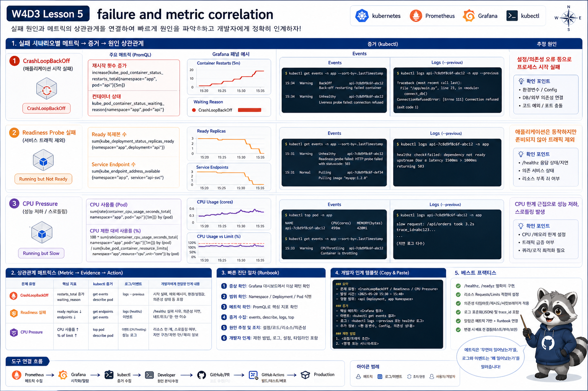

# 5교시: 장애와 Metric 연결



## 수업 목표
- CrashLoop, readiness 실패, CPU 압박을 metric과 연결한다.
- metric만 보고 결론 내리지 않고 logs/events와 함께 확인한다.
- 장애 시나리오를 PromQL과 dashboard evidence로 남긴다.

## 장애 시나리오 배포
```bash
kubectl apply -f week4/day3/labs/observability-scenarios/namespace.yaml
kubectl apply -f week4/day3/labs/observability-scenarios/crashloop-demo.yaml
kubectl apply -f week4/day3/labs/observability-scenarios/cpu-pressure-demo.yaml
kubectl apply -f week4/day3/labs/observability-scenarios/readiness-bad-demo.yaml
```

kubectl 확인:
```bash
kubectl -n week4-observe get pod
```

예상:
```text
crashloop-demo-xxxxx       0/1   CrashLoopBackOff
cpu-pressure-demo-xxxxx    1/1   Running
readiness-bad-demo-xxxxx   0/1   Running
```

실제 검증에서는 rollout 중 다음처럼 보일 수 있다.

```text
cpu-pressure-demo-...      1/1   Running
crashloop-demo-...         0/1   CrashLoopBackOff
readiness-bad-demo-...     1/1   Running
readiness-bad-demo-...     0/1   Running
```

`readiness-bad-demo`가 두 개 보이는 것은 새 Pod가 Ready가 되지 못해 rollout이 멈췄고, 기존 Ready Pod가 service 안정성을 위해 남아 있기 때문이다.

## CrashLoop과 restart metric
```promql
kube_pod_container_status_restarts_total{namespace="week4-observe"}
```

최근 5분 증가량:
```promql
increase(kube_pod_container_status_restarts_total{namespace="week4-observe"}[5m])
```

kubectl 원인:
```bash
kubectl -n week4-observe logs deploy/crashloop-demo --previous
kubectl -n week4-observe describe pod -l app=crashloop-demo
```

출력 예시:
```text
intentional restart for observability
```

event 예시:
```text
Back-off restarting failed container
```

restart metric은 “재시작이 늘었다”를 보여주고, log/event는 “왜 재시작했는가”를 보여준다.

## readiness 실패
readiness 실패는 restart가 늘지 않을 수 있다.

```bash
kubectl -n week4-observe describe pod -l app=readiness-bad-demo
```

예상 event:
```text
Readiness probe failed: HTTP probe failed with statuscode: 404
```

metric으로는 ready replica 또는 condition 계열을 본다.

```promql
kube_pod_status_ready{namespace="week4-observe", condition="true"}
```

해석:
| 증상 | restart metric | ready metric |
|---|---|---|
| CrashLoop | 증가 | 대개 ready 아님 |
| readiness 실패 | 증가 안 할 수 있음 | ready false |
| 정상 rollout 대기 | 증가 없음 | 일시적으로 ready 감소 |

따라서 restart만 보면 readiness 장애를 놓칠 수 있다.

검증된 PromQL 예시:
```promql
kube_pod_status_ready{namespace="week4-observe", condition="true"}
```

결과 해석:
```text
crashloop-demo       0
cpu-pressure-demo    1
readiness old pod    1
readiness new pod    0
```

운영에서는 “Pod가 1개라도 Ready니까 정상”이라고 보지 않는다. rollout status와 ReplicaSet을 함께 봐야 한다.

```bash
kubectl -n week4-observe rollout status deploy/readiness-bad-demo
kubectl -n week4-observe get rs,pod -l app=readiness-bad-demo
```

## CPU 압박
```promql
sum by (pod) (rate(container_cpu_usage_seconds_total{namespace="week4-observe", container!="", image!=""}[2m]))
```

limit 대비 사용량은 dashboard에서 함께 본다. CPU limit은 OOM처럼 바로 죽기보다 latency와 throttling으로 드러날 수 있다.

## metric과 원인 연결표
| metric 변화 | 원인 후보 | 함께 볼 것 |
|---|---|---|
| restart 증가 | CrashLoop, OOMKilled | logs previous, describe |
| ready 감소 | readiness 실패, rollout 실패 | endpoints, events |
| CPU 증가 | loop, 부하, throttling | app latency, top pod |
| memory 증가 | leak, cache, batch | OOMKilled, working set |
| target down | scrape 실패 | target error, ServiceMonitor |

## 장애를 한 화면에 연결하기
좋은 장애 분석은 세 줄로 연결된다.

```markdown
1. 증상: /api 503 증가
2. metric: ready replica 감소, ingress 5xx 증가
3. 원인 evidence: readiness probe 404 event
```

또는:

```markdown
1. 증상: 응답 지연
2. metric: api Pod CPU rate 증가
3. 원인 evidence: cpu-pressure-demo loop, resource limit 낮음
```

metric 이름만 나열하면 개발팀이 움직이기 어렵다. 사용자 증상과 Kubernetes evidence를 함께 전달해야 한다.

## 시나리오별 관찰 순서
CrashLoop:
```text
Grafana restart panel
  -> PromQL increase(restarts[5m])
  -> kubectl get pod
  -> logs --previous
  -> describe pod events
```

Readiness 실패:
```text
Grafana ready replica 감소
  -> kube_pod_status_ready
  -> kubectl get endpoints
  -> describe pod readiness event
  -> Ingress 503 여부 확인
```

CPU 압박:
```text
Grafana CPU usage
  -> PromQL rate(container_cpu_usage_seconds_total)
  -> kubectl top pod
  -> resource requests/limits
  -> latency/readiness 영향 확인
```

## 장애 재현 후 정리
실습 장애는 계속 남겨두면 다음 수업에 방해된다.

```bash
kubectl delete namespace week4-observe
```

하지만 삭제 전에는 반드시 evidence를 남긴다.

| evidence | 예시 |
|---|---|
| kubectl | `get pod`, `describe pod`, `logs --previous` |
| PromQL | restart increase, CPU rate |
| Grafana | Pod dashboard screenshot |
| 판단 | metric과 event가 어떻게 연결되는지 |

## 오해하기 쉬운 지점
| 오해 | 정리 |
|---|---|
| CPU가 높으면 장애다 | 지속 시간과 사용자 영향 필요 |
| restart가 있으면 무조건 문제다 | rollout 중 일시 restart일 수도 있음 |
| readiness 실패는 log에 항상 보인다 | event에 먼저 보일 때가 많음 |
| metric이 없으면 정상이다 | target discovery 실패일 수 있음 |

## Evidence Note
```markdown
# W4D3S5 failure correlation
- 재현한 장애:
- kubectl 증상:
- PromQL:
- Grafana dashboard:
- logs/events 원인:
- 개발팀에 전달할 문장:
- 정리/cleanup 여부:
```

## 한 줄 요약
```text
metric은 장애의 시간과 범위를 보여주고, logs/events는 원인을 좁히는 증거다.
```
