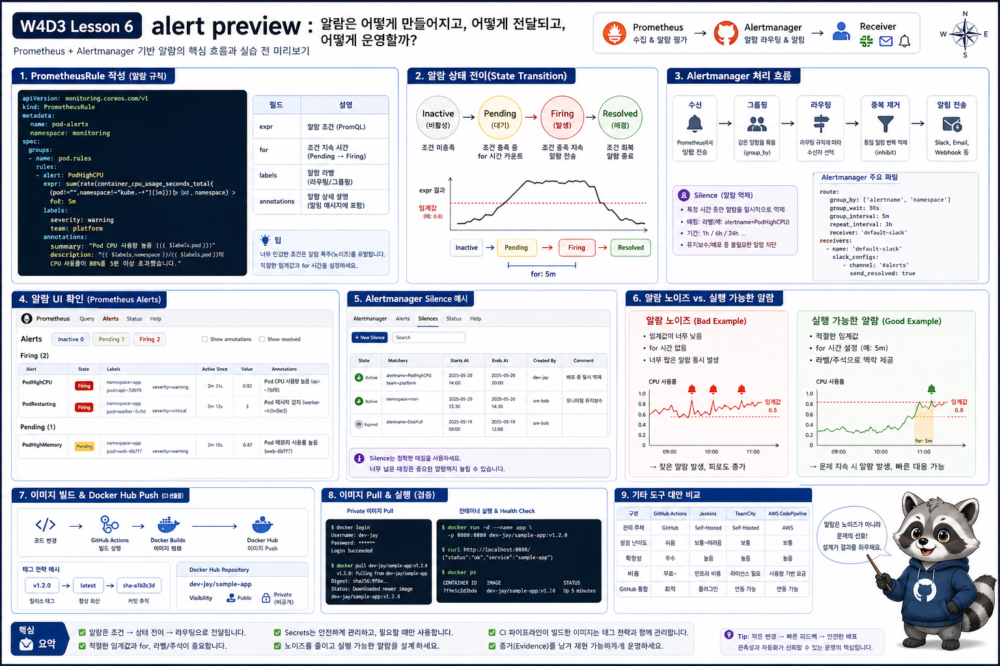

# 6교시: Alert Preview



## 수업 목표
- alert rule, pending, firing, resolved, silence의 의미를 구분한다.
- threshold를 너무 낮게 잡으면 alert noise가 생긴다는 점을 이해한다.
- PrometheusRule manifest를 preview 수준으로 적용한다.

## Alert의 기본 흐름
```text
PromQL 조건
  -> 일정 시간 유지(for)
  -> pending
  -> firing
  -> Alertmanager routing
  -> silence 또는 notification
```

alert는 “metric이 있다”에서 끝나지 않고, 사람이 개입해야 할 조건을 정의하는 것이다.

## PrometheusRule 적용
```bash
kubectl apply -f week4/day3/labs/observability-scenarios/prometheus-rule-preview.yaml
kubectl -n week4-observe get prometheusrule
```

rule 일부:
```yaml
expr: increase(kube_pod_container_status_restarts_total{namespace="week4-observe"}[5m]) > 0
for: 1m
labels:
  severity: warning
```

해석:
| 필드 | 의미 |
|---|---|
| `expr` | alert 조건 |
| `for` | 조건이 유지되어야 하는 시간 |
| `severity` | routing과 우선순위 기준 |
| `annotations` | 사람이 읽을 설명 |

## UI에서 확인
Prometheus:
```text
http://localhost:9090/alerts
```

상태:
| 상태 | 의미 |
|---|---|
| inactive | 조건 불만족 |
| pending | 조건 만족 중이지만 `for` 대기 |
| firing | 조건이 유지되어 alert 발생 |

API로도 확인할 수 있다.

```bash
curl -s --get 'http://localhost:9090/api/v1/query' \
  --data-urlencode 'query=ALERTS{alertname="Week4ObservePodRestarting"}'
```

실제 검증 예시:
```text
alertname="Week4ObservePodRestarting"
alertstate="firing"
namespace="week4-observe"
pod="crashloop-demo-..."
value="1"
```

rule 목록에서 확인:
```text
Week4ObservePodRestarting firing increase(kube_pod_container_status_restarts_total{namespace="week4-observe"}[5m]) > 0
```

## pending이 필요한 이유
`for`가 없으면 순간적인 spike에도 alert가 바로 firing된다.

```yaml
for: 1m
```

의미:
```text
조건이 1분 동안 계속 참이어야 firing으로 전환
```

예를 들어 Pod가 배포 중 한 번 restart한 것은 정상적인 운영 이벤트일 수 있다. 하지만 짧은 시간에 반복 restart가 이어지면 사람이 봐야 할 가능성이 커진다.

## Alertmanager에서 보는 것
Alertmanager는 alert를 그대로 보내는 도구가 아니라 묶고, 라우팅하고, 잠시 조용히 만드는 도구다.

| 기능 | 의미 |
|---|---|
| grouping | 비슷한 alert를 묶음 |
| routing | severity/team/service에 따라 전달 |
| inhibition | 상위 장애가 있을 때 하위 alert 억제 |
| silence | 특정 조건 alert를 일정 시간 숨김 |

오늘은 알림 채널 연동까지 하지 않고 개념과 UI만 확인한다.

## Silence preview
Alertmanager는 alert를 묶고 조용히 만드는 silence 기능을 제공한다.

접속:
```bash
kubectl -n monitoring port-forward svc/kube-prometheus-stack-alertmanager 9093:9093
```

브라우저:
```text
http://localhost:9093
```

silence는 장애를 고치는 기능이 아니다. 이미 알고 있는 작업이나 테스트로 인해 알림이 불필요할 때 일정 시간 알림을 줄이는 기능이다.

## Alert noise
나쁜 alert는 팀의 집중력을 깎는다.

| 나쁜 alert | 문제 |
|---|---|
| CPU 50% 1분 | 너무 흔함 |
| Pod restart 1회 | 배포 중 정상일 수도 있음 |
| target down 즉시 | 일시적 재시작에도 울림 |

더 나은 alert:
| 조건 | 이유 |
|---|---|
| 10분 이상 지속 | 일시적 spike 제거 |
| 사용자 영향 metric과 결합 | 실제 장애 가능성 증가 |
| severity 구분 | 대응 우선순위 결정 |
| runbook link 포함 | 다음 행동 명확화 |

## alert 문장 작성 기준
좋은 alert annotation은 다음을 포함한다.

| 항목 | 예시 |
|---|---|
| 무엇이 | `week4-observe namespace Pod` |
| 어떻게 | `container restart 증가` |
| 얼마나 | `5분 동안 1회 이상` |
| 다음 행동 | `logs --previous와 describe pod 확인` |

나쁜 문장:
```text
PodRestarting
```

더 나은 문장:
```text
week4-observe namespace에서 최근 5분 동안 container restart가 증가했습니다. rollout, logs --previous, describe pod event를 확인하세요.
```

수업에서 이 alert가 좋은 이유:
| 기준 | 설명 |
|---|---|
| 대상이 좁음 | `week4-observe` namespace만 본다 |
| 재현 가능 | crashloop-demo로 즉시 조건을 만들 수 있다 |
| 다음 행동이 있음 | `logs --previous`, `describe pod`로 이어진다 |
| noise 토론 가능 | restart 1회 alert가 운영에서 너무 민감할 수 있음을 설명할 수 있다 |

## alert를 만들지 않아도 되는 경우
| 상황 | 이유 |
|---|---|
| 실습용 장애 | 사람이 이미 알고 있음 |
| 순간 spike | 자동 복구 가능 |
| 영향 없는 dev namespace | noise 가능성 |
| dashboard로 충분한 지표 | 즉시 개입 필요 없음 |

alert는 많을수록 좋은 것이 아니라 적절할수록 좋다.

## Evidence Note
```markdown
# W4D3S6 Alert preview
- PrometheusRule 이름:
- alert expr:
- for:
- pending/firing 상태:
- noise가 될 수 있는 이유:
- silence가 필요한 상황:
```

## 한 줄 요약
```text
좋은 alert는 metric 조건이 아니라 사람이 지금 해야 할 행동과 연결되어야 한다.
```
