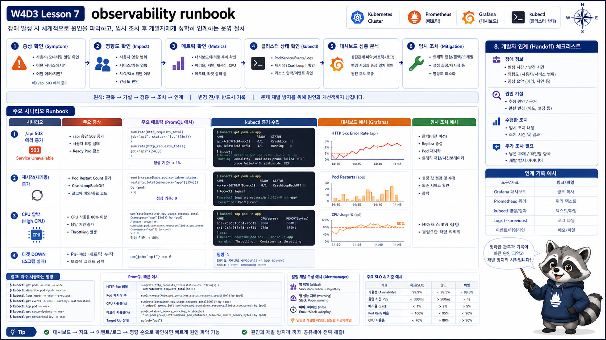

# 7교시: 관찰 Runbook 작성



## 수업 목표
- 증상별로 볼 metric, kubectl 명령, dashboard를 연결한다.
- 개발팀에 전달할 정보를 정리한다.
- W4D1~W4D3의 확인 순서를 운영 runbook으로 만든다.

## Runbook이 필요한 이유
장애 순간에는 기억력이 줄어든다. runbook은 “다음에 뭘 볼지”를 미리 정리한 문서다.

```text
증상
  -> 영향 범위
  -> metric
  -> kubectl evidence
  -> dashboard
  -> 임시 조치
  -> 개발팀 전달
```

## 증상별 runbook
| 증상 | PromQL/Dashboard | kubectl |
|---|---|---|
| 503 증가 | ingress 5xx, endpoint ready 감소 | `get ingress,svc,endpoints` |
| Pod restart 증가 | restart total/increase | `logs --previous`, `describe pod` |
| CPU 압박 | CPU rate, throttling dashboard | `top pod`, resources |
| memory 증가 | working set, OOMKilled | `describe pod`, events |
| target down | `up == 0`, Targets UI | ServiceMonitor, Service, Endpoint |
| rollout 지연 | ready replica, restart | `rollout status`, `get rs,pod` |
| alert firing | `ALERTS{alertname=...}` | `get prometheusrule`, 관련 Pod `describe` |

## 예시 1: `/api` 503 증가
```markdown
## Symptom
- `/api`에서 503 증가

## Metrics
- ingress 5xx 증가
- ready replica 감소

## Kubernetes evidence
- `kubectl -n week4 get endpoints api`: `<none>`
- `kubectl -n week4 describe pod -l app=api`: readiness probe failed

## Action
- 최근 rollout 확인
- readiness endpoint 수정 또는 rollback
```

## 예시 2: restart 증가
```markdown
## Symptom
- Grafana에서 api Pod restart 증가

## Metrics
- `increase(kube_pod_container_status_restarts_total{pod=~"api.*"}[10m]) > 0`

## Kubernetes evidence
- `kubectl logs --previous`
- `kubectl describe pod` Last State / Events

## Action
- image/tag 변경 확인
- app crash 원인 개발팀 전달
```

## 예시 3: readiness rollout 정지
```markdown
## Symptom
- rollout이 끝나지 않고 새 Pod가 READY 0/1로 남음

## Metrics
- `kube_pod_status_ready{namespace="week4-observe", condition="true"}`에서 새 Pod 값 0
- restart는 증가하지 않을 수 있음

## Kubernetes evidence
- `kubectl -n week4-observe rollout status deploy/readiness-bad-demo`
- `kubectl -n week4-observe describe pod -l app=readiness-bad-demo`
- event: `Readiness probe failed: HTTP probe failed with statuscode: 404`

## Action
- readiness path와 app route 확인
- 이전 ReplicaSet이 traffic을 유지 중인지 Endpoint 확인
- 새 revision 수정 또는 rollback
```

## 예시 4: alert firing
```markdown
## Symptom
- Prometheus Alerts에서 `Week4ObservePodRestarting` firing

## Metrics
- `ALERTS{alertname="Week4ObservePodRestarting"}` value 1
- `increase(kube_pod_container_status_restarts_total{namespace="week4-observe"}[5m]) > 0`

## Kubernetes evidence
- `kubectl -n week4-observe get pod`
- `kubectl -n week4-observe logs deploy/crashloop-demo --previous`
- `kubectl -n week4-observe describe pod -l app=crashloop-demo`

## Action
- 배포 직후 정상 restart인지 반복 crash인지 구분
- Last State, exit code, event, 최근 image tag 확인
```

## 개발팀에 전달할 정보
| 항목 | 예시 |
|---|---|
| 증상 | `/api` 503 증가 |
| 시작 시각 | 10:32 KST |
| 영향 범위 | `week4` namespace, api service |
| metric | ready replica 2 -> 0 |
| logs/events | readiness 404 |
| 최근 변경 | api rollout revision 3 |
| 임시 조치 | rollback 완료 |
| 추가 요청 | `/ready` endpoint 확인 필요 |

## Runbook template
```markdown
# Incident note

## Symptom
- URL/API:
- status/error:
- start time:

## Metrics
- dashboard:
- PromQL:
- value/change:

## Kubernetes evidence
- namespace:
- ingress/service/endpoint:
- pod READY/restart:
- events/logs:

## Action
- rollback/restart/scale:
- result:

## Handoff
- suspected cause:
- app owner request:
- evidence links:
```

## 개발팀에 전달할 때 빼면 안 되는 것
```text
"느려요"만 보내면 부족하다.
```

같이 보내야 한다.

| 정보 | 예시 |
|---|---|
| 시간 | 10:32~10:38 KST |
| 영향 | `/api` 503 |
| 최근 변경 | deploy/api revision 4 |
| metric | ready replica 2 -> 0 |
| event | readiness probe 404 |
| log | `/ready` route not found |
| 조치 | rollback revision 3 |

이 정도가 있어야 개발팀이 재현 없이도 원인을 좁힐 수 있다.

## W4D1~W4D3 연결
| Day | runbook에 들어갈 기준 |
|---|---|
| W4D1 | readiness, resources, metrics-server |
| W4D2 | Ingress, Service, Endpoint, NetworkPolicy |
| W4D3 | Prometheus target, dashboard, alert, runbook |

## 실제 검증 runbook 연결
오늘 검증한 장애는 다음처럼 묶을 수 있다.

| 증상 | metric | kubectl evidence | 판단 |
|---|---|---|---|
| CrashLoopBackOff | restart increase, alert firing | `logs --previous`, `describe pod` | container가 반복 종료 |
| readiness 404 | ready condition 0 | readiness event 404 | app route/probe mismatch |
| CPU loop | CPU rate 증가 | `top pod`, deployment command | 지속 부하 발생 |
| scheduler target down | `up{job="kube-scheduler"} == 0` | ServiceMonitor/Endpoint 확인 | local kind target 노출 이슈 가능 |

## Evidence Note
```markdown
# W4D3S7 Runbook
- 내가 고른 증상:
- 먼저 볼 dashboard:
- 먼저 볼 kubectl 명령:
- 개발팀에 전달할 핵심 evidence:
- 임시 조치 기준:
```

## 한 줄 요약
```text
runbook은 장애 중에 새로 생각하지 않기 위해 평소에 작성하는 확인 순서다.
```
