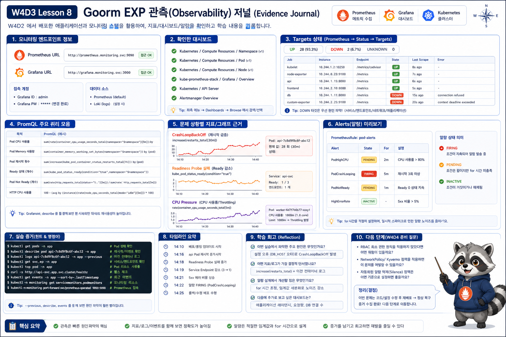

# 8교시: 구름 EXP 배움일기



## 수업 목표
- Prometheus/Grafana에서 확인한 지표를 evidence로 정리한다.
- target down, restart 증가, readiness 실패를 구분해 기록한다.
- W4D4 RBAC/Kyverno로 이어질 운영 질문을 남긴다.

## 오늘 배운 내용 요약
| 주제 | 핵심 |
|---|---|
| Observability | logs/events/metrics/traces를 조합해 장애 질문을 좁힘 |
| Prometheus | target scrape와 PromQL |
| Grafana | dashboard로 시간 흐름 확인 |
| ServiceMonitor | Service 기반 target discovery |
| Alert | 사람이 개입할 조건 정의 |
| Runbook | 증상별 확인 순서와 전달 정보 |

## 배움일기 표
| 항목 | 기록 |
|---|---|
| Prometheus 접속 URL |  |
| Grafana 접속 URL |  |
| 확인한 dashboard |  |
| UP target 예시 |  |
| DOWN 또는 헷갈린 target |  |
| 사용한 PromQL 1개 |  |
| CrashLoop metric |  |
| readiness 실패 evidence |  |
| CPU 압박 evidence |  |
| alert preview 상태 |  |
| 개발팀에 전달할 정보 |  |

## 오늘의 evidence 명령
```bash
helm list -n monitoring
kubectl -n monitoring get pod,svc
kubectl get servicemonitor,podmonitor,prometheusrule -A
kubectl -n week4-observe get pod
kubectl -n week4-observe describe pod -l app=crashloop-demo
kubectl -n week4-observe describe pod -l app=readiness-bad-demo
```

PromQL:
```promql
up
increase(kube_pod_container_status_restarts_total[5m])
sum by (namespace, pod) (rate(container_cpu_usage_seconds_total{container!="", image!=""}[5m]))
kube_pod_status_ready{condition="true"}
```

## 작성 예시
| 항목 | 기록 예시 |
|---|---|
| 확인한 dashboard | Kubernetes / Compute Resources / Pod |
| UP target 예시 | `kube-state-metrics` |
| PromQL | `increase(kube_pod_container_status_restarts_total[5m])` |
| CrashLoop evidence | restart 증가 + `logs --previous` |
| readiness evidence | 새 Pod READY 0/1 + readiness 404 event + 기존 Pod 유지 |
| CPU evidence | cpu-pressure-demo CPU rate 증가 |
| alert 상태 | `Week4ObservePodRestarting` firing |

## 실제 검증 기록 예시
| 항목 | 기록 |
|---|---|
| cluster | kind, single control-plane node Ready |
| monitoring Pod | Prometheus 2/2, Grafana 3/3, Alertmanager 2/2 Running |
| CrashLoop | `crashloop-demo` restart 증가, alert firing |
| Readiness | nginx `/not-ready` 404로 새 Pod Ready 0/1 |
| Target | local kind에서 일부 control plane target은 `up=0` 가능 |
| Alert | `ALERTS{alertname="Week4ObservePodRestarting"}` 값 1 |

## 좋은 기록과 아쉬운 기록
| 아쉬운 기록 | 좋은 기록 |
|---|---|
| Grafana 봤다 | Pod dashboard에서 `cpu-pressure-demo` CPU 증가 확인 |
| alert 떴다 | `Week4ObservePodRestarting` firing, restart 증가 PromQL 확인 |
| target이 이상했다 | `/targets`에서 kube-state-metrics DOWN, error message 기록 |
| Pod가 죽었다 | CrashLoopBackOff + `logs --previous` 출력 + restart metric 증가 |
| readiness 문제 | READY 0/1 + event 404 + endpoint 없음 |

## 최종 runbook 한 문단
```markdown
장애가 발생하면 먼저 사용자 증상과 시각을 기록한다. Prometheus target이 UP인지 확인하고, Grafana에서 namespace와 Pod 단위 resource/restart/ready 상태를 본다. 그다음 kubectl로 Service/Endpoint/Pod event/logs를 확인한다. metric은 시간과 범위를 보여주고, event와 log는 원인을 좁힌다. alert는 사람이 개입해야 할 조건만 남기고 noise가 되면 threshold와 for 시간을 조정한다.
```

## 오늘의 final note
```markdown
W4D3에서는 kube-prometheus-stack을 Helm으로 설치하고 Prometheus target, Grafana dashboard, alert preview를 확인했다. target이 DOWN이면 dashboard보다 먼저 ServiceMonitor, Service, Endpoint, Pod readiness를 확인해야 한다. restart 증가, readiness 실패, CPU 압박은 각각 다른 metric과 kubectl evidence로 확인해야 한다. 좋은 alert는 단순 threshold가 아니라 사람이 해야 할 행동과 runbook으로 이어져야 한다.
```

## W4D4로 이어지는 질문
| 질문 | W4D4 연결 |
|---|---|
| 누가 monitoring namespace를 수정할 수 있는가 | RBAC |
| 누구에게 PrometheusRule 생성 권한을 줄 것인가 | Role/RoleBinding |
| 위험한 manifest를 배포 전에 막을 수 있는가 | Kyverno |
| label/resource/probe 없는 Pod를 차단할 수 있는가 | admission policy |
| policy 위반도 dashboard/alert로 볼 수 있는가 | observability + security |

## 개인 정리 질문
아래 질문에 답하면 오늘 수업의 핵심을 거의 정리한 것이다.

| 질문 | 내 답 |
|---|---|
| `up=0`과 query 결과 없음은 어떻게 다른가 |  |
| ServiceMonitor에서 port name이 틀리면 어떤 일이 생기는가 |  |
| restart 증가를 볼 PromQL은 무엇인가 |  |
| readiness 실패는 restart metric에 반드시 보이는가 |  |
| rollout 중 이전 Pod가 남아 있는 이유는 무엇인가 |  |
| dashboard screenshot에 time range가 필요한 이유는 무엇인가 |  |
| alert의 `for`는 왜 필요한가 |  |
| alert noise를 줄이는 방법은 무엇인가 |  |

## 수업 후 남길 파일/메모
```markdown
# W4D3 observability memo

## Dashboards
- Prometheus URL:
- Grafana URL:
- 확인한 dashboard:

## Queries
- target:
- restart:
- CPU:
- readiness:

## Incident practice
- 증상:
- metric:
- kubectl evidence:
- 판단:

## Next
- W4D4에서 권한/정책으로 막아보고 싶은 위험:
```

## cleanup 결정
| 선택 | 기준 |
|---|---|
| monitoring stack 유지 | W4D4에서도 dashboard/alert를 보고 싶음 |
| monitoring stack 삭제 | local resource를 아껴야 함 |
| scenario namespace 삭제 | CrashLoop/CPU loop가 계속 돌면 방해됨 |

삭제:
```bash
kubectl delete namespace week4-observe
helm uninstall kube-prometheus-stack -n monitoring
kubectl delete namespace monitoring
```

유지한다면 `helm list -A`와 `kubectl get ns` 결과를 기록한다.

## Evidence Note
```markdown
# W4D3S8 Journal
- 오늘 가장 도움이 된 dashboard:
- 가장 헷갈린 PromQL:
- target down을 보면 먼저 확인할 것:
- alert noise를 줄이는 방법:
- W4D4에서 확인하고 싶은 권한/정책 질문:
- monitoring stack 유지/삭제 결정:
```

## 한 줄 요약
```text
W4D3의 산출물은 dashboard 캡처가 아니라 장애를 좁히는 metric 질문과 runbook이다.
```
