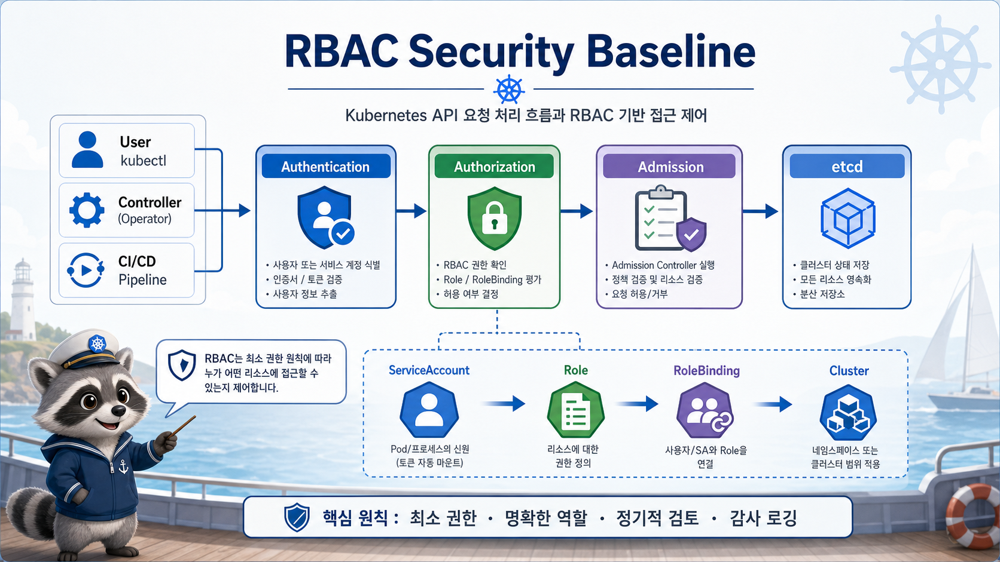

# 1교시: Day3 요약 + Kubernetes 권한 모델



## 수업 목표
- W4D3 observability에서 W4D4 security로 넘어가는 이유를 설명한다.
- Kubernetes API 요청이 authentication, authorization, admission을 거치는 흐름을 이해한다.
- user, group, ServiceAccount, Role, ClusterRole, RoleBinding의 위치를 구분한다.

## Day3에서 이어지는 질문
W4D3에서는 장애를 보기 위한 질문을 만들었다.

| W4D3 질문 | W4D4 질문 |
|---|---|
| 어떤 Pod가 restart했는가 | 누가 그 Pod를 수정할 수 있는가 |
| 어떤 target이 DOWN인가 | 누가 monitoring 설정을 바꿀 수 있는가 |
| 어떤 alert가 firing인가 | 누가 alert rule을 만들 수 있는가 |
| readiness가 왜 실패했는가 | readiness 없는 Pod를 배포 전에 막을 수 있는가 |
| latest tag가 어떤 문제를 만들었는가 | latest tag 사용을 admission에서 차단할 수 있는가 |

관찰은 문제를 발견하게 해주고, 권한과 정책은 문제가 반복되는 경로를 줄인다.

## Kubernetes API 요청 흐름
```text
client(kubectl, controller, CI)
  -> authentication
  -> authorization(RBAC)
  -> admission(policy/webhook)
  -> etcd 저장
```

이 흐름을 알아야 오류 메시지를 구분할 수 있다.

| 단계 | 실패 예시 | 의미 |
|---|---|---|
| authentication | 인증 정보 없음 | 누구인지 모름 |
| authorization | `Forbidden` | 누구인지는 알지만 권한 없음 |
| admission | `admission webhook denied` | 권한은 있지만 object 내용이 정책 위반 |
| persistence | API validation error | object schema 또는 필드 오류 |

## RBAC의 네 가지 질문
RBAC은 다음 네 가지로 읽는다.

| 질문 | 예시 |
|---|---|
| 누가 | `system:serviceaccount:week4-security:readonly-viewer` |
| 무엇에 | `pods`, `deployments`, `services` |
| 어떤 동작을 | `get`, `list`, `watch`, `create`, `delete` |
| 어느 범위에서 | `week4-security` namespace |

이 네 가지 중 하나라도 빠지면 권한 설명이 흐려진다.

## Subject
Kubernetes RBAC subject는 user, group, ServiceAccount가 될 수 있다.

| Subject | 주로 쓰는 곳 |
|---|---|
| User | 사람이 kubeconfig로 접근 |
| Group | 조직/팀 단위 권한 |
| ServiceAccount | Pod 안에서 실행되는 application/controller |

수업에서는 ServiceAccount를 중심으로 본다. Kubernetes 안에서 돌아가는 workload는 대부분 ServiceAccount identity로 API를 호출하기 때문이다.

## Role과 ClusterRole
| 구분 | 범위 | 예시 |
|---|---|---|
| Role | namespace 안 | `week4-security`에서 Pod 읽기 |
| ClusterRole | cluster 전체 또는 재사용 | Node 보기, CRD 보기, 여러 namespace 공통 권한 |

처음부터 ClusterRoleBinding을 남발하면 권한 범위가 커진다. 수업에서는 namespace Role과 RoleBinding으로 최소 권한을 먼저 만든다.

## RoleBinding
RoleBinding은 subject와 Role을 연결한다.

```text
ServiceAccount readonly-viewer
  -> RoleBinding readonly-viewer-pod-reader
  -> Role pod-reader
  -> pods/services/deployments get/list/watch
```

Role만 만들어서는 아무도 그 권한을 갖지 않는다. RoleBinding이 있어야 subject가 권한을 얻는다.

## `kubectl auth can-i`
권한을 추측하지 말고 물어본다.

```bash
kubectl auth can-i list pods \
  --as=system:serviceaccount:week4-security:readonly-viewer \
  -n week4-security
```

결과:
```text
yes
```

삭제 권한:
```bash
kubectl auth can-i delete pods \
  --as=system:serviceaccount:week4-security:readonly-viewer \
  -n week4-security
```

결과:
```text
no
```

## 권한과 정책을 섞지 않기
RBAC은 "할 수 있는가"를 본다. Kyverno는 "이 manifest가 허용되는가"를 본다.

| 오류 | 원인 후보 |
|---|---|
| `User ... cannot delete resource pods` | RBAC |
| `admission webhook ... denied the request` | Kyverno/admission |
| `unknown field` | YAML schema |
| `ImagePullBackOff` | image/registry/runtime |

운영자는 오류를 보는 순간 어느 단계에서 막혔는지 분리해야 한다.

## 수업 중 사용할 namespace
```bash
kubectl apply -f week4/day4/labs/rbac/namespace.yaml
```

오늘 모든 예제는 `week4-security` namespace에 모은다. RBAC과 policy 실습은 cluster 전체에 영향을 줄 수 있으므로 scope를 좁혀야 한다.

## 오늘의 security mental model
```text
RBAC:
  "이 사람이/앱이 이 API를 호출할 수 있는가"

Kyverno:
  "이 object가 우리 cluster 기준을 만족하는가"

Evidence:
  "어디서 거절됐는가"
```

## Evidence Note
```markdown
# W4D4S1 Security baseline
- API 요청 흐름:
- RBAC이 답하는 질문:
- admission policy가 답하는 질문:
- Forbidden과 admission deny 차이:
- 오늘 사용할 namespace:
```

## 한 줄 요약
```text
Kubernetes 보안 troubleshooting은 RBAC에서 막혔는지, admission policy에서 막혔는지를 분리하는 것에서 시작한다.
```
