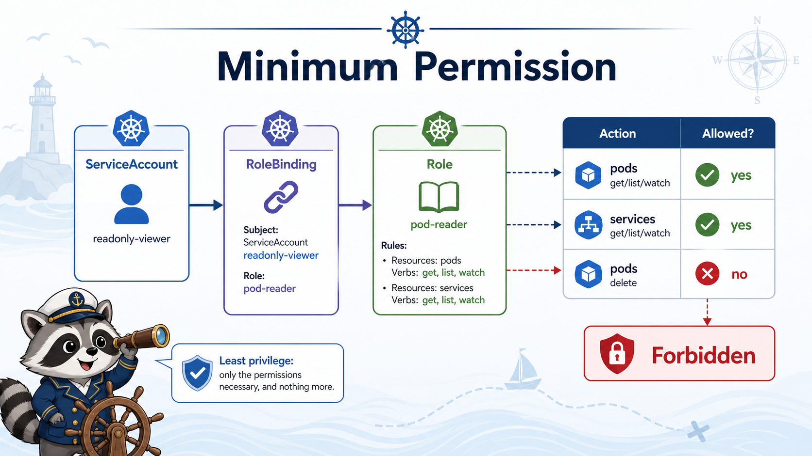

# 2교시: RBAC 최소 권한 실습



## 수업 목표
- ServiceAccount, Role, RoleBinding을 직접 적용한다.
- 읽기 권한과 삭제 권한을 `kubectl auth can-i`로 비교한다.
- `Forbidden` 오류를 보고 RBAC 문제로 판단한다.

## 왜 최소 권한인가
운영에서 편하다고 넓은 권한을 주면 사고 범위가 커진다.

| 넓은 권한 | 위험 |
|---|---|
| 모든 namespace pod delete 가능 | 다른 팀 서비스까지 삭제 가능 |
| secret list 가능 | 민감정보 노출 |
| cluster-admin 공유 | 감사/audit 불가능 |
| default ServiceAccount에 권한 부여 | 어떤 Pod가 권한을 쓰는지 추적 어려움 |

오늘은 읽기 전용 ServiceAccount를 만들고, 삭제가 막히는 것을 확인한다.

## 리소스 적용
```bash
kubectl apply -f week4/day4/labs/rbac/namespace.yaml
kubectl apply -f week4/day4/labs/rbac/serviceaccounts.yaml
kubectl apply -f week4/day4/labs/rbac/readonly-role.yaml
kubectl apply -f week4/day4/labs/rbac/sample-workload.yaml
```

확인:
```bash
kubectl -n week4-security get sa
kubectl -n week4-security get role,rolebinding
kubectl -n week4-security get deploy,svc,pod
```

## ServiceAccount 확인
```bash
kubectl -n week4-security get sa
```

예상:
```text
readonly-viewer
app-runner
token-demo
default
```

| ServiceAccount | 용도 |
|---|---|
| `readonly-viewer` | RBAC can-i 실습 |
| `app-runner` | application Pod 실행 |
| `token-demo` | token mount 확인 |
| `default` | 쓰지 않는 것이 목표 |

## Role 읽기
```bash
kubectl -n week4-security get role pod-reader -o yaml
```

핵심:
```yaml
resources: ["pods", "services", "endpoints", "configmaps"]
verbs: ["get", "list", "watch"]
```

여기에는 `delete`, `create`, `update`가 없다. 그래서 읽기는 되지만 삭제는 안 된다.

## 권한 확인
읽기:
```bash
kubectl auth can-i list pods \
  --as=system:serviceaccount:week4-security:readonly-viewer \
  -n week4-security
```

예상:
```text
yes
```

삭제:
```bash
kubectl auth can-i delete pods \
  --as=system:serviceaccount:week4-security:readonly-viewer \
  -n week4-security
```

예상:
```text
no
```

주의할 점이 있다. `kubectl auth can-i`는 사람이 보기에는 `no`를 출력하고 끝난 것처럼 보이지만, shell 입장에서는 실패 exit code를 줄 수 있다. 그래서 자동 검증 스크립트에서 `set -e`를 켜둔 상태로 실행하면 여기서 멈출 수 있다.

수업 중에는 한 줄씩 실행하거나 다음처럼 evidence를 남긴다.

```bash
kubectl auth can-i delete pods \
  --as=system:serviceaccount:week4-security:readonly-viewer \
  -n week4-security || true
```

## 실제 forbidden 만들기
```bash
kubectl --as=system:serviceaccount:week4-security:readonly-viewer \
  -n week4-security delete pod -l app=security-api
```

예상:
```text
Error from server (Forbidden): pods ... is forbidden:
User "system:serviceaccount:week4-security:readonly-viewer"
cannot delete resource "pods" in API group "" in the namespace "week4-security"
```

실제 검증 예시:
```text
pods "security-api-..." is forbidden:
User "system:serviceaccount:week4-security:readonly-viewer"
cannot delete resource "pods" in API group "" in the namespace "week4-security"
```

오류 문장에서 볼 것:
| 부분 | 의미 |
|---|---|
| User | 어떤 subject로 요청했는가 |
| cannot delete | 어떤 verb가 막혔는가 |
| resource pods | 어떤 resource가 막혔는가 |
| namespace week4-security | 어떤 scope인가 |

## namespace scope 확인
다른 namespace에서 같은 subject로 확인한다.

```bash
kubectl auth can-i list pods \
  --as=system:serviceaccount:week4-security:readonly-viewer \
  -n default
```

예상:
```text
no
```

RoleBinding은 `week4-security` namespace에만 있으므로 default namespace 권한은 없다.

## RoleBinding 확인
```bash
kubectl -n week4-security get rolebinding readonly-viewer-pod-reader -o yaml
```

핵심:
```yaml
subjects:
  - kind: ServiceAccount
    name: readonly-viewer
roleRef:
  kind: Role
  name: pod-reader
```

subject와 roleRef가 맞아야 권한이 연결된다.

## 자주 하는 실수
| 실수 | 증상 |
|---|---|
| Role만 만들고 RoleBinding 없음 | can-i가 계속 no |
| ServiceAccount namespace 오타 | subject가 다른 identity로 잡힘 |
| RoleBinding namespace 착각 | 다른 namespace에서 권한 없음 |
| resource 이름 오타 | 권한이 있어 보이지만 적용 안 됨 |
| ClusterRoleBinding 남발 | 필요 이상 권한 부여 |

## 최소 권한 정리표
| 운영 요청 | 권한 방향 |
|---|---|
| 앱 로그 보기 | pods/log get |
| 배포 상태 보기 | deployments get/list/watch |
| Pod 삭제 | 운영자에게만 제한 |
| Secret 조회 | 극히 제한 |
| 모든 namespace 접근 | cluster 운영자에게만 제한 |

## Evidence Note
```markdown
# W4D4S2 RBAC minimum permission
- ServiceAccount:
- Role:
- RoleBinding:
- can-i list pods:
- can-i delete pods:
- forbidden message:
- namespace scope 확인:
```

## 한 줄 요약
```text
RBAC은 권한을 추측하는 것이 아니라 can-i와 forbidden 메시지로 subject, verb, resource, scope를 확인하는 작업이다.
```
