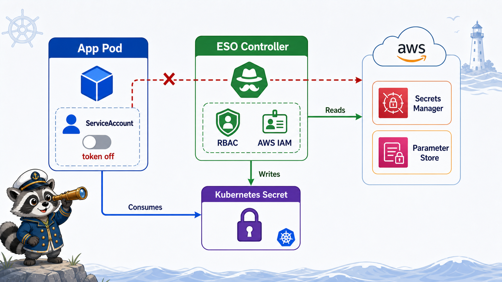

# 3교시: app Pod와 ServiceAccount



## 수업 목표
- Pod가 어떤 ServiceAccount로 실행되는지 확인한다.
- default ServiceAccount를 무심코 쓰는 위험을 설명한다.
- automountServiceAccountToken 설정을 보고 token mount 여부를 확인한다.

## Pod와 identity
Kubernetes 안에서 실행되는 application도 API를 호출할 수 있다. 이때 사용되는 identity가 ServiceAccount다.

```text
Pod
  -> ServiceAccount
  -> token
  -> Kubernetes API 호출
  -> RBAC 판단
```

모든 앱이 Kubernetes API를 호출할 필요는 없다. API를 쓰지 않는 앱에는 token을 mount하지 않는 편이 낫다.

## sample workload 확인
```bash
kubectl -n week4-security get deploy security-api -o yaml
```

핵심:
```yaml
serviceAccountName: app-runner
automountServiceAccountToken: false
```

이 설정은 "이 앱은 app-runner identity로 실행하지만, Pod 안에 API token을 자동 mount하지 않는다"는 뜻이다.

## default ServiceAccount 위험
Deployment에서 `serviceAccountName`을 생략하면 default ServiceAccount가 사용된다.

| 방식 | 문제 |
|---|---|
| 생략 | 어떤 identity인지 의도가 안 보임 |
| default에 권한 부여 | 같은 namespace의 여러 Pod가 권한 공유 |
| token 자동 mount | 앱 취약점이 API token 노출로 이어질 수 있음 |

운영 기준은 "workload마다 이름 있는 ServiceAccount"다.

## token mount 확인
token을 mount하는 Pod를 만든다.

```bash
kubectl apply -f week4/day4/labs/rbac/token-mounted-pod.yaml
kubectl -n week4-security get pod token-mounted-demo
```

Pod 안에서 확인:
```bash
kubectl -n week4-security exec token-mounted-demo -- \
  ls /var/run/secrets/kubernetes.io/serviceaccount
```

예상:
```text
ca.crt
namespace
token
```

이 파일들은 Pod가 API Server에 자신을 증명할 때 쓰인다.

실제 검증 예시:
```text
ca.crt
namespace
token
```

여기서 token 파일이 보인다는 것은 Pod 안의 process가 해당 token을 읽을 수 있다는 뜻이다. 앱이 Kubernetes API를 호출할 일이 없다면 굳이 이 경로를 열어둘 필요가 없다.

## token이 없는 Pod 확인
```bash
pod="$(kubectl -n week4-security get pod -l app=security-api -o jsonpath='{.items[0].metadata.name}')"
kubectl -n week4-security exec "$pod" -- \
  ls /var/run/secrets/kubernetes.io/serviceaccount
```

예상:
```text
No such file or directory
```

`automountServiceAccountToken: false`라서 token directory가 없다.

실제 검증 예시:
```text
ls: /var/run/secrets/kubernetes.io/serviceaccount: No such file or directory
command terminated with exit code 1
```

이 실패는 장애가 아니라 의도한 보안 상태다. "token directory가 없다"는 결과를 성공 evidence로 기록한다.

## 언제 token이 필요한가
| workload | token 필요 여부 |
|---|---|
| 일반 web API | 대개 필요 없음 |
| batch job이 API를 안 씀 | 필요 없음 |
| controller/operator | 필요 |
| external secret controller | 필요 |
| deployment automation agent | 필요 |

필요한 경우에도 최소 권한 Role을 붙인다.

## workload identity preview
cloud 환경에서는 Kubernetes ServiceAccount와 cloud IAM을 연결하는 방식이 자주 쓰인다.

| 환경 | 예시 |
|---|---|
| AWS | IRSA/EKS Pod Identity |
| GCP | Workload Identity |
| Azure | Workload Identity |

오늘은 local kind이므로 cloud IAM 연동은 하지 않는다. 대신 "Pod identity는 ServiceAccount에서 시작한다"는 기준만 잡는다.

## 위험 시나리오
앱에 RCE 취약점이 있고 token이 mount되어 있다면 공격자는 Pod 안에서 token을 읽어 API를 호출할 수 있다.

```text
app exploit
  -> serviceaccount token read
  -> Kubernetes API call
  -> RBAC 권한만큼 cluster 영향
```

그래서 token mount와 RBAC 최소 권한은 함께 봐야 한다.

## 확인 명령 모음
```bash
kubectl -n week4-security get pod -o custom-columns=NAME:.metadata.name,SA:.spec.serviceAccountName
kubectl -n week4-security get sa app-runner -o yaml
kubectl -n week4-security describe pod token-mounted-demo
```

## ServiceAccount 확인표
| 확인 | 명령 | 기대 |
|---|---|---|
| Pod가 어떤 SA를 쓰는가 | `get pod -o custom-columns` | `app-runner`, `token-demo` |
| token mount 여부 | `exec ls /var/run/secrets/...` | true면 파일 3개 |
| app Pod token 차단 | `exec ls /var/run/secrets/...` | No such file |
| SA 권한 | `kubectl auth can-i --as=...` | 필요한 verb만 yes |

이 네 가지를 함께 봐야 "Pod identity가 의도대로 제한됐다"고 말할 수 있다.

## 오해하기 쉬운 지점
| 오해 | 정리 |
|---|---|
| ServiceAccount를 만들면 자동으로 권한이 생김 | RoleBinding이 있어야 함 |
| token이 없으면 Pod 실행이 안 됨 | API 호출이 필요 없으면 없어도 됨 |
| default ServiceAccount는 안전함 | 권한이 붙으면 추적이 어려움 |
| RBAC만 있으면 충분함 | manifest 품질은 admission policy도 필요 |

## Evidence Note
```markdown
# W4D4S3 ServiceAccount
- app workload ServiceAccount:
- automountServiceAccountToken:
- token-mounted-demo token files:
- security-api token directory result:
- token이 필요한 workload 예시:
```

## 한 줄 요약
```text
ServiceAccount는 Pod의 identity이고, token mount는 앱이 Kubernetes API에 접근할 수 있는 문을 열지 결정하는 설정이다.
```
