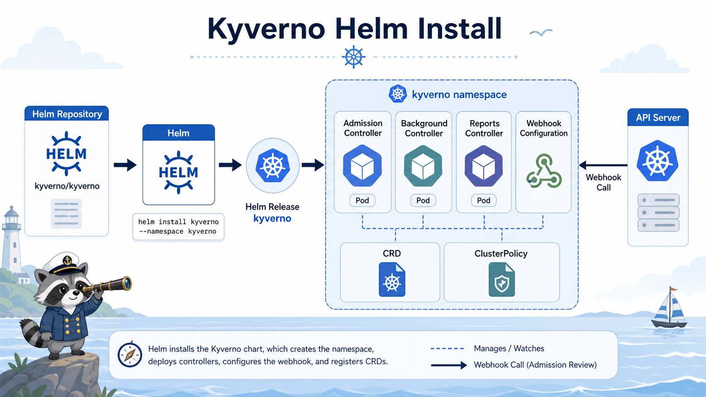

# 4교시: Kyverno Helm 설치



## 수업 목표
- Kyverno가 admission controller로 동작하는 위치를 이해한다.
- Helm으로 Kyverno를 설치하고 controller Pod, CRD, webhook을 확인한다.
- 설치 실패와 policy 실패를 구분한다.

## Kyverno를 왜 쓰는가
RBAC은 사용자의 권한을 제한한다. 하지만 권한이 있는 사람이 나쁜 manifest를 배포하는 것은 별개의 문제다.

예:
```yaml
image: nginx:latest
securityContext:
  privileged: true
volumes:
  - hostPath:
      path: /
```

이런 manifest는 권한 있는 사용자가 만들 수도 있다. Kyverno는 admission 단계에서 object 내용을 검사한다.

## 설치 전 확인
```bash
kubectl config current-context
kubectl get nodes
helm version --short
```

namespace 확인:
```bash
kubectl get ns kyverno
```

없어도 괜찮다. Helm 설치에서 `--create-namespace`를 사용한다.

## Helm repo
```bash
helm repo add kyverno https://kyverno.github.io/kyverno/
helm repo update
```

chart 확인:
```bash
helm search repo kyverno/kyverno
```

수업에서는 긴 `--set` 대신 repo에 있는 values file을 사용한다.

```bash
cat week4/day4/labs/kyverno/values.yaml
```

## 설치
```bash
helm upgrade --install kyverno kyverno/kyverno \
  --namespace kyverno \
  --create-namespace \
  -f week4/day4/labs/kyverno/values.yaml
```

예상:
```text
NAME: kyverno
NAMESPACE: kyverno
STATUS: deployed
```

실제 검증 예시:
```text
Chart version: 3.8.1
Kyverno version: v1.18.1
STATUS: deployed
```

## Pod 확인
```bash
kubectl -n kyverno get pods
```

예상 component:
| Pod | 역할 |
|---|---|
| admission-controller | admission webhook 요청 처리 |
| background-controller | background scan |
| cleanup-controller | cleanup policy 처리 |
| reports-controller | policy report 생성 |

버전에 따라 Pod 이름과 component 구성이 조금 다를 수 있다. 중요한 것은 admission controller가 Running인지다.

실제 검증 예시:
```text
kyverno-admission-controller    1/1 Running
kyverno-background-controller   1/1 Running
kyverno-cleanup-controller      1/1 Running
kyverno-reports-controller      1/1 Running
```

## CRD 확인
```bash
kubectl get crd | grep kyverno
```

대표:
```text
clusterpolicies.kyverno.io
policies.kyverno.io
policyreports.wgpolicyk8s.io
```

CRD가 없으면 policy manifest를 적용할 수 없다.

## webhook 확인
```bash
kubectl get validatingwebhookconfiguration | grep kyverno
kubectl get mutatingwebhookconfiguration | grep kyverno
```

admission controller는 webhook으로 API Server와 연결된다.

```text
API Server
  -> Kyverno webhook
  -> allow/deny
```

## 설치가 느릴 때
Kyverno는 webhook과 controller가 준비될 때까지 시간이 걸릴 수 있다.

```bash
kubectl -n kyverno wait --for=condition=Ready pod --all --timeout=180s
```

Pod가 Ready가 아니면:
```bash
kubectl -n kyverno describe pod <pod-name>
kubectl -n kyverno logs <pod-name>
```

## Helm으로 설치하는 이유
| 방식 | 수업 기준 |
|---|---|
| Helm | release/values/uninstall이 명확 |
| remote YAML apply | 버전/출처/삭제 기준이 흐려짐 |
| 수동 manifest 복붙 | 반복 재현 어려움 |

W4D1 이후 add-on 설치는 Helm으로 통일한다.

## 설치 후 바로 policy를 넣지 않는 이유
먼저 Kyverno 자체가 건강한지 확인해야 한다.

| 확인 | 이유 |
|---|---|
| Pod Running | webhook 처리 가능 |
| CRD 존재 | policy resource 생성 가능 |
| webhook 존재 | API Server와 연결 |
| Helm release deployed | uninstall/upgrade 가능 |

설치가 불안정한 상태에서 policy가 실패하면 원인이 policy인지 설치인지 구분하기 어렵다.

## Evidence Note
```markdown
# W4D4S4 Kyverno install
- Helm release:
- Kyverno namespace Pod:
- CRD:
- ValidatingWebhookConfiguration:
- 설치 중 막힌 지점:
```

## 한 줄 요약
```text
Kyverno 설치 검증은 policy 작성 전 단계이며, admission controller가 Running이어야 배포 차단 실습이 의미가 있다.
```
