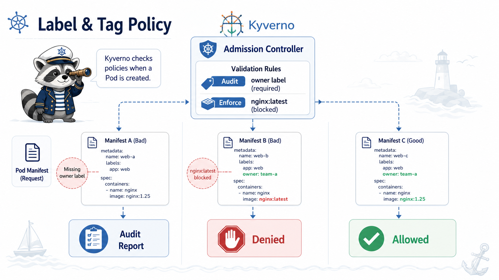

# 5교시: Kyverno Policy 1 - latest 금지와 required label



## 수업 목표
- Audit와 Enforce의 차이를 실습한다.
- owner label 누락을 Audit로 기록한다.
- `latest` tag 사용을 Enforce로 차단한다.
- image tag 기준을 Week3 Git tag/Docker tag 기준과 연결한다.

## 왜 label을 강제하는가
운영 중 문제가 생기면 "이 Pod는 누가 책임지는가"를 바로 알아야 한다.

| label | 운영 용도 |
|---|---|
| `owner` | 담당 팀/사람 |
| `app` | 서비스 식별 |
| `env` | dev/stage/prod 구분 |
| `version` | 배포 버전 |
| `cost-center` | 비용 배부 |

오늘은 단순하게 `owner` label만 요구한다.

## Audit 정책 적용
```bash
kubectl apply -f week4/day4/labs/kyverno/require-owner-label-audit.yaml
```

확인:
```bash
kubectl get clusterpolicy require-owner-label-audit
```

핵심:
```yaml
validationFailureAction: Audit
```

Audit은 위반을 기록하지만 object 생성을 막지 않는다.

## owner 없는 Pod 적용
```bash
kubectl apply -f week4/day4/labs/kyverno/bad-pod-missing-owner.yaml
```

예상:
```text
pod/bad-missing-owner created
```

왜 생성되는가?

| 이유 | 설명 |
|---|---|
| 정책은 위반 | owner label 없음 |
| 모드는 Audit | 생성은 허용 |
| 목적 | 영향 범위와 기존 위반 확인 |

## policy report 확인
Kyverno 버전과 설정에 따라 report resource 이름이 다를 수 있다.

```bash
kubectl get policyreport -A 2>/dev/null || true
kubectl get admissionreport -A 2>/dev/null || true
kubectl get clusterpolicyreport -A 2>/dev/null || true
```

report가 바로 안 보이면 reports controller 상태와 시간을 확인한다.

```bash
kubectl -n kyverno get pods
kubectl -n kyverno logs deploy/kyverno-reports-controller --tail=80
```

## latest tag를 막는 이유
`latest`는 간편하지만 운영에서는 위험하다.

| 문제 | 설명 |
|---|---|
| 재현 어려움 | 같은 tag가 다른 image를 가리킬 수 있음 |
| rollback 어려움 | 어떤 버전으로 돌아갈지 불명확 |
| audit 어려움 | 배포 시점 artifact 추적 어려움 |
| 캐시 혼란 | node/image cache와 registry 상태가 엇갈릴 수 있음 |

Week3에서 정리한 것처럼 image tag는 가능하면 web application version 또는 release tag와 맞춘다.

## Enforce 정책 적용
```bash
kubectl apply -f week4/day4/labs/kyverno/disallow-latest-enforce.yaml
```

확인:
```bash
kubectl get clusterpolicy disallow-latest-enforce
```

핵심:
```yaml
validationFailureAction: Enforce
```

Enforce는 위반 object를 admission 단계에서 거절한다.

## latest Pod 적용
```bash
kubectl apply -f week4/day4/labs/kyverno/bad-pod-latest.yaml
```

예상:
```text
Error from server: error when creating ...
admission webhook ... denied the request:
Do not use image tag latest
```

이건 RBAC 문제가 아니다. 요청자는 Pod 생성 권한이 있었지만, object 내용이 policy를 위반했다.

## 정상 Pod 적용
```bash
kubectl apply -f week4/day4/labs/kyverno/good-pod.yaml
kubectl -n week4-security get pod good-versioned-owner
```

정상 기준:
| 조건 | 값 |
|---|---|
| image tag | `nginx:1.27-alpine` |
| owner label | `owner: platform` |
| privileged | 없음 |
| hostPath | 없음 |

## Audit에서 Enforce로 바꿀 때
운영에서 정책을 바로 Enforce로 넣으면 기존 배포가 막힐 수 있다.

권장 흐름:
```text
Audit 적용
  -> report 확인
  -> 예외/수정 대상 정리
  -> 팀 공지
  -> Enforce 전환
  -> 실패 runbook 작성
```

## 정책 문장 작성 기준
나쁜 메시지:
```text
policy failed
```

좋은 메시지:
```text
Do not use image tag latest. Match the web application version or release tag.
```

정책 실패 메시지는 개발자가 바로 수정할 수 있어야 한다.

## Evidence Note
```markdown
# W4D4S5 Kyverno label/tag policy
- Audit policy:
- bad missing owner result:
- report 확인:
- Enforce policy:
- bad latest result:
- good pod result:
- image tag 운영 기준:
```

## 한 줄 요약
```text
Audit는 위반을 보이게 만들고, Enforce는 위반 배포를 막는다.
```
