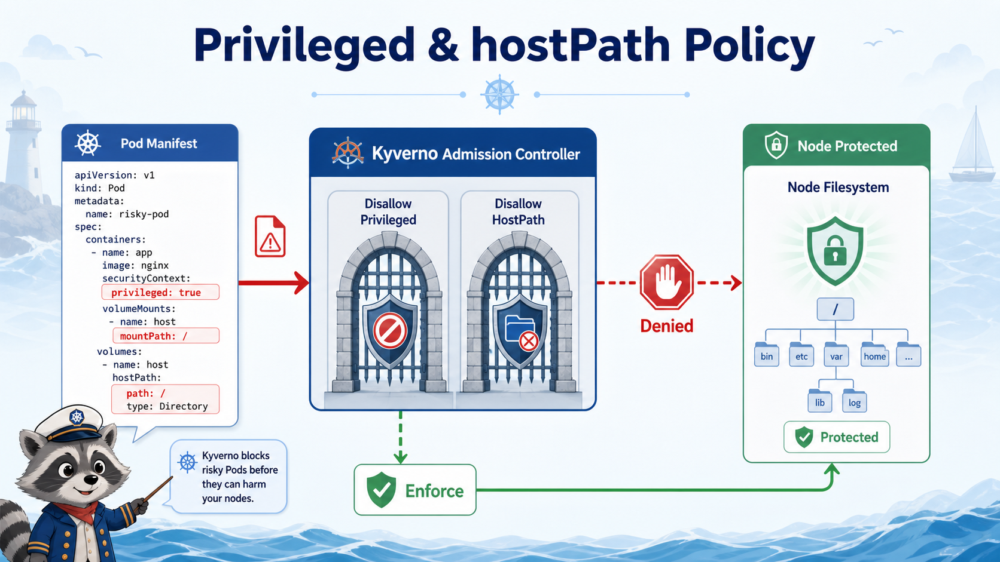

# 6교시: Kyverno Policy 2 - privileged와 hostPath 제한



## 수업 목표
- privileged container와 hostPath volume의 위험을 설명한다.
- Kyverno Enforce 정책으로 위험한 Pod 생성을 차단한다.
- policy deny 메시지를 읽고 수정 방향을 찾는다.

## privileged container
privileged container는 container isolation을 크게 약화한다.

| 위험 | 설명 |
|---|---|
| host 자원 접근 | node 수준 권한으로 이어질 수 있음 |
| kernel 기능 접근 | 일반 container보다 넓은 capability |
| 사고 범위 확대 | 앱 취약점이 node 영향으로 확대 |

모든 privileged가 나쁜 것은 아니지만, 일반 application Pod에는 없어야 한다.

## hostPath volume
hostPath는 node filesystem을 Pod에 mount한다.

```yaml
volumes:
  - name: host-root
    hostPath:
      path: /
```

이 설정은 학습용으로도 강하게 주의해야 한다. 실제 운영에서 hostPath는 로그 수집 agent, CNI, CSI, node agent 같은 특수 workload에 제한적으로 쓰인다.

## 정책 적용
```bash
kubectl apply -f week4/day4/labs/kyverno/disallow-privileged-hostpath-enforce.yaml
```

확인:
```bash
kubectl get clusterpolicy disallow-privileged-hostpath-enforce
```

정책은 두 가지를 본다.

| rule | 막는 것 |
|---|---|
| `disallow-privileged` | `securityContext.privileged: true` |
| `disallow-hostpath` | `spec.volumes[].hostPath` |

## 나쁜 Pod 적용
```bash
kubectl apply -f week4/day4/labs/kyverno/bad-pod-privileged-hostpath.yaml
```

예상:
```text
admission webhook ... denied the request
Privileged containers are not allowed in week4-security.
hostPath volumes are not allowed in week4-security.
```

실제 검증 예시:
```text
disallow-privileged-hostpath-enforce:
  disallow-hostpath: rule disallow-hostpath failed at path /spec/volumes/0/hostPath/
  disallow-privileged: rule disallow-privileged failed at path /spec/containers/0/securityContext/privileged/
```

Kyverno는 object가 etcd에 저장되기 전에 거절한다.

## policy anchor 실수 주의
hostPath를 막을 때 `volumes` 자체를 금지하도록 쓰면, volume이 없는 정상 Pod까지 막을 수 있다. 의도는 "volumes가 있으면 그 안에 hostPath가 없어야 한다"이다.

잘못된 방향:
```yaml
spec:
  X(volumes):
    - hostPath: "*"
```

수업용 정책:
```yaml
spec:
  =(volumes):
    - X(hostPath): "*"
```

`=(volumes)`는 volumes가 있을 때만 내부를 검사하고, `X(hostPath)`는 hostPath key가 있으면 실패하게 만든다.

## denial 메시지 읽기
오류 메시지에서 볼 것:
| 항목 | 의미 |
|---|---|
| webhook 이름 | admission 단계에서 거절 |
| policy 이름 | 어떤 정책이 막았는가 |
| rule 이름 | 어떤 rule이 위반됐는가 |
| message | 수정 방향 |
| resource | 어떤 object가 막혔는가 |

## RBAC과 다르게 보기
같은 Pod 생성 실패라도 원인이 다르다.

| 오류 | 원인 |
|---|---|
| `cannot create resource pods` | RBAC 권한 없음 |
| `admission webhook denied` | 권한은 있으나 manifest가 정책 위반 |
| `forbidden: violates PodSecurity` | Pod Security Admission 또는 유사 정책 |
| `unknown field` | YAML schema 오류 |

오늘은 Kyverno deny를 명확히 보려고 Enforce 정책을 사용한다.

## 수정 방향
bad manifest를 운영 가능하게 바꾸려면 다음을 제거한다.

```yaml
securityContext:
  privileged: true
```

그리고 hostPath volume도 제거한다.

```yaml
volumes:
  - hostPath: ...
```

일반 앱이 node 파일시스템을 직접 봐야 한다면 설계부터 다시 검토해야 한다.

## 예외는 어떻게 다룰까
현실에는 예외가 있다. 예를 들어 node exporter, CNI, CSI, log collector는 host와 가까운 권한이 필요할 수 있다.

예외 기준:
| 기준 | 설명 |
|---|---|
| namespace 제한 | `kube-system`, `monitoring` 등 |
| ServiceAccount 제한 | 특정 controller만 허용 |
| image 제한 | 승인된 registry/image만 허용 |
| change approval | PR/승인 기록 필요 |
| runbook | 왜 예외인지 문서화 |

수업에서는 예외를 만들지 않고 "일반 application namespace에서는 차단" 기준을 잡는다.

## policy를 너무 세게 걸면
보안 정책은 안전하지만 배포 속도를 늦출 수 있다.

| 문제 | 대응 |
|---|---|
| 기존 앱 대량 위반 | Audit 먼저 적용 |
| 메시지가 불친절 | 수정 가능한 message 작성 |
| 예외가 필요 | namespace/SA/image 조건으로 제한 |
| 개발팀 혼란 | 실패 예시와 해결 예시 제공 |

정책은 팀이 고칠 수 있는 형태여야 한다.

## Evidence Note
```markdown
# W4D4S6 Kyverno privileged/hostPath
- policy name:
- blocked manifest:
- deny message:
- privileged 위험:
- hostPath 위험:
- 운영 예외가 필요한 경우:
```

## 한 줄 요약
```text
privileged와 hostPath는 일반 application namespace에서 막아야 할 대표적인 node 영향 위험이다.
```
