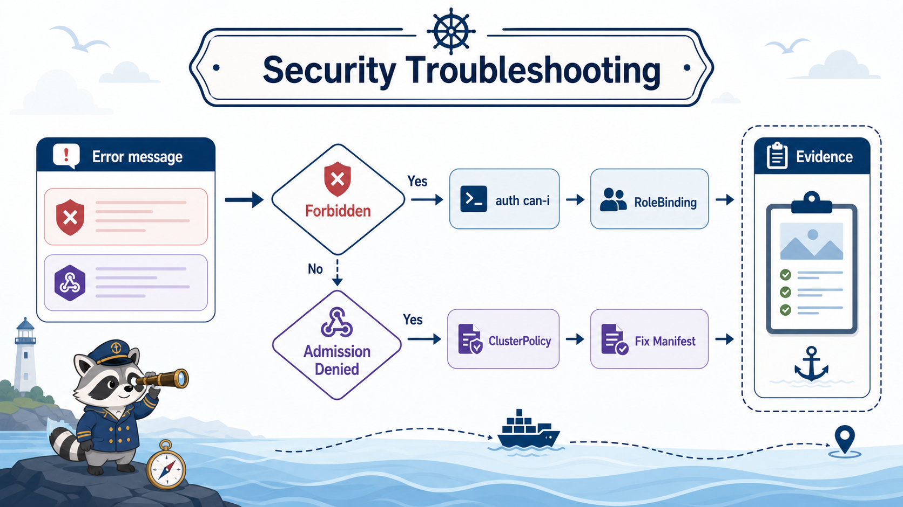

# 7교시: 권한과 정책 장애 분석



## 수업 목표
- RBAC forbidden과 Kyverno admission deny를 구분한다.
- 배포 실패 메시지에서 첫 확인 명령을 고른다.
- 보안 정책이 배포를 막았을 때 개발팀에 전달할 evidence를 정리한다.

## 장애를 두 갈래로 나누기
보안 관련 실패는 크게 두 가지다.

```text
권한 없음
  -> RBAC forbidden

권한은 있지만 object가 정책 위반
  -> admission deny
```

이 둘을 섞으면 해결이 늦어진다. 권한 문제는 Role/RoleBinding을 봐야 하고, 정책 문제는 policy와 manifest를 봐야 한다.

## 오류 메시지 예시
RBAC:
```text
Error from server (Forbidden): pods is forbidden:
User "system:serviceaccount:week4-security:readonly-viewer"
cannot delete resource "pods" in API group "" in the namespace "week4-security"
```

Kyverno:
```text
admission webhook "validate.kyverno.svc-fail" denied the request:
resource Pod/week4-security/bad-latest was blocked due to the following policies
disallow-latest-enforce
```

정상 Pod가 막히는 경우도 있다. policy 작성 실수로 `volumes` 전체를 금지하면 `good-pod`처럼 hostPath가 없는 Pod도 막힐 수 있다. 이때는 manifest가 아니라 policy pattern과 anchor 위치를 확인한다.

## 첫 확인 명령
| 증상 | 첫 명령 |
|---|---|
| Forbidden | `kubectl auth can-i ... --as=...` |
| admission denied | `kubectl get clusterpolicy` |
| policy report 위반 | `kubectl get policyreport -A` |
| webhook timeout | `kubectl -n kyverno get pod` |
| CRD 없음 | `kubectl get crd | grep kyverno` |
| 정상 manifest도 deny | policy pattern/anchor 위치 확인 |

## RBAC runbook
```markdown
## Symptom
- command:
- forbidden message:

## Subject
- user/group/serviceaccount:
- namespace:

## Permission
- verb:
- resource:
- apiGroup:
- scope:

## Evidence
- `kubectl auth can-i ...`
- Role:
- RoleBinding:

## Action
- 권한 추가 필요 여부:
- 최소 권한으로 가능한가:
```

## Kyverno runbook
```markdown
## Symptom
- command:
- admission deny message:

## Policy
- policy:
- rule:
- action: Audit/Enforce
- message:

## Manifest
- resource:
- namespace:
- violated field:

## Action
- manifest 수정:
- policy 예외 필요 여부:
- Audit 전환 필요 여부:
```

## 실습 장애 1: readonly가 삭제 시도
```bash
kubectl --as=system:serviceaccount:week4-security:readonly-viewer \
  -n week4-security delete pod -l app=security-api
```

분석:
| 항목 | 값 |
|---|---|
| 단계 | authorization |
| 오류 | Forbidden |
| 조치 | delete 권한이 필요한지 검토 |
| 주의 | 무조건 권한을 늘리지 않음 |

## 실습 장애 2: latest tag Pod 생성
```bash
kubectl apply -f week4/day4/labs/kyverno/bad-pod-latest.yaml
```

분석:
| 항목 | 값 |
|---|---|
| 단계 | admission |
| 오류 | Kyverno deny |
| 정책 | disallow-latest-enforce |
| 조치 | versioned tag로 수정 |

## 실습 장애 3: privileged/hostPath
```bash
kubectl apply -f week4/day4/labs/kyverno/bad-pod-privileged-hostpath.yaml
```

분석:
| 항목 | 값 |
|---|---|
| 단계 | admission |
| 오류 | Kyverno deny |
| 정책 | disallow-privileged-hostpath-enforce |
| 조치 | privileged와 hostPath 제거 |

## 운영에서 좋은 대응
| 나쁜 대응 | 좋은 대응 |
|---|---|
| "권한 풀어주세요" | 필요한 verb/resource/scope를 제시 |
| "정책 때문에 안 됨" | policy/rule/message와 수정 field 전달 |
| "일단 예외 주세요" | 왜 예외가 필요한지, 기간과 범위 기록 |
| cluster-admin 부여 | 최소 권한 Role 설계 |

## 개발팀 전달 예시
```markdown
배포가 RBAC이 아니라 Kyverno admission 정책에서 거절되었습니다.

- namespace: week4-security
- resource: Pod/bad-latest
- policy: disallow-latest-enforce
- rule: require-explicit-image-tag
- message: Do not use image tag latest
- 수정: nginx:latest 대신 nginx:1.27-alpine처럼 애플리케이션 버전과 맞는 tag 사용
```

## W4D3 observability와 연결
보안 정책 실패도 관찰 대상이다.

| W4D3 도구 | W4D4 연결 |
|---|---|
| Event | admission deny event 확인 |
| Prometheus | policy violation metric preview |
| Grafana | Kyverno dashboard 가능 |
| Alert | 반복 violation alert 가능 |
| Runbook | 권한/정책 장애 분리 |

오늘은 dashboard까지 깊게 가지 않지만, W4D3에서 만든 observability 사고방식을 그대로 적용한다.

## Evidence Note
```markdown
# W4D4S7 Security troubleshooting
- RBAC forbidden example:
- Kyverno deny example:
- 첫 확인 명령:
- 개발팀 전달 문장:
- 최소 권한 판단:
```

## 한 줄 요약
```text
Forbidden은 권한 문제이고, admission denied는 object 내용이 정책을 위반했다는 신호다.
```
