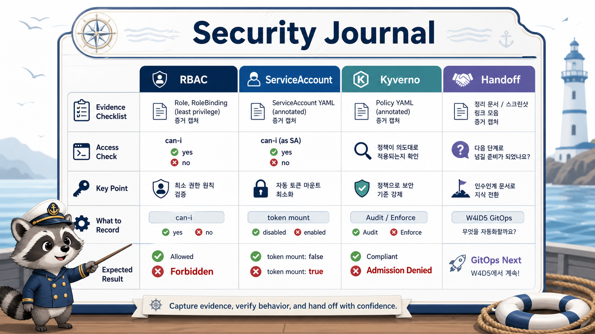

# 8교시: 구름 EXP 배움일기



## 수업 목표
- RBAC과 Kyverno 실습 결과를 evidence로 정리한다.
- forbidden과 admission deny를 구분해 기록한다.
- W4D5 GitOps/Argo CD로 이어질 보안 질문을 남긴다.

## 오늘 배운 내용 요약
| 주제 | 핵심 |
|---|---|
| RBAC | subject, verb, resource, scope |
| ServiceAccount | Pod의 Kubernetes identity |
| token mount | API 접근 필요 여부에 따라 줄일 수 있는 공격면 |
| Kyverno | admission 단계에서 manifest 정책 검증 |
| Audit | 위반을 기록하지만 허용 |
| Enforce | 위반 object 생성 차단 |
| Troubleshooting | Forbidden과 admission deny 구분 |

## 배움일기 표
| 항목 | 기록 |
|---|---|
| 실습 cluster/context |  |
| namespace | `week4-security` |
| 읽기 전용 ServiceAccount |  |
| `can-i list pods` 결과 |  |
| `can-i delete pods` 결과 |  |
| forbidden 메시지 핵심 |  |
| token mount 확인 결과 |  |
| Kyverno Helm release |  |
| Audit policy 결과 |  |
| Enforce policy 결과 |  |
| admission deny 메시지 핵심 |  |
| 개발팀에 전달할 수정 방향 |  |

## 오늘의 evidence 명령
```bash
kubectl -n week4-security get sa,role,rolebinding
kubectl auth can-i list pods --as=system:serviceaccount:week4-security:readonly-viewer -n week4-security
kubectl auth can-i delete pods --as=system:serviceaccount:week4-security:readonly-viewer -n week4-security
kubectl -n kyverno get pods
kubectl get clusterpolicy
kubectl get policyreport -A 2>/dev/null || true
```

## 작성 예시
| 항목 | 기록 예시 |
|---|---|
| can-i list pods | `yes` |
| can-i delete pods | `no` |
| forbidden | readonly-viewer cannot delete pods |
| token mount | token-demo에는 token 있음, security-api에는 없음 |
| Audit policy | owner label 없는 Pod 생성은 허용, report 확인 |
| Enforce policy | `nginx:latest` Pod admission denied |
| privileged/hostPath | policy deny로 생성 차단 |

## 좋은 기록과 아쉬운 기록
| 아쉬운 기록 | 좋은 기록 |
|---|---|
| 권한 안 됨 | `readonly-viewer`가 `delete pods` 권한 없음 |
| 정책 때문에 안 됨 | `disallow-latest-enforce`가 `nginx:latest` 차단 |
| Kyverno 설치함 | Helm release, Pod, CRD, webhook 확인 |
| Pod 안 됨 | RBAC인지 admission인지 오류 메시지로 분리 |
| 보안 좋음 | 어떤 위험을 어떤 정책으로 줄였는지 기록 |

## 오늘의 final note
```markdown
W4D4에서는 RBAC과 Kyverno를 분리해서 봤다. RBAC은 누가 어떤 API 동작을 할 수 있는지 판단하고, Kyverno는 권한이 있더라도 배포하려는 object가 정책 기준을 만족하는지 admission 단계에서 검사한다. readonly ServiceAccount는 list는 가능하지만 delete는 forbidden이었고, Kyverno Enforce 정책은 latest tag와 privileged/hostPath manifest를 admission deny로 차단했다.
```

## W4D5로 이어지는 질문
W4D5에서는 Argo CD와 mesh preview로 간다. 오늘 질문은 GitOps와 바로 연결된다.

| 질문 | W4D5 연결 |
|---|---|
| Git에 policy 위반 manifest가 올라가면 어떻게 되는가 | Argo CD sync 실패 |
| Argo CD가 쓸 ServiceAccount 권한은 어디까지인가 | RBAC |
| GitOps controller가 cluster-admin이면 위험하지 않은가 | 최소 권한 |
| policy 때문에 sync가 막히면 누가 고치는가 | Git PR과 runbook |
| mesh sidecar injection도 policy로 관리할 수 있는가 | admission + mesh |

## 수업 회고 포인트
| 관찰한 장면 | 회고 질문 |
|---|---|
| `can-i delete pods`가 `no` | 이 권한을 정말 줘야 하는가 |
| forbidden 메시지 | subject/verb/resource/scope를 읽었는가 |
| token directory 없음 | 이 실패를 성공 evidence로 이해했는가 |
| Audit policy | 막기 전에 위반 범위를 볼 수 있는가 |
| Enforce policy | 개발자가 수정할 수 있는 메시지인가 |
| 정상 Pod가 policy에 막힘 | manifest 문제가 아니라 policy 작성 실수일 수 있음을 봤는가 |

정책은 강하게 만들수록 운영을 보호하지만, 잘못 만들면 정상 배포도 막는다. 그래서 policy 자체도 코드처럼 리뷰하고 검증해야 한다.

## 개인 정리 질문
| 질문 | 내 답 |
|---|---|
| RBAC이 답하는 질문은 무엇인가 |  |
| Kyverno가 답하는 질문은 무엇인가 |  |
| Role과 ClusterRole의 차이는 무엇인가 |  |
| RoleBinding이 없으면 어떤 일이 생기는가 |  |
| `automountServiceAccountToken: false`는 왜 쓰는가 |  |
| Audit와 Enforce의 차이는 무엇인가 |  |
| `latest` tag를 막는 이유는 무엇인가 |  |
| privileged/hostPath가 위험한 이유는 무엇인가 |  |
| Forbidden과 admission deny를 어떻게 구분하는가 |  |

## 수업 후 남길 메모
```markdown
# W4D4 security memo

## RBAC
- subject:
- allowed:
- denied:
- forbidden message:

## ServiceAccount
- app workload SA:
- token mount:

## Kyverno
- installed release:
- Audit policy:
- Enforce policy:
- denied manifest:

## Handoff
- 개발팀에 요구할 label/tag/securityContext 기준:
- GitOps에서 막힐 수 있는 지점:
```

## cleanup 결정
| 선택 | 기준 |
|---|---|
| Kyverno 유지 | W4D5 Argo CD sync 실패와 policy 연결을 보고 싶음 |
| Kyverno 삭제 | local resource를 아껴야 함 |
| week4-security 삭제 | 실습 Pod와 policy 영향 정리 |

수업 직후 바로 W4D5로 이어간다면 Kyverno를 유지하는 편이 좋다. Argo CD가 sync하려는 manifest가 policy에 막히는 장면을 보여줄 수 있기 때문이다. 반대로 학생 개인 노트북에서 리소스가 부족하면 Kyverno와 실습 namespace를 삭제한다.

삭제:
```bash
kubectl delete namespace week4-security
helm uninstall kyverno -n kyverno
kubectl delete namespace kyverno
```

## Evidence Note
```markdown
# W4D4S8 Journal
- 오늘 가장 중요한 오류 메시지:
- RBAC과 Kyverno 차이:
- 내가 만든 최소 권한 기준:
- 내가 막은 위험 manifest:
- W4D5 GitOps에서 확인하고 싶은 질문:
```

## 한 줄 요약
```text
W4D4의 산출물은 보안 이론 암기가 아니라 권한 실패와 정책 실패를 구분하는 운영 evidence다.
```
