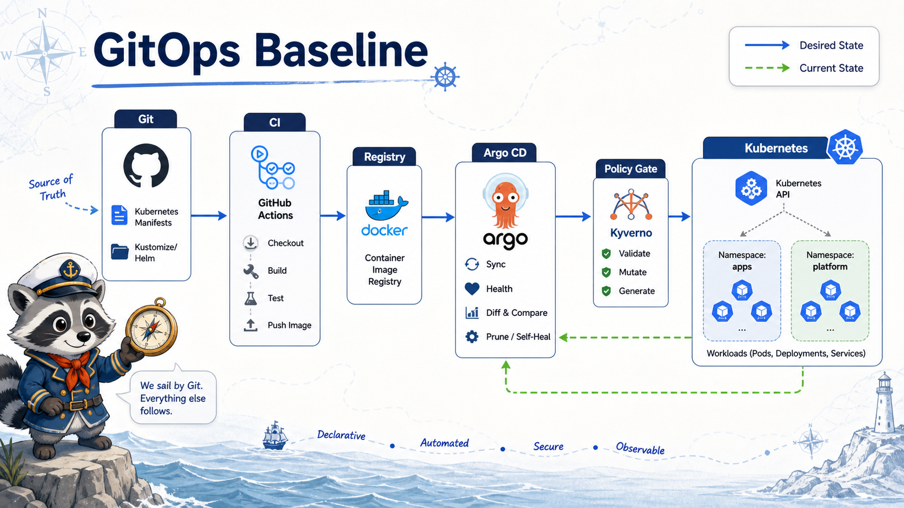

# 1교시: Day4 요약 + GitOps 개념



## 수업 목표
- W4D4 RBAC/Kyverno와 W4D5 GitOps의 연결을 설명한다.
- GitHub Actions와 Argo CD의 역할 차이를 구분한다.
- Git repository를 Kubernetes desired state의 기준으로 보는 관점을 이해한다.

## Day4에서 이어지는 질문
W4D4에서는 누가 무엇을 할 수 있고, 어떤 manifest가 배포 가능한지 봤다.

| W4D4 질문 | W4D5 질문 |
|---|---|
| 누가 Pod를 삭제할 수 있는가 | Argo CD는 어떤 권한으로 배포하는가 |
| Kyverno가 manifest를 막는가 | Argo CD sync도 policy에 막히는가 |
| forbidden과 admission deny를 구분하는가 | sync failure 원인을 어디서 보는가 |
| token mount가 필요한가 | GitOps controller는 어떤 identity를 쓰는가 |

보안 정책은 GitOps와 충돌하는 것이 아니라 GitOps 배포 품질을 높이는 gate가 된다.

## CI와 CD
W3D3에서 GitHub Actions는 CI gate로 다뤘다.

```text
source code
  -> test
  -> SAST/DAST
  -> Docker build
  -> Docker Hub push
```

W4D5의 Argo CD는 Git에 있는 Kubernetes manifest를 cluster에 반영한다.

```text
Git manifest
  -> Argo CD
  -> Kubernetes API
  -> cluster state
```

| 구분 | GitHub Actions | Argo CD |
|---|---|---|
| 주 역할 | build/test/push | deploy/sync |
| 기준 | workflow run | Git desired state |
| 산출물 | image, log, artifact | Application sync status |
| 실패 위치 | test/build/push step | sync/diff/health |
| secret | registry token | repo credential, cluster access |

## GitOps란
GitOps는 Git을 운영 상태의 기준으로 삼는다. 운영자가 cluster에서 직접 수정한 값은 Git과 다르면 drift가 된다.

```text
Git: replicas 1
Cluster: replicas 2
Argo CD: OutOfSync
```

중요한 것은 "누가 cluster를 직접 바꿨는가"보다 "Git 기준과 cluster 기준이 왜 달라졌는가"를 설명하는 것이다.

## desired state와 current state
Kubernetes 자체도 desired/current state를 비교한다. Argo CD는 그 위에서 Git desired state와 cluster state를 비교한다.

| 계층 | 비교 |
|---|---|
| Kubernetes controller | object spec vs 실제 Pod 상태 |
| Argo CD | Git manifest vs cluster object |
| 운영자 | 기대 사용자 상태 vs 실제 사용자 경험 |

이 계층을 섞으면 문제 분석이 느려진다.

## Namespace를 넘어 동작하는 add-on 이해
Helm으로 설치한 add-on은 보통 자기 namespace에 설치된다.

| add-on | 설치 namespace 예시 | 다른 영역을 보는 이유 |
|---|---|---|
| metrics-server | `kube-system` | node/kubelet metric과 metrics API 제공 |
| kube-prometheus-stack | `monitoring` | ServiceMonitor/RBAC으로 여러 namespace metric 수집 |
| Kyverno | `kyverno` | admission webhook으로 API server 요청 검사 |
| Argo CD | `argocd` | Application controller가 RBAC으로 target namespace에 sync |
| Istio | `istio-system` | istiod가 sidecar 설정을 배포하고 mesh 상태 관리 |

중요한 원리는 두 가지다.

| 원리 | 설명 |
|---|---|
| Service 통신 | namespace가 달라도 Service DNS로 통신할 수 있다 |
| API 권한 | 다른 namespace 리소스를 보려면 ServiceAccount와 RBAC 권한이 필요하다 |

예를 들어 `argocd` namespace의 Argo CD controller가 `week4-gitops` namespace에 Deployment를 만든다. 이건 namespace 벽을 몰래 넘는 것이 아니라, controller가 Kubernetes API server에 요청하고 RBAC이 허용했기 때문에 가능한 것이다.

```text
argocd-application-controller Pod
  -> ServiceAccount token
  -> https://kubernetes.default.svc
  -> API server RBAC check
  -> week4-gitops namespace resources
```

반대로 app Pod끼리 HTTP로 통신할 때는 Kubernetes API 권한이 아니라 Service/DNS/network 경로를 본다.

```text
frontend.week4-a
  -> http://backend.week4-b.svc.cluster.local
```

따라서 "다른 namespace와 통신된다"는 말은 상황별로 나눠야 한다.

| 질문 | 확인할 것 |
|---|---|
| HTTP 호출이 되는가 | Service DNS, port, endpoint, NetworkPolicy |
| 리소스 조회/생성이 되는가 | ServiceAccount, Role/ClusterRole, Binding |
| metric이 보이는가 | scraper 권한, ServiceMonitor, metrics API |
| admission이 막는가 | webhook, policy, namespace selector |

## GitOps가 필요한 이유
| 문제 | GitOps 효과 |
|---|---|
| 누가 kubectl apply 했는지 모름 | Git commit/PR로 변경 추적 |
| cluster 직접 수정 반복 | Git 기준 sync로 drift 확인 |
| 배포 절차가 사람마다 다름 | Application sync로 표준화 |
| rollback 기준 흐림 | Git revert 또는 이전 revision sync |
| 보안 정책 실패 추적 어려움 | sync failure evidence로 남음 |

GitOps는 마법 자동 배포가 아니라, 변경의 기준을 Git으로 고정하는 운영 방식이다.

## GitOps와 Kyverno
W4D4의 policy는 W4D5에서 더 의미가 커진다.

```text
Git manifest
  -> Argo CD sync
  -> Kubernetes API
  -> Kyverno admission
  -> allow/deny
```

Kyverno가 deny하면 Argo CD는 sync 실패를 보여준다. 이때 Argo CD 문제가 아니라 policy violation일 수 있다.

## 오늘의 성공 기준
| 범위 | 성공 기준 |
|---|---|
| Argo CD | Helm 설치, UI 접속, Application 확인 |
| GitOps app | Git path 기반 sync 또는 template 이해 |
| Drift | cluster 직접 변경 후 OutOfSync 설명 |
| Istio | Helm 설치, sidecar injection 확인 |
| Kiali | graph UI 접속, traffic edge 확인 |
| Runbook | sync failure와 mesh traffic 문제 구분 |

## 오해하기 쉬운 지점
| 오해 | 정리 |
|---|---|
| GitHub Actions가 있으면 Argo CD가 필요 없다 | CI와 CD 책임이 다름 |
| Argo CD가 image를 build한다 | 보통 image build는 CI에서 수행 |
| sync 성공이면 서비스 정상이다 | health와 user traffic 확인 필요 |
| mesh를 쓰면 앱 문제가 사라진다 | traffic 관찰/제어 계층일 뿐 |

## Evidence Note
```markdown
# W4D5S1 GitOps baseline
- CI 책임:
- CD/GitOps 책임:
- Git desired state 예시:
- drift 예시:
- W4D4 policy와 연결:
- namespace 간 통신/API 접근 차이:
```

## 한 줄 요약
```text
GitOps는 Kubernetes 배포의 기준을 사람의 터미널이 아니라 Git repository로 옮기는 운영 방식이다.
```
