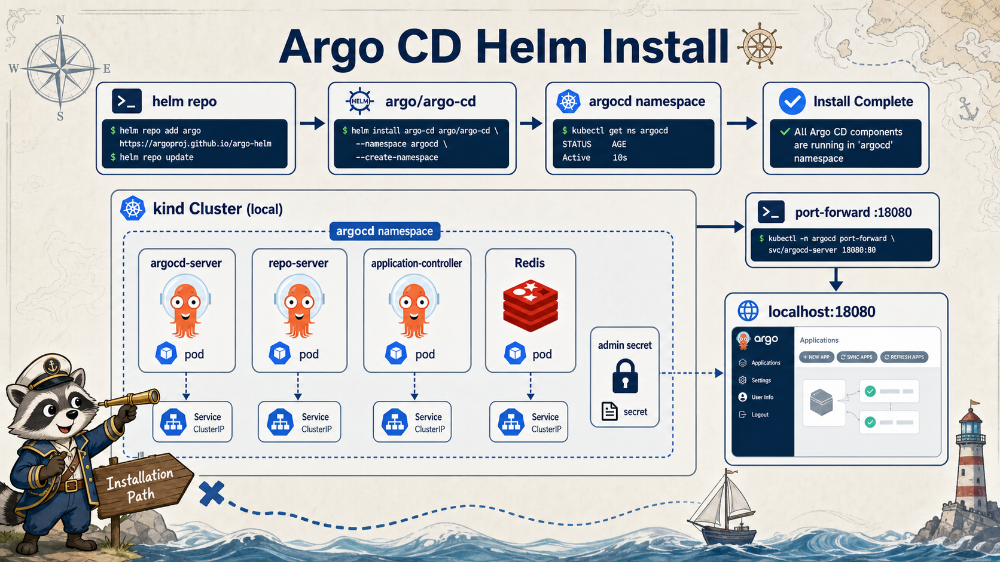

# 2교시: Argo CD Helm 설치



## 수업 목표
- Argo CD를 Helm으로 설치한다.
- server, repo-server, application-controller의 역할을 구분한다.
- admin password와 port-forward로 UI에 접속한다.

## Argo CD 구성요소
| 구성요소 | 역할 |
|---|---|
| argocd-server | UI/API endpoint |
| application-controller | Application sync와 health 판단 |
| repo-server | Git/Helm/Kustomize manifest 렌더링 |
| redis | cache/session 보조 |
| dex | SSO/OIDC 연동, 수업에서는 비활성 |

수업에서는 GitOps 개념 확인이 목표라 dex와 notification은 줄인다.

## Argo CD가 다른 namespace에 배포하는 원리
Argo CD는 `argocd` namespace에 설치되지만 Application destination은 `week4-gitops`, `dev`, `stage`, `prod`처럼 다른 namespace가 될 수 있다.

```text
argocd namespace
  argocd-application-controller
    -> Kubernetes API server
    -> week4-gitops namespace
```

이때 통신은 두 층으로 나눠서 봐야 한다.

| 층 | 의미 | 확인 |
|---|---|---|
| API server 통신 | controller가 `https://kubernetes.default.svc`로 API 호출 | Pod env, Service DNS |
| 권한 | controller ServiceAccount가 target namespace에 create/update 가능 | RBAC, `kubectl auth can-i` |

Argo CD가 모든 namespace를 볼 수 있는 것처럼 보이는 이유는 chart가 ServiceAccount, Role/ClusterRole, Binding을 함께 설치하기 때문이다. 운영에서는 이 권한을 Project와 RBAC 정책으로 제한해야 한다.

확인 명령:
```bash
kubectl -n argocd get sa
kubectl get clusterrole,clusterrolebinding | grep argocd
kubectl auth can-i create deployments \
  --as=system:serviceaccount:argocd:argocd-application-controller \
  -n week4-gitops
```

결과가 `yes`면 Argo CD controller가 해당 namespace에 Deployment를 만들 권한이 있다는 뜻이다. `no`면 Application sync는 실패한다.

## values 확인
```bash
cat week4/day5/labs/argocd/values.yaml
```

핵심:
```yaml
server:
  service:
    type: ClusterIP
dex:
  enabled: false
applicationSet:
  enabled: false
```

local kind에서는 LoadBalancer 대신 port-forward로 접속한다.

## Helm 설치
```bash
helm repo add argo https://argoproj.github.io/argo-helm
helm repo update

helm upgrade --install argocd argo/argo-cd \
  --namespace argocd \
  --create-namespace \
  -f week4/day5/labs/argocd/values.yaml
```

확인:
```bash
helm list -n argocd
kubectl -n argocd get pods,svc
kubectl -n argocd wait --for=condition=Ready pod --all --timeout=240s
```

권한 확인:
```bash
kubectl -n argocd get sa
kubectl get clusterrolebinding | grep argocd
```

## admin password
초기 admin password는 secret에 들어 있다.

```bash
kubectl -n argocd get secret argocd-initial-admin-secret \
  -o jsonpath='{.data.password}' | base64 -d; echo
```

주의:
| 항목 | 설명 |
|---|---|
| 수업용 | 초기 password를 확인해 UI 접속 |
| 운영 | SSO/OIDC, password rotation, RBAC 필요 |
| 공유 금지 | 화면 공유 시 password 노출 주의 |

## UI 접속
```bash
kubectl -n argocd port-forward svc/argocd-server 18080:80
```

브라우저:
```text
http://localhost:18080
user: admin
password: secret에서 확인한 값
```

## Pod가 안 뜰 때
```bash
kubectl -n argocd get pods
kubectl -n argocd describe pod <pod-name>
kubectl -n argocd logs <pod-name> --tail=80
```

자주 보는 원인:
| 증상 | 원인 후보 |
|---|---|
| Pending | local resource 부족 |
| ImagePullBackOff | registry/network |
| CrashLoopBackOff | values/secret/config |
| UI 접속 실패 | port-forward 대상/port 오류 |

## Helm 설치 evidence
```markdown
# W4D5S2 Argo CD install
- Helm release:
- server Pod:
- application-controller Pod:
- repo-server Pod:
- controller ServiceAccount:
- target namespace 권한 확인:
- admin password 확인 여부:
- UI URL:
```

## 한 줄 요약
```text
Argo CD 설치 검증은 UI가 뜨는 것에서 끝나지 않고 controller, repo-server, Application sync 준비 상태까지 확인해야 한다.
```
