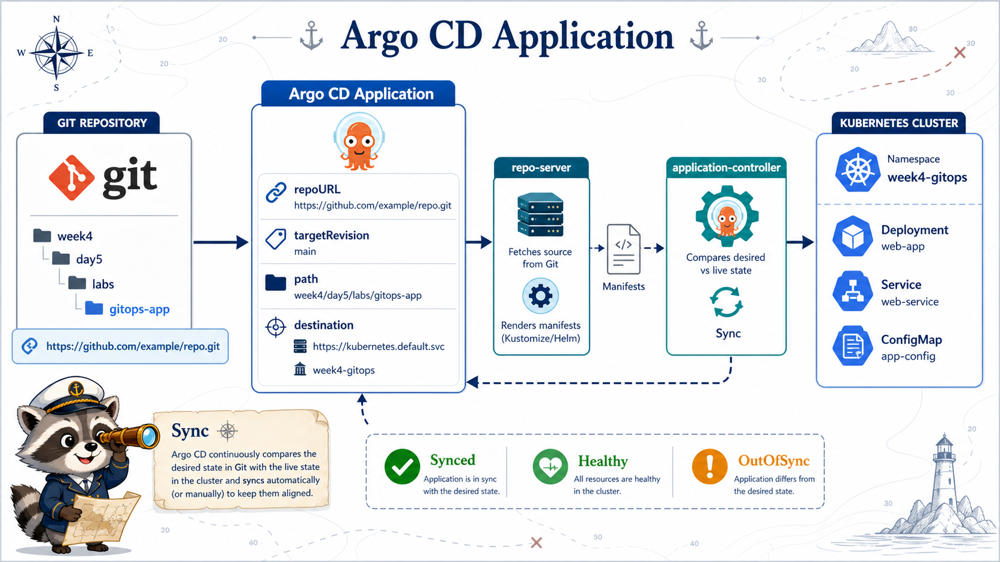

# 3교시: Argo CD Application 생성



## 수업 목표
- Argo CD Application manifest 구조를 읽는다.
- repoURL, targetRevision, path, destination을 설명한다.
- sample app을 Git path 기준으로 sync하는 흐름을 이해한다.

## Application이란
Argo CD Application은 "어느 Git repo의 어느 path를 어느 cluster/namespace에 반영할 것인가"를 정의한다.

```text
repoURL + targetRevision + path
  -> destination cluster + namespace
  -> sync
```

## template 확인
```bash
cat week4/day5/labs/argocd/application-template.yaml
```

핵심:
```yaml
source:
  repoURL: https://github.com/REPLACE_WITH_YOUR_GITHUB_ID/REPLACE_WITH_YOUR_REPO.git
  targetRevision: main
  path: week4/day5/labs/gitops-app
destination:
  server: https://kubernetes.default.svc
  namespace: week4-gitops
```

학생 개인 repo에 맞게 `repoURL`만 바꿔야 한다.

## `kubernetes.default.svc`의 의미
Application destination의 server 값은 보통 다음과 같다.

```yaml
server: https://kubernetes.default.svc
```

이 주소는 cluster 내부에서 Kubernetes API server를 가리키는 기본 Service DNS다. Argo CD controller Pod는 이 주소로 API server에 요청한다.

```text
argocd-application-controller
  -> kubernetes.default.svc
  -> API server
  -> RBAC check
  -> week4-gitops namespace
```

여기서 `namespace: week4-gitops`는 HTTP 통신 대상 namespace가 아니라, Argo CD가 Kubernetes object를 만들 destination namespace다. 즉 Application sync는 "Service끼리 통신"이 아니라 "controller가 API server를 통해 object를 생성/수정"하는 흐름이다.

| 값 | 의미 |
|---|---|
| `server` | 어느 Kubernetes cluster API에 반영할 것인가 |
| `namespace` | 그 cluster의 어느 namespace에 리소스를 만들 것인가 |
| `repoURL/path` | 어떤 manifest를 desired state로 볼 것인가 |
| Argo CD ServiceAccount | 이 동작을 수행할 권한의 주체 |

## sync할 app manifest
```bash
find week4/day5/labs/gitops-app -type f | sort
```

구성:
| 파일 | 역할 |
|---|---|
| `namespace.yaml` | 배포 namespace |
| `configmap.yaml` | nginx content |
| `deployment.yaml` | web workload |
| `service.yaml` | ClusterIP Service |

## Application 적용
```bash
cp week4/day5/labs/argocd/application-template.yaml /tmp/w4d5-application.yaml
```

`repoURL` 수정 후:
```bash
kubectl apply -f /tmp/w4d5-application.yaml
kubectl -n argocd get application
```

UI에서 `w4d5-gitops-app`을 열고 Sync를 실행한다.

## Sync 확인
```bash
kubectl -n week4-gitops get deploy,svc,pod,cm
```

port-forward:
```bash
kubectl -n week4-gitops port-forward svc/gitops-web 18085:80
```

브라우저:
```text
http://localhost:18085
```

## sync 상태 읽기
| 상태 | 의미 |
|---|---|
| Synced | Git과 cluster object가 일치 |
| OutOfSync | Git과 cluster object가 다름 |
| Healthy | runtime 상태가 정상 |
| Progressing | rollout/health 진행 중 |
| Degraded | workload 상태 이상 |
| Missing | Git에는 있는데 cluster에 없음 |

Synced와 Healthy는 다르다. Git과 일치해도 Pod가 죽으면 Healthy가 아니다.

## Application 실패 원인
| 증상 | 원인 후보 |
|---|---|
| repo fetch 실패 | repoURL 오타, private repo credential 없음 |
| path 없음 | `path` 오타 |
| sync denied | RBAC 또는 Kyverno admission deny |
| namespace 없음 | CreateNamespace 옵션 누락 |
| unhealthy | Deployment/Pod runtime 문제 |

## Evidence Note
```markdown
# W4D5S3 Argo CD Application
- repoURL:
- path:
- targetRevision:
- destination namespace:
- sync status:
- health status:
- browser result:
```

## 한 줄 요약
```text
Argo CD Application은 Git path와 Kubernetes destination을 연결하는 GitOps 배포 단위다.
```
