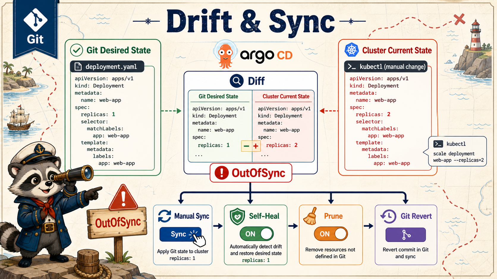

# 4교시: Drift와 Sync



## 수업 목표
- drift와 OutOfSync의 의미를 설명한다.
- cluster 직접 변경과 Git 변경의 차이를 확인한다.
- prune, self-heal, rollback 기준을 운영 관점으로 정리한다.

## Drift란
drift는 Git에 선언된 상태와 cluster 실제 object가 달라진 상태다.

```text
Git: replicas 1
Cluster: replicas 2
Argo CD: OutOfSync
```

drift는 무조건 나쁜 것은 아니다. 장애 대응 중 임시 scale out처럼 의도된 drift도 있다. 하지만 임시 조치가 끝나면 Git에 반영하거나 Git 기준으로 되돌려야 한다.

## drift 만들기
```bash
kubectl -n week4-gitops scale deploy/gitops-web --replicas=2
kubectl -n week4-gitops get deploy gitops-web
```

Argo CD UI에서 확인:
| 위치 | 볼 것 |
|---|---|
| Application tile | OutOfSync |
| Diff | replicas 차이 |
| Events/History | 누가 sync했는지 |
| Resource tree | Deployment/ReplicaSet/Pod 상태 |

## Sync
Sync는 Git manifest를 cluster에 적용하는 동작이다.

| 방식 | 의미 |
|---|---|
| Manual Sync | 사람이 버튼/CLI로 sync |
| Auto Sync | Git 변경을 자동 반영 |
| Self-heal | cluster drift를 자동 복구 |
| Prune | Git에서 삭제된 리소스를 cluster에서도 삭제 |

수업에서는 manual sync로 시작한다. 자동화는 편하지만 정책과 승인 기준이 먼저 필요하다.

## Prune 주의
Prune은 Git에서 사라진 리소스를 cluster에서도 삭제한다.

| 장점 | 위험 |
|---|---|
| 유령 리소스 제거 | 실수로 Git path에서 빠진 리소스 삭제 |
| drift 감소 | stateful 리소스 삭제 위험 |
| 운영 정리 | 승인 없는 삭제 사고 가능 |

처음에는 prune을 바로 켜기보다 어떤 리소스가 삭제될지 확인한다.

## Self-heal 주의
Self-heal은 cluster에서 직접 바꾼 값을 Git 기준으로 되돌린다.

좋은 경우:
```text
누군가 수동으로 replicas 변경
  -> Argo CD가 Git 기준으로 복구
```

주의할 경우:
```text
장애 대응 중 임시 scale out
  -> self-heal이 바로 되돌림
```

운영팀은 self-heal을 켜기 전에 incident 임시 조치 기준을 정해야 한다.

## Rollback 기준
GitOps rollback은 보통 Git revision 기준으로 한다.

| 방법 | 기준 |
|---|---|
| Git revert | 잘못된 manifest commit 되돌림 |
| Argo CD history rollback | 이전 synced revision으로 이동 |
| image tag rollback | manifest의 image tag를 이전 버전으로 변경 |
| Kubernetes rollout undo | GitOps와 충돌할 수 있어 주의 |

GitOps 환경에서 `kubectl rollout undo`만 하면 Git과 cluster가 다시 달라진다. 장기 복구는 Git에 반영해야 한다.

## Kyverno와 sync failure
W4D4 Kyverno가 남아 있으면 policy 위반 manifest는 Argo CD sync에서 실패한다.

```text
Application OutOfSync
  -> sync failed
  -> admission webhook denied
  -> policy/rule/message 확인
```

이때 Argo CD를 의심하기보다 policy와 manifest를 같이 본다.

## Evidence Note
```markdown
# W4D5S4 Drift and sync
- drift를 만든 명령:
- Argo CD status:
- diff field:
- sync 결과:
- prune/self-heal 판단:
- rollback 기준:
```

## 한 줄 요약
```text
GitOps에서 drift는 Git과 cluster가 다르다는 신호이며, sync는 어느 쪽을 기준으로 복구할지 결정하는 운영 행위다.
```
