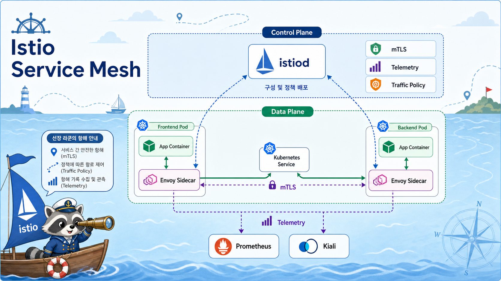

# 5교시: Istio 개념 Preview



## 수업 목표
- Kubernetes Service 통신만으로 부족한 지점을 설명한다.
- Istio의 data plane과 control plane을 구분한다.
- sidecar proxy가 traffic 관찰과 제어를 어디서 수행하는지 이해한다.

## Kubernetes Service만 있을 때
Kubernetes Service는 Pod 집합에 안정적인 이름과 가상 IP를 제공한다.

```text
frontend Pod
  -> http://backend.default.svc.cluster.local
  -> backend Pod
```

하지만 실제 운영에서는 "연결된다"만으로 부족하다.

| 운영 질문 | Service만으로 보기 어려운 것 |
|---|---|
| 어떤 서비스가 느린가 | 요청 latency 분포 |
| 어느 경로에서 실패하는가 | service-to-service error rate |
| 일부 요청만 새 버전으로 보낼 수 있는가 | traffic split |
| 장애를 일부러 재현할 수 있는가 | delay/fault injection |
| 서비스 간 암호화가 되는가 | mTLS 상태 |

Istio는 이런 문제를 application code 바깥의 proxy 계층에서 다루는 서비스 메시다.

## 서비스 메시란
서비스 메시(service mesh)는 서비스 간 통신을 관찰하고 제어하는 인프라 계층이다.

```text
app container
  -> local proxy
  -> network
  -> local proxy
  -> app container
```

앱은 HTTP 요청을 보낸다고 생각하지만, 실제 통신 경로에는 proxy가 들어간다. 이 proxy가 metric, log, routing, retry, timeout, mTLS 같은 기능을 처리한다.

## Istio의 두 평면
| 구분 | 구성요소 | 역할 |
|---|---|---|
| Data plane | Envoy sidecar | 실제 요청을 받고 보내는 proxy |
| Control plane | istiod | Envoy 설정 배포, service discovery, certificate 관리 |

수업에서는 이 두 가지를 꼭 분리해서 말한다.

```text
istiod는 요청을 직접 처리하지 않는다.
요청은 각 Pod 옆의 Envoy proxy를 지난다.
```

## Sidecar injection
Istio를 namespace에 활성화하면 Pod 생성 시 Envoy container가 함께 붙는다.

```bash
kubectl label namespace mesh-demo istio-injection=enabled
kubectl -n mesh-demo get pod
```

정상 예:

```text
NAME                             READY
mesh-api-xxxxx                   2/2
mesh-frontend-xxxxx              2/2
```

`1/1`이면 앱 container만 있는 것이고, `2/2`이면 앱 container와 Envoy sidecar가 함께 있는 상태다.

## Mesh가 주는 것
| 기능 | 수업에서 보는 방식 |
|---|---|
| Traffic graph | Kiali graph |
| Request metric | Prometheus metric |
| Access log | `istio-proxy` container logs |
| Fault injection | VirtualService delay |
| Policy preview | mTLS/RBAC 개념 소개 |

오늘은 깊게 운영하지 않고 "왜 메시가 필요한지"와 "눈으로 트래픽이 보이는 경험"에 집중한다.

## Mesh가 항상 좋은 것은 아니다
| 비용 | 설명 |
|---|---|
| Resource overhead | Pod마다 proxy가 추가되어 CPU/Memory 사용 증가 |
| Debug 복잡도 | 앱 문제인지 proxy/routing 문제인지 분리 필요 |
| Learning curve | Gateway, VirtualService, DestinationRule 등 학습 필요 |
| Upgrade 부담 | Istio control plane과 sidecar 버전 관리 필요 |

서비스가 단순하고 팀이 작다면 mesh가 과할 수 있다. 반대로 서비스 수가 늘고 장애 분석과 traffic 제어가 중요해지면 mesh의 가치가 커진다.

## Compose와 비교
W2D5의 Docker Compose에서는 service name으로 통신했다.

```text
frontend -> backend -> db
```

Kubernetes에서도 Service 이름으로 통신한다.

```text
frontend -> backend.default.svc.cluster.local
```

Istio를 붙이면 통신 경로를 proxy가 관찰한다.

```text
frontend app -> frontend envoy -> backend envoy -> backend app
```

Compose의 네트워크 이해가 Kubernetes Service 이해로 이어지고, Kubernetes Service 이해가 service mesh 이해로 이어진다.

## Evidence Note
```markdown
# W4D5S5 Istio concept
- Service만으로 부족한 운영 질문:
- Data plane:
- Control plane:
- sidecar injection 확인 기준:
- mesh 도입 비용:
```

## 한 줄 요약
```text
Istio는 서비스 간 요청 경로에 proxy를 넣어 traffic을 관찰하고 제어하는 서비스 메시다.
```
