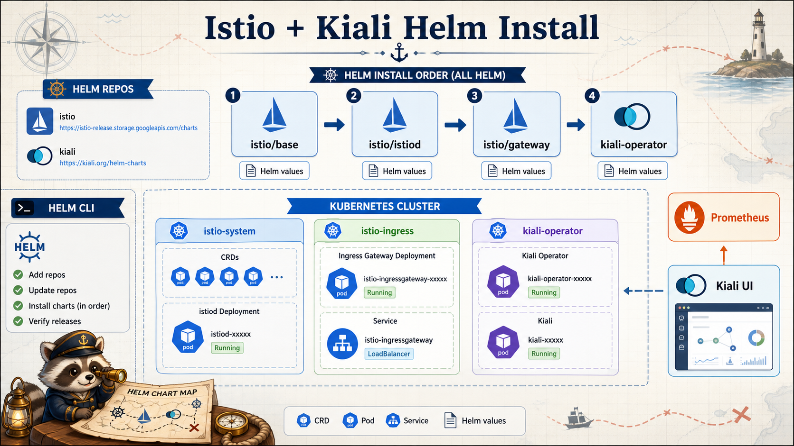

# 6교시: Istio/Kiali Helm 설치



## 수업 목표
- Istio를 Helm chart 기준으로 설치한다.
- istio-base, istiod, gateway의 역할을 구분한다.
- Kiali를 설치하고 Prometheus와 연결해 graph를 볼 준비를 한다.

## 설치 원칙
이번 Kubernetes 구간의 설치는 Helm으로 통일한다.

| 이유 | 설명 |
|---|---|
| 재현성 | values 파일로 설정을 남길 수 있음 |
| 비교 가능 | chart/version/values를 evidence로 남길 수 있음 |
| 삭제 용이 | release 단위로 uninstall 가능 |
| 운영 친화 | 실제 현장에서도 Helm 기반 설치가 흔함 |

`kubectl apply -f 인터넷 URL` 방식은 빠르지만, 수업에서는 어디서 어떤 설정이 들어갔는지 추적하기 어렵다.

## Helm repo 추가
```bash
helm repo add istio https://istio-release.storage.googleapis.com/charts
helm repo add kiali https://kiali.org/helm-charts
helm repo update
```

확인:
```bash
helm search repo istio
helm search repo kiali
```

## Istio 설치 순서
Istio는 보통 다음 순서로 설치한다.

```text
istio/base
  -> CRD와 기본 리소스
istio/istiod
  -> control plane
istio/gateway
  -> ingress/egress gateway
```

수업에서는 gateway Service를 `ClusterIP`로 둔다. local kind에서 LoadBalancer가 없어도 설치 흐름을 확인하기 위해서다.

## values 확인
```bash
cat week4/day5/labs/istio/base-values.yaml
cat week4/day5/labs/istio/istiod-values.yaml
cat week4/day5/labs/istio/gateway-values.yaml
```

중요 설정:
```yaml
meshConfig:
  accessLogFile: /dev/stdout
```

이 설정 덕분에 `istio-proxy` container log에서 요청 흔적을 볼 수 있다.

## Istio 설치
```bash
helm upgrade --install istio-base istio/base \
  --namespace istio-system \
  --create-namespace \
  -f week4/day5/labs/istio/base-values.yaml

helm upgrade --install istiod istio/istiod \
  --namespace istio-system \
  -f week4/day5/labs/istio/istiod-values.yaml

helm upgrade --install istio-ingress istio/gateway \
  --namespace istio-ingress \
  --create-namespace \
  -f week4/day5/labs/istio/gateway-values.yaml
```

확인:
```bash
helm list -n istio-system
helm list -n istio-ingress
kubectl -n istio-system get pods,svc
kubectl -n istio-ingress get pods,svc
```

## Kiali 설치
Kiali는 mesh traffic을 graph로 보여주는 UI다. Prometheus metric을 읽어 graph를 구성한다.

```bash
helm upgrade --install kiali-operator kiali/kiali-operator \
  --namespace kiali-operator \
  --create-namespace \
  -f week4/day5/labs/istio/kiali-values.yaml
```

확인:
```bash
kubectl -n kiali-operator get pods
kubectl -n istio-system get kiali
kubectl -n istio-system get svc kiali
```

접속:
```bash
kubectl -n istio-system port-forward svc/kiali 20001:20001
```

브라우저:
```text
http://localhost:20001
```

## Prometheus 연결 주의
W4D3에서 kube-prometheus-stack을 설치했다면 Prometheus Service 이름은 보통 다음과 같다.

```text
kube-prometheus-stack-prometheus.monitoring:9090
```

Kiali가 graph를 못 그리면 먼저 Prometheus 연결을 확인한다.

```bash
kubectl -n monitoring get svc | grep prometheus
kubectl -n istio-system describe kiali kiali
```

Graph가 비어 있는 것은 항상 설치 실패가 아니다. traffic이 아직 없거나 Prometheus scrape이 충분히 쌓이지 않았을 수도 있다.

## Resource 주의
Istio와 Kiali는 local cluster에서 무겁다.

| 증상 | 점검 |
|---|---|
| Pod Pending | Docker Desktop/WSL CPU/Memory |
| istiod CrashLoopBackOff | values, image pull, resource |
| Kiali graph empty | Prometheus, traffic, namespace 선택 |
| UI 접속 안 됨 | port-forward namespace/service |

## Evidence Note
```markdown
# W4D5S6 Istio and Kiali install
- istio-base release:
- istiod release:
- gateway release:
- kiali release:
- Prometheus service:
- Kiali URL:
- 설치 중 문제:
```

## 한 줄 요약
```text
Istio/Kiali 설치는 Helm release, Pod 상태, Prometheus 연결, UI 접속까지 함께 확인해야 한다.
```
