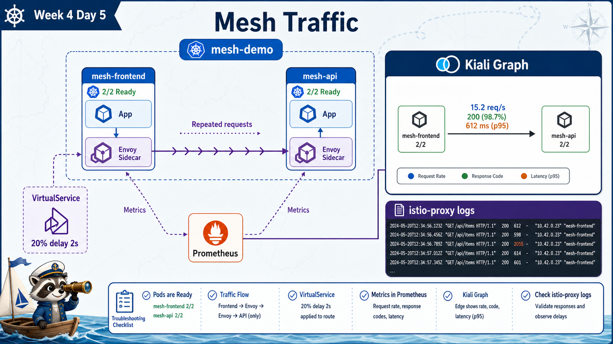

# 7교시: Mesh Traffic 확인



## 수업 목표
- sidecar가 붙은 sample app을 실행한다.
- Kiali graph에서 service-to-service traffic을 확인한다.
- VirtualService로 지연 주입을 걸고 관찰 지점을 정리한다.

## sample app 구조
먼저 아주 단순한 구조로 sidecar와 graph가 보이는지 확인한다.

```text
mesh-frontend
  -> mesh-api
```

`mesh-frontend`는 반복적으로 `mesh-api`에 요청한다. 그래야 Kiali graph와 Envoy access log에서 traffic이 보인다.

그 다음 MSA 형태의 샘플을 실행한다.

```text
frontend
  -> bff
      -> catalog
      -> inventory
      -> order
          -> inventory
          -> payment
```

이 구조는 "mesh가 왜 필요한가"를 더 잘 보여준다. 서비스가 2개일 때는 proxy graph가 단순하지만, MSA에서는 한 요청이 여러 서비스로 퍼지고 특정 서비스의 지연이 전체 응답에 영향을 준다.

## manifest 확인
```bash
find week4/day5/labs/mesh-app -type f | sort
```

구성:
| 파일 | 역할 |
|---|---|
| `namespace.yaml` | `istio-injection=enabled` namespace |
| `deployments.yaml` | frontend/api workload |
| `services.yaml` | api Service |
| `virtualservice-preview.yaml` | fault injection preview |

MSA 샘플:
```bash
find week4/day5/labs/mesh-msa-app -type f | sort
```

구성:
| 파일 | 역할 |
|---|---|
| `namespace.yaml` | `istio-injection=enabled` namespace |
| `deployments.yaml` | frontend, bff, catalog, inventory, order, payment |
| `services.yaml` | 각 workload 앞의 ClusterIP Service |
| `virtualservice-order-delay.yaml` | order 서비스 지연 주입 preview |

## 배포
```bash
kubectl apply -f week4/day5/labs/mesh-app/namespace.yaml
kubectl apply -f week4/day5/labs/mesh-app/deployments.yaml
kubectl apply -f week4/day5/labs/mesh-app/services.yaml
```

확인:
```bash
kubectl -n mesh-demo get pods
kubectl -n mesh-demo get svc
```

정상 기준:
```text
READY 2/2
```

`1/1`이면 sidecar injection이 안 된 것이다. namespace label과 Pod 생성 시점을 다시 본다.

## 로그 확인
앱 container 로그:
```bash
kubectl -n mesh-demo logs deploy/mesh-frontend -c frontend --tail=20
```

proxy 로그:
```bash
kubectl -n mesh-demo logs deploy/mesh-frontend -c istio-proxy --tail=20
kubectl -n mesh-demo logs deploy/mesh-api -c istio-proxy --tail=20
```

앱 로그와 proxy 로그는 성격이 다르다.

| 로그 | 의미 |
|---|---|
| app container log | 애플리케이션이 남긴 로그 |
| istio-proxy log | proxy가 본 network request log |

백엔드 앱이 정상이어도 proxy 로그에서 timeout, reset, routing 문제를 볼 수 있다.

## Kiali graph 확인
```bash
kubectl -n istio-system port-forward svc/kiali 20001:20001
```

브라우저에서:
```text
http://localhost:20001
```

확인 순서:
| 위치 | 확인 |
|---|---|
| Namespace | `mesh-demo` 선택 |
| Graph | `mesh-frontend -> mesh-api` edge |
| Edge label | request rate, response code |
| Workloads | sidecar 있음 |
| Services | mesh-api traffic |

Graph가 안 보이면 frontend가 실제로 요청을 보내고 있는지 로그부터 확인한다.

## MSA mesh sample 배포
단순 예제가 보이면 MSA 샘플을 배포한다.

```bash
kubectl apply -f week4/day5/labs/mesh-msa-app/namespace.yaml
kubectl apply -f week4/day5/labs/mesh-msa-app/deployments.yaml
kubectl apply -f week4/day5/labs/mesh-msa-app/services.yaml
```

확인:
```bash
kubectl -n mesh-msa-demo get pods
kubectl -n mesh-msa-demo get svc
```

정상 기준:
```text
frontend-...    2/2
bff-...         2/2
catalog-...     2/2
inventory-...   2/2
order-...       2/2
payment-...     2/2
```

traffic generator 로그:
```bash
kubectl -n mesh-msa-demo logs deploy/frontend -c traffic-generator --tail=20
```

Kiali에서 `mesh-msa-demo` namespace를 선택한다. 기대 graph는 다음과 같다.

| Edge | 의미 |
|---|---|
| `frontend -> bff` | 사용자 진입점 |
| `bff -> catalog` | 상품 목록 조회 |
| `bff -> inventory` | 재고 조회 |
| `bff -> order` | 주문 API 호출 |
| `order -> inventory` | 주문 처리 중 재고 확인 |
| `order -> payment` | 결제 승인 호출 |

이 graph를 보면 어떤 서비스가 upstream이고 downstream인지, 한 서비스 지연이 어떤 경로로 전파되는지 설명할 수 있다.

## fault injection preview
VirtualService를 적용하면 일부 요청에 지연을 넣을 수 있다.

```bash
kubectl apply -f week4/day5/labs/mesh-app/virtualservice-preview.yaml
```

파일 핵심:
```yaml
fault:
  delay:
    percentage:
      value: 20
    fixedDelay: 2s
```

이 설정은 mesh-api로 가는 요청 중 일부를 2초 늦춘다.

확인:
```bash
kubectl -n mesh-demo get virtualservice
kubectl -n mesh-demo logs deploy/mesh-frontend -c frontend --tail=40
```

Kiali graph에서도 response time이 달라지는지 확인한다.

MSA 샘플에서는 order 서비스에 지연을 넣는다.

```bash
kubectl apply -f week4/day5/labs/mesh-msa-app/virtualservice-order-delay.yaml
kubectl -n mesh-msa-demo get virtualservice
kubectl -n mesh-msa-demo logs deploy/frontend -c traffic-generator --tail=40
```

Kiali에서 `frontend -> bff -> order` 경로의 latency 변화를 확인한다. 이때 `catalog` 경로와 `order` 경로의 차이를 비교하면 mesh traffic policy가 어느 호출 경로에 영향을 주는지 이해하기 쉽다.

## Troubleshooting
| 증상 | 확인 |
|---|---|
| Pod가 `1/1` | namespace label, Pod 재생성 |
| Graph가 비어 있음 | traffic 발생 여부, Prometheus, namespace 선택 |
| Kiali 접속 실패 | port-forward service/namespace |
| VirtualService 효과 없음 | host 이름, namespace, CRD 설치 |
| 요청은 되는데 graph 없음 | Prometheus scrape 지연 |
| MSA graph edge 일부만 보임 | 해당 경로 요청이 아직 충분히 발생하지 않음 |
| MSA Pod가 `1/1` | namespace label 적용 전 Pod 생성, 재생성 필요 |

## Cleanup
```bash
kubectl delete -f week4/day5/labs/mesh-app/virtualservice-preview.yaml --ignore-not-found
kubectl delete -f week4/day5/labs/mesh-app/services.yaml
kubectl delete -f week4/day5/labs/mesh-app/deployments.yaml
kubectl delete -f week4/day5/labs/mesh-app/namespace.yaml
kubectl delete -f week4/day5/labs/mesh-msa-app/virtualservice-order-delay.yaml --ignore-not-found
kubectl delete namespace mesh-msa-demo --ignore-not-found
```

## Evidence Note
```markdown
# W4D5S7 Mesh traffic
- Pod READY:
- frontend app log:
- frontend istio-proxy log:
- Kiali graph edge:
- MSA graph edges:
- VirtualService 적용 여부:
- delay 관찰 결과:
```

## 한 줄 요약
```text
Mesh traffic 확인은 Pod 2/2, app log, proxy log, MSA graph, traffic policy 효과를 순서대로 보는 것이다.
```
