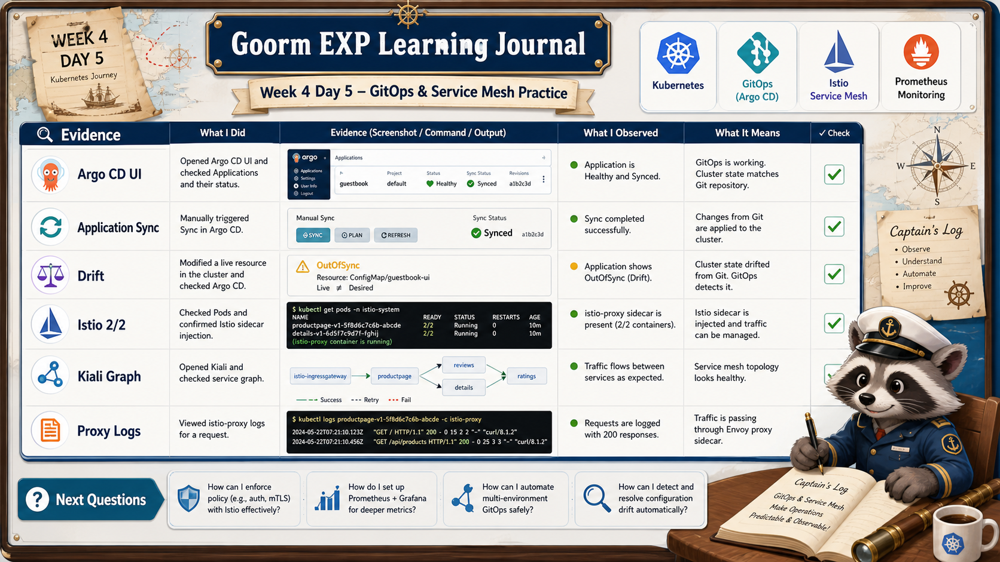

# 8교시: 구름 EXP 배움일기



## 수업 목표
- 오늘 배운 GitOps와 service mesh를 운영 관점으로 정리한다.
- Argo CD와 Istio/Kiali evidence를 표로 남긴다.
- 다음 Kubernetes 심화 구간에서 이어갈 질문을 만든다.

## 오늘 배운 내용 요약
| 교시 | 핵심 질문 | 핵심 산출물 |
|---|---|---|
| 1교시 | GitOps가 왜 필요한가 | CI/CD/GitOps 역할 구분 |
| 2교시 | Argo CD는 어떻게 설치하는가 | Helm release, UI 접속 |
| 3교시 | Application은 무엇을 연결하는가 | repoURL/path/destination |
| 4교시 | drift는 어떻게 발견하고 복구하는가 | OutOfSync, sync, rollback 기준 |
| 5교시 | service mesh가 왜 필요한가 | data plane/control plane 구분 |
| 6교시 | Istio/Kiali를 어떻게 설치하는가 | Helm release, Prometheus 연결 |
| 7교시 | mesh traffic은 어디서 보는가 | Kiali graph, proxy log |

## 오늘의 운영 관점
| 주제 | 운영 질문 |
|---|---|
| GitOps | 운영 상태의 기준은 Git인가, cluster인가 |
| Argo CD | sync 실패가 배포 문제인가, policy 문제인가 |
| Drift | 임시 변경을 Git에 반영할 것인가, 되돌릴 것인가 |
| Istio | proxy 계층을 추가할 만큼 traffic 관찰/제어가 필요한가 |
| Kiali | graph가 비었을 때 traffic, Prometheus, namespace 중 무엇부터 볼 것인가 |

## Evidence 정리 표
아래 표를 채우면서 오늘 결과를 정리한다.

| 항목 | 명령/화면 | 내 결과 | 해석 |
|---|---|---|---|
| Argo CD 설치 | `helm list -n argocd` |  |  |
| Argo CD UI | `http://localhost:18080` |  |  |
| Application | Argo CD UI Application 화면 |  |  |
| GitOps app | `kubectl -n week4-gitops get deploy,svc,pod` |  |  |
| Drift | Argo CD Diff 화면 |  |  |
| Istio 설치 | `helm list -n istio-system` |  |  |
| Sidecar | `kubectl -n mesh-demo get pods` |  |  |
| Kiali graph | `http://localhost:20001` |  |  |
| Proxy log | `kubectl logs -c istio-proxy` |  |  |

## 배움일기 작성 가이드
구름 EXP 배움일기는 단순 감상이 아니라 "오늘 어디서 막혔고 무엇을 확인했는지"를 남긴다.

```markdown
# W4D5 배움일기

## 1. 오늘의 핵심 개념
- GitOps:
- Argo CD Application:
- Drift:
- Service Mesh:
- Sidecar:

## 2. 직접 확인한 Evidence
| 확인 항목 | 결과 |
|---|---|
| Argo CD UI | |
| Application sync | |
| OutOfSync/Diff | |
| Istio Pod 2/2 | |
| Kiali graph | |

## 3. 가장 헷갈렸던 지점
- 

## 4. 운영 관점에서 느낀 점
- 

## 5. 다음에 더 보고 싶은 것
- 
```

## 좋은 기록 예시
```markdown
Argo CD에서 Synced와 Healthy가 다르다는 점이 중요했다.
Git과 cluster object가 같아도 Pod가 죽으면 사용자 입장에서는 정상 서비스가 아니다.
또 Kyverno policy가 sync를 막을 수 있으므로, sync failed를 볼 때 Argo CD만 보지 말고 admission webhook 메시지도 같이 봐야 한다.
```

```markdown
Istio는 app container 옆에 proxy가 붙는 구조라서 Pod가 2/2가 되는 것이 첫 번째 확인 지점이었다.
Kiali graph가 비어 있을 때는 Kiali 설치 실패라고 단정하지 않고, frontend가 실제로 요청을 보내는지와 Prometheus가 metric을 수집했는지를 먼저 봐야 한다.
```

## 다음 Kubernetes 여정 연결
앞으로의 Kubernetes 구간은 다음 질문으로 이어진다.

| 다음 주제 | 이어지는 질문 |
|---|---|
| Helm 심화 | values와 chart를 팀 표준으로 관리할 수 있는가 |
| Argo CD 심화 | app-of-apps, sync wave, promotion 전략은 어떻게 잡는가 |
| Istio 심화 | traffic split, mTLS, authorization policy를 어떻게 운영하는가 |
| Observability | metric/log/trace를 하나의 장애 분석 흐름으로 연결할 수 있는가 |
| Policy | Kyverno와 GitOps를 어떻게 충돌 없이 운영하는가 |

## 마무리 정리
| 개념 | 한 줄 정의 |
|---|---|
| GitOps | Git을 운영 상태의 기준으로 삼는 방식 |
| Argo CD | Git desired state를 cluster에 sync하는 controller |
| Drift | Git과 cluster 상태가 달라진 상태 |
| Istio | service-to-service traffic을 proxy로 관찰/제어하는 mesh |
| Kiali | Istio mesh traffic을 graph로 보여주는 UI |

## 한 줄 요약
```text
오늘은 Kubernetes 운영을 Git 기준으로 배포하고, service mesh 기준으로 traffic을 관찰하는 첫 연결점을 만든 날이다.
```
