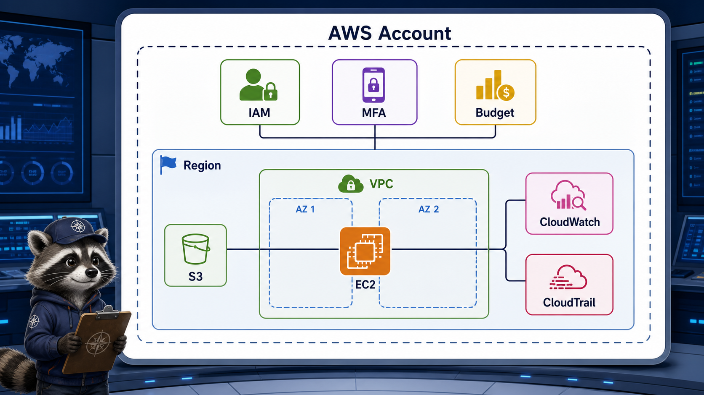

# Week 5 Day 1: AWS 계정 안전과 운영 좌표계

## Overview
오늘은 AWS 주간의 첫날이다. Kubernetes에서는 `kubectl`, Helm, manifest, controller, Service, Ingress, Secret, PV/PVC, Cloud-native observability를 다뤘다. AWS에서는 그 개념들이 실제 계정, 권한, Region, VPC, EC2, S3, 비용, 감사 로그로 연결된다.

첫날의 목표는 많은 resource를 만드는 것이 아니다. 계정 사고를 막고, 앞으로 만들 resource를 같은 기준으로 관찰할 수 있는 좌표계를 만드는 것이다.

## Learning Goals
- root user, MFA, IAM, Budget, Region 선택을 AWS 실습의 선행 안전장치로 설명한다.
- Region과 Availability Zone을 장애 경계와 latency 관점으로 구분한다.
- EC2, VPC, S3, RDS, ELB, ECR/ECS, CloudWatch, CloudTrail을 computing spine에 매핑한다.
- VPC와 Security Group을 Kubernetes Service/Ingress와 비교해 설명한다.
- EC2와 S3를 생성 전 관찰 기준, 비용 기준, 삭제 기준으로 읽는다.

## Lesson Index
| 교시 | 주제 | 핵심 확인 |
|---|---|---|
| 1교시 | Week4 요약 + AWS로 넘어가는 이유 | Kubernetes 운영 질문이 AWS resource로 연결되는 지점 |
| 2교시 | AWS 계정 안전장치 | root user, MFA, IAM, Budget, access key 위험 |
| 3교시 | Region/AZ와 장애 경계 | Region selector, AZ, latency, failure boundary |
| 4교시 | AWS 서비스 운영 지도 | EC2/VPC/S3/RDS/ELB/ECR/ECS/CloudWatch/CloudTrail 매핑 |
| 5교시 | VPC와 Security Group 기본 | VPC, subnet, route table, IGW, SG, Service/Ingress 비교 |
| 6교시 | EC2 첫 관찰 | AMI, instance type, key pair, public IP, stop/terminate |
| 7교시 | S3 첫 관찰 | bucket, object, public access block, static hosting preview |
| 8교시 | 구름 EXP 배움일기 | 계정 안전장치, AWS 매핑, 다음 수업 전 질문 |

## Practice Files
| 자료 | 용도 |
|---|---|
| `academic-foundations.md` | 공식 문서 기반 개념 근거와 읽을 키워드 |
| `lesson-01.md` ~ `lesson-08.md` | 교시별 강의 자료 |
| `assets/day1-aws-operating-map.png` | AWS 계정, IAM, 비용, Region, VPC, EC2, S3, 관찰 계층 overview |

## Official References
| Topic | Reference |
|---|---|
| Root user best practices | https://docs.aws.amazon.com/IAM/latest/UserGuide/root-user-best-practices.html |
| MFA for root user | https://docs.aws.amazon.com/IAM/latest/UserGuide/enable-mfa-for-root.html |
| Regions and Availability Zones | https://docs.aws.amazon.com/global-infrastructure/latest/regions/aws-regions-availability-zones.html |
| VPC Security Groups | https://docs.aws.amazon.com/vpc/latest/userguide/vpc-security-groups.html |
| S3 Block Public Access | https://docs.aws.amazon.com/AmazonS3/latest/userguide/access-control-block-public-access.html |
| AWS Budgets | https://docs.aws.amazon.com/cost-management/latest/userguide/budgets-managing-costs.html |
| Cost Explorer | https://docs.aws.amazon.com/cost-management/latest/userguide/ce-what-is.html |
| CloudTrail | https://docs.aws.amazon.com/awscloudtrail/latest/userguide/cloudtrail-user-guide.html |
| EC2 instance lifecycle | https://docs.aws.amazon.com/AWSEC2/latest/UserGuide/ec2-instance-lifecycle.html |

## Preparation Checklist
- AWS Console 로그인 가능
- root user MFA 설정 또는 설정 상태 확인 가능
- 실습 Region을 `ap-northeast-2`로 고정
- Billing and Cost Management 접근 가능
- Budget 또는 비용 알림 생성 권한 확인
- 개인 access key를 만들지 않고도 오늘 수업을 진행할 수 있음
- 실습 중 생성한 resource에 tag를 붙일 준비

## Deliverables
- AWS account safety checklist
- W4 Kubernetes 개념과 AWS service 매핑 표
- Region/AZ 선택 note
- VPC/Security Group 관찰 note
- EC2 생성 전 점검표
- S3 public access 점검표
- 구름 EXP 배움일기

## End Of Day Checklist
- root user로 실습 resource를 만들지 않았는가
- MFA와 Budget 상태를 확인했는가
- 오늘 사용한 Region을 evidence에 남겼는가
- EC2와 S3를 만들었다면 삭제 또는 유지 사유를 남겼는가
- 다음 수업에서 EC2/ALB 실습을 진행할 수 있도록 key pair, SSH 방식, browser-based 접속 가능성을 확인했는가
