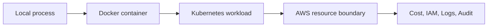

# 1교시: Week4 요약 + AWS로 넘어가는 이유


## 수업 목표
- Kubernetes 운영에서 남은 질문을 AWS resource로 연결한다.
- AWS 주간의 학습 목표를 "서비스 생성"보다 "운영 경계 이해"로 잡는다.
- 오늘 사용할 evidence note 형식을 만든다.

## 오늘 반드시 가져갈 것
| 필수 개념 | 왜 필수인가 | 놓치면 생기는 문제 | 확인 지점 |
|---|---|---|---|
| Cloud resource boundary | AWS에서는 모든 resource가 계정, Region, 권한, 비용 경계 안에 생성된다 | resource를 만들고도 어디서 비용이 나는지 모른다 | Account ID, Region selector, Billing |
| Kubernetes와 AWS의 역할 차이 | Kubernetes는 cluster 안 workload를 조율하고, AWS는 cluster 밖 compute/network/storage를 제공한다 | Service/Ingress와 ALB/VPC를 같은 계층으로 오해한다 | W4 object와 AWS service mapping |
| Evidence-first 운영 | Console 클릭보다 생성 전/후 증거가 중요하다 | 장애나 비용 질문에 답하지 못한다 | screenshot, resource ID, tag, event |

## Week4에서 남은 질문
W4D5까지 Kubernetes 안에서 다음을 확인했다.

| Kubernetes에서 본 것 | AWS에서 다시 묻는 질문 |
|---|---|
| Node capacity | node는 어떤 EC2 instance 또는 managed compute 위에서 도는가 |
| Service/Ingress/Gateway | 외부 load balancer와 public endpoint는 누가 만들고 비용은 어디서 나는가 |
| Secret/ConfigMap | cloud secret store와 parameter store는 어디에 있는가 |
| PV/PVC | 실제 disk, object storage, managed database는 어떤 service인가 |
| metrics/logs/events | CloudWatch, CloudTrail, billing data는 어디서 확인하는가 |
| RBAC/Kyverno | AWS IAM과 resource policy는 어떤 경계에서 막는가 |

Kubernetes 수업에서는 cluster 안의 선언과 controller 동작을 봤다. AWS 수업에서는 그 cluster와 app이 기대는 계정, network, compute, storage, database, observability, billing 경계를 본다.

## AWS 주간의 관점
AWS를 처음 볼 때 service 이름이 많아 보인다. 오늘은 이름을 전부 외우는 시간이 아니다. Week 1 computing spine에 다시 붙여서 읽는다.



| Spine | AWS에서 볼 대표 service | 오늘의 관찰 질문 |
|---|---|---|
| Compute | EC2, ECS, Lambda | 어떤 실행 단위가 돈을 쓰는가 |
| Network | VPC, subnet, SG, ALB | 누가 어디서 접속 가능한가 |
| Storage | S3, EBS, EFS | 데이터가 resource 삭제와 함께 사라지는가 |
| Database | RDS | 누가 DB port에 접근 가능한가 |
| Identity | IAM, MFA, role | 누가 생성/삭제 권한을 갖는가 |
| Observability | CloudWatch, CloudTrail | 로그/지표/API 이벤트를 어디서 보는가 |
| Cost | Billing, Budget, Cost Explorer | 언제부터 비용이 생기고 어떻게 알림을 받는가 |

## 오늘 하지 않는 것
오늘은 EC2/ALB/ECS/RDS를 깊게 실습하지 않는다. 첫날부터 많은 resource를 만들면 학생마다 잔여 비용과 권한 상태가 달라져 다음 날 수업이 흔들린다. 오늘은 안전장치와 resource map을 먼저 잡고, 실제 EC2/ALB는 Day2에서 진행한다.

## Evidence Note
```markdown
# W5D1S1 AWS transition
- 오늘 사용할 AWS Account ID:
- 오늘 사용할 Region:
- Week4에서 AWS로 연결되는 질문 3개:
- 가장 걱정되는 비용/권한 지점:
- 오늘 만들거나 확인할 evidence:
```

## 혼자 다시 따라오기
- 최소 재현 경로: Week4에서 배운 Kubernetes object 3개를 고르고, AWS에서 대응되는 service 후보를 적는다.
- 공식 문서 키워드: `AWS Regions`, `IAM root user`, `VPC security groups`, `S3 Block Public Access`.
- 스스로 확인할 화면: AWS Console 오른쪽 위 Region selector, Billing console, IAM dashboard.
- 흔한 실패 3개: Region을 바꿔놓고 resource를 못 찾음, root user로 계속 작업함, resource 생성 전 비용 알림을 확인하지 않음.
- 다음 준비 상태: 오늘 사용할 account, Region, Budget 상태를 말로 설명할 수 있어야 한다.

## 한 줄 요약
```text
AWS 수업의 첫 질문은 "무엇을 만들까"가 아니라 "어느 계정, 어느 Region, 어떤 권한과 비용 경계 안에서 만들까"이다.
```
